# Time Reporting System — System Description
_Adapted from Eduardo Miranda (2014)_

## 1) Overall Context

The **Time Reporting System (TRS)** lets employees report hours worked against customer projects so customers can be billed. Hours are charged to **Pay Codes** (each Pay Code = unique _project + task_). Employees may only charge to Pay Codes for which they have a **charge authorization**.

Because many employees work at customer sites, TRS must support **remote access via web** with no local installs, and run seamlessly on **Chrome, Safari, and Firefox**.

To reduce misuse or tampering, access is **password-protected** and **Pay Code creation is separated from charge authorization**. Worked hours can be approved **only** by the supervisor who **created** the relevant authorization **or their delegate** (delegation is scoped to a specific employee).

Approved timesheets are exported to the **Payroll System**, which the organization uses for payroll and **downstream billing**.

---

## 2) System Context

**Purpose & scope.** The diagram shows the **TRS boundary**, the **human actors**, and the **two system-to-system interfaces**.

### 2.1 UML Use Case Diagram

```mermaid
flowchart LR
  classDef actor fill:#fff,stroke:#555,stroke-dasharray:4 2
  classDef main fill:#fde68a,stroke:#b45309,stroke-width:3px,color:#111

  %% Human actors
  emp["👤 Employee"]:::actor
  sup["👤 Supervisor"]:::actor
  adm["👤 Administrator"]:::actor

  %% External systems
  Perso["🗄️ Personnel System"]:::actor
  Payroll["💶 Payroll System"]:::actor

  %% System boundary
  subgraph TRS["Time Reporting System"]
    useOperate(("Operate Time Reporting System")):::main
    ucEmpSync(("Synchronize<br>Employee<br>Data"))
    ucTsExport(("Export<br>Approved<br>Timesheets"))
  end

  %% Associations
  emp --> useOperate
  sup --> useOperate
  adm --> useOperate

  Perso --> ucEmpSync
  ucTsExport --> Payroll

  %% Show they are part of overall operation
  ucEmpSync --- useOperate
  ucTsExport --- useOperate

```

#### 2.2 Actors at the boundary

- **Employee** — performs day-to-day time reporting.
    
- **Supervisor** — creates charge authorizations, delegates approval, and approves timesheets.
    
- **Administrator** — manages account access and the Pay Code catalog.
    
- **🗄️ Personnel System (Perso)** — inbound HR/master data for employees and reporting lines.
    
- **💶 Payroll System** — receives **approved** timesheets for payroll and downstream billing.
    

#### 2.3 Information flow & boundary rules

- Direction on arrows indicates who initiates and where data goes (e.g., **Perso ➜ TRS**; **TRS ➜ Payroll**).
    
- Context-level only: internals (DB, screens, services) are out of scope here.
    

---

## 3) Time Reporting Subsystems

- **Access Control** — login and RBAC; **Admin maintains**, **Supervisor/Employee consume**.
    
- **Pay Code** — catalog of chargeable codes (project+task); **Admin maintains**.
    
- **Employee** — employee reference data (incl. supervisor reporting line from Perso).
    
- **Charge Matrix** — the **authorization map** (which employees may charge which Pay Codes); **Supervisors own** it.
    
- **Timesheet** — employees enter/submit; supervisors approve/reject according to the Charge Matrix rules.
    

### 3.1 Operational story

1. **Admins** maintain Access Control and the Pay Code catalog.
    
2. **Supervisors** build the Charge Matrix (authorizations) and approve Timesheets they own (or via valid delegation).
    
3. **Employees** authenticate, see **only authorized** Pay Codes, and create/submit Timesheets.
    

### 3.2 Global UML Class Diagram

---

## 4) Supervisor Functions

- **Login → Access Control** — RBAC is checked for supervisor capabilities.
    
- **Create/Delete Charge Authorization** — grants/removes an employee’s ability to charge a Pay Code (project+task). The record is stored in the **Charge Matrix** and marked with **createdBy** (the owning supervisor).
    
- **Delegate Approval / Revoke Delegation** — a supervisor may delegate **approval authority for a specific employee** to another supervisor for a validity window.
    
- **Approve Timesheet** — approves/rejects employee Timesheets. Approval is allowed when the approver is **the Authorization.createdBy** **or** has a **valid Delegation** for that **employee**.
    
- **Supervisor Report** — reports over authorizations and Timesheet status/activity.
    

### 4.1 Supervisor UML Class Diagram

**Approval policy for mixed Pay Codes.** Approvals are **per TimesheetRow** (per charged Pay Code). A Timesheet becomes **Approved** when **all** rows are approved; otherwise it remains **Partially Approved** or **Submitted** (policy name up to the team).

---

## 5) Employee Functions

- **Login → Access Control** — the employee authenticates.
    
- **Report Time** — create time entries (date, Pay Code, hours, notes).
    
- **Modify Timesheet** — edit Draft entries.
    
- **Submit Timesheet** — move to **Submitted** for supervisor action (usually locks edits).
    
- **Recall Timesheet** — move back to **Draft** (allowed **until any row is approved**).
    
- **Employee Report** — personal summaries (hours by period/Pay Code, statuses).
    

### 5.1 Operational story

1. Employee authenticates.
    
2. Employee records time, with available Pay Codes filtered by the **Charge Matrix** (must be authorized).
    
3. Employee can modify until submission; after submission, they can **recall** (unless any row was already approved).
    
4. Employee may view reports at any time.
    

### 5.2 Timesheet lifecycle (policy)

### 5.3 Employee UML Class Diagram

---

## 6) Administrator Functions

Two areas, both gated by Login/Access Control:

1. **Employee account & access management**
    
    - **Grant TRS Account Access** (provision/activate account with role).
        
    - **Revoke TRS Account Access** (permanently remove access).
        
    - **Block Account** (temporary disable).
        
    - **Reset Password**.
        
2. **Pay Code catalog lifecycle**
    
    - **Create / Update / Delete Pay Code** entries used by other subsystems.
        

> Terminology: These are **account access** operations (not charge authorizations). Charge authorizations are in the Supervisor area via the **Charge Matrix**.

### 6.1 Admin UML Class Diagram

