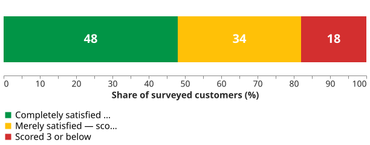

# Customer Types

Satisfaction and loyalty are not the same variable, and the gap between them is where customers are
lost. Jones and Sasser's study of more than thirty companies across five markets found that
*"merely satisfying customers who have the freedom to make choices is not enough to keep them
loyal. The only truly loyal customers are totally satisfied customers"* .

## 1. A 4 out of 5 is a warning, not a pass

The finding is a discontinuity, not a slope. At Xerox, **completely** satisfied customers were
**six times** more likely to repurchase over the next 18 months than merely satisfied ones. The
curve is nearly flat across the middle of a satisfaction scale and then rises steeply at the top.

The consequence for anyone reading a survey is immediate. For example, a management team looking at **82% of
responses in the top two boxes** read it as a pass. The correct reading was *"only 48% of our
customers are completely satisfied, and 52% are up for grabs"* — the same data, a different
conclusion. Stated intent flatters further: 60–80% of car buyers say they will repurchase the same
brand, and 35–40% actually do.

_The 82% headline, split._ 

## 2. The types, and what they look like in software

Hoover credits the taxonomy to Jones and Sasser in place . The
software readings below are ours, not the sources'.

| Type | In the source | In a software product |
|---|---|---|
| **Loyalist / apostle** | Completely satisfied; the apostle tells others | Renews without a conversation; answers questions in your community forum; gives the reference call |
| **Defector** | Dissatisfied, neutral — **and the merely satisfied** | Renews once, then silently does not. Usage decays months before the renewal date |
| **Terrorist** | *"Can't wait to tell others about their anger and frustration"* | Takes the outage to the public issue tracker, or to a competitor's procurement reference call |
| **Mercenary** | Completely satisfied, no loyalty | Acquired on a migration credit, gone at the first competitor promotion |
| **Hostage** | *"Stuck… must accept it"* | The internal user of a mandated system; the customer locked in by data gravity and an export format nobody implemented |

## 3. The two types you are manufacturing yourself

Terrorists and hostages are both produced by something the organisation is doing, which is what
makes them worth separating from the others.

A hostage is a **satisfied-looking number produced by the absence of a choice**, and Jones and
Sasser name the moment it stops being real: *"the curve snaps."* Their case is a corporate PC user
who cannot pick the standard — until purchasing replaces the fleet, at which point accumulated
end-user dissatisfaction lands all at once. In software the snap has four familiar triggers: a
re-tender, a platform migration, an API deprecation, and a competitor launching a free tier. Every
green satisfaction score on a mandated internal system should be read against that list.

The repair mechanism in the literature is recovery rather than prevention: at one company studied,
**35% of defectors were recaptured simply by contacting them and listening**. A well-handled failure
is the only documented route from defector to apostle — which is why postmortems, credits and a
public status page are project management rather than public relations.

## 4. What this does not tell you

The types describe a customer's current position, not its cause, and the taxonomy carries no
threshold: nothing here says at what point a merely-satisfied account becomes a defector, or how
long a hostage stays. It is a diagnostic vocabulary for a conversation about accounts, not a
segmentation you can compute. Nor does it survive contact with a customer who has no alternative and
never will — a regulator-mandated filing system has hostages by construction, and the useful question
there is about the cost of their dissatisfaction, not their loyalty.

## How solid is this?

- **Where it comes from.** A 1995 *Harvard Business Review* article drawing on more than 30
  companies across five markets, with the underlying studies named — J.D. Power on 32 automobile
  nameplates, roughly 10,000 patient surveys, about 20,000 airline passengers.
- **What is contested.** Nothing in the taxonomy. But the evidence is **correlational throughout**;
  nothing establishes that raising satisfaction causes loyalty rather than the reverse.
- **What we do not hold.** One software case between this article and its companion, so the
  percentages belong to other industries. The types have not been validated on software products.

---

### Acknowledgments

This page adapts material from lectures by Eduardo Miranda and David Root
 on software project management.

### References



---

{: .highlight }
**Disclaimer:** AI is used for text summarization, polishing and explaining. Authors have verified all facts and claims. In case of an error, feel free to file an issue.
