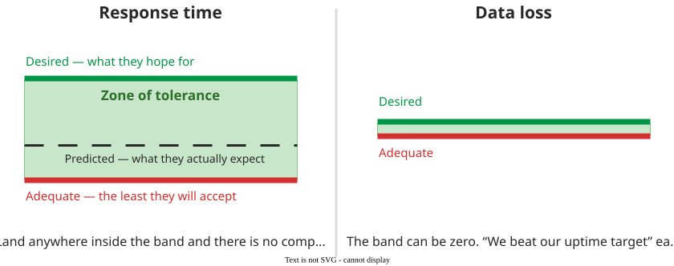
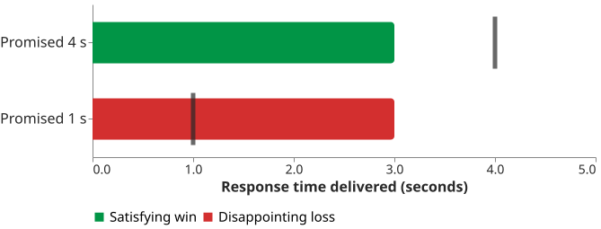

# Customer Expectations

A customer's judgement of your project is a **comparison**, not a measurement: they form a standard
before they see anything, they perceive what you delivered, and satisfaction is the gap between the
two. The lecture states it as a ratio :

$$
\text{Customer Perception} = \frac{\text{Project Performance}}{\text{Expectations}}
$$

Boehm makes the same point without arithmetic : *"A customer
expecting a 4-second response time will consider a 3-second response time a satisfying win; a
customer expecting a 1-second response time will consider a 3-second capability as a disappointing
loss."* Performance is identical in both halves of that sentence. Only the expectation moved.

## 1. The denominator has parts

Customers do not hold one number. Research identifies three levels at once : the **desired** level they hope for, the **adequate** they will accept, and the **predicted** they think they will get. The space between them is the **zone of tolerance**: a delivery inside it draws no complaint.

_The three levels, and the band between the top two._ 

Two consequences carry below. The zone **moves from the bottom**: almost everything a manager controls acts on the adequate line, not on what the customer wants. And for some attributes it is **zero** — no credit for exceeding an uptime target, only a penalty for missing it.

_Identical performance, opposite verdicts._ 

## 2. What the pages cover

| Page | The question it answers |
|---|---|
| [Expectation space and solution space](quadrant) | What can each side actually trade? |
| [Defining success](success) | Who decides what counts as success, and when? |
| [Threshold of success](tos) | How do you write that down so it can be checked? |
| [Customer types](cust_types) | Why is a satisfied customer not a loyal one? |
| [Kano classes](kano) | Why did delivering everything they asked for still disappoint them? |
| [Setting expectations](setting) | What moves an expectation before the commitment? |
| [Customer involvement](involvement) | How much of the customer's time should you ask for? |

The through-line: **expectations move when information moves, not when arguments are won.** A
prototype, a task breakdown and a fortnightly demo all work the same way — each puts something in
front of the customer that they can evaluate themselves.

## How solid is this?

- **Where it comes from.** The three-level model is 17 propositions from 16 exploratory focus groups
  across five US service industries — insurance, equipment repair, truck rental, auto repair and
  hotels. There is no software in it, and the translation to software here is ours.
- **What is contested.** The zone of tolerance has no direct measure; the authors flag
  operationalising it as a difference score as problematic. Any number attached to a zone did not
  come from this research.
- **What we do not hold.** No measured effect size in software for any of these levers.

---

### Acknowledgments

This page adapts material from lectures by Eduardo Miranda and David Root
 on software project management.

### References



---

{: .highlight }
**Disclaimer:** AI is used for text summarization, polishing and explaining. Authors have verified all facts and claims. In case of an error, feel free to file an issue.
