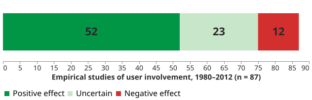
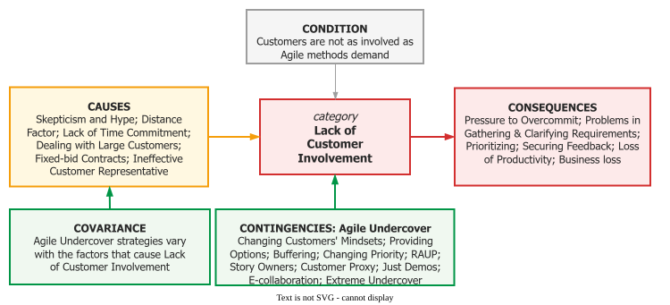

# Customer Involvement

Involving users is a lever with a cost and a setting, not a virtue. The largest synthesis available
— **87 empirical studies over 32 years** — reaches a two-sided conclusion
: *"Our results have revealed that UI does contribute positively to
system success. But it is a double edged sword and if not managed carefully it may cause more
problems than benefits."*

## 1. What the evidence actually says

The review screened 2,776 citations down to 87 studies and classifies their results, in its abstract, as **52 positive, 12 negative, 23 uncertain**. Badly run involvement produces unrealistic expectations, communication breakdown and intergroup hostility.

_87 studies over 32 years._ 

That turns an exhortation into four design decisions the review names:

- **Which users?** Primary (hands-on), secondary (occasional or via an intermediary), tertiary (affected but never touching it). A project that involved only primaries has not involved its users.
- **At what degree?** A ladder, not a switch: **informative** → **consultative** → **participative**,
  where participative means *"users influence decisions relating to the whole system"*. Promising
  participative while running informative is how involvement generates the negative results in the
  sample.
- **For which goal?** For satisfaction, structure participation to create a sense of control; for system quality, to move domain knowledge to the developers. **These are different designs**, and conflating them is how involvement disappoints.
- **In which phase?** Early buys accurate requirements and less resistance; design and
  implementation buy ownership; testing buys usability.

The review also states a genuine **when-not**: for routine transaction-processing systems with
lower-level users, an analyst gathering requirements by interview is sufficient, and more
involvement does not raise satisfaction.

## 2. Involvement is not participation

**Participation** is a set of behaviours — attending meetings, reviewing screens. **Involvement** is
a psychological state: how important and personally relevant the system is to that user. A user can
attend every session and not be involved, so *"we involved the users"* is not a checkable claim, and
a project reporting attendance as involvement has measured the wrong thing.

## 3. When the customer will not give you the time

Agile methods assume an on-site customer. A three-year study of 30 practitioners in 16 organisations found teams routinely working without one, and mapped what they do instead as a continuum ordered by directness :

**On-site Customer → Story Owner → Just Demos → E-collaboration → Customer Proxy → Extreme
Undercover.**

_Fig. 5 — a continuum, not a ladder: the levels **may occur simultaneously**._ 

Knowing which rung a project is on is more useful than any advice about collaboration. Two repairs from the study are concrete enough to copy: a **Definition of Ready**, so unclarified stories are demoted rather than guessed at, and a **buffer sized from recorded velocity**. For example, one team reserved two days of a two-week sprint and ran the customer hour as **15 minutes showing software and 45 minutes discussing it**.

Customers defaulted to hands-off; those who had **read the Scrum books** expected unlimited scope freedom while resisting the involvement that pays for it.

_Fig. 4 — causes, condition, consequences, and the strategies that answer them._ 

{: .warning }
**Extreme Undercover is a transition aid, not a permanent substitute.** The authors are explicit,
and it became less frequent across the three years as customers grew familiar with agile. Teaching
it without that boundary would be teaching deception.

## 4. Customers can do real work — if you train them

Involvement can extend into the customer doing part of the job: self-service, defect reports, forum answers, reviews. Intuit adds *"more than a hundred changes"* to each annual release from customer-service input .

Two cautions. **Untrained customers become antagonists** — a loyal base is the *hardest* to retrain, which is why Southwest built a "Boarding School" before changing boarding. And a channel that collects then ignores is **worse than none**: it spends the credibility it runs on.

## How solid is this?

- **Where it comes from.** A systematic review following EBSE guidelines (87 studies, 1980–2012), a
  grounded-theory study of 30 practitioners, and one chapter of a trade book whose numbers are
  business cases rather than research findings.
- **What is contested.** The review reports its own split two ways — the abstract gives 52/12/23,
  section 7 gives 59 positive, 7 negative, 21 uncertain. Both are verbatim and both total 87. The
  abstract's figures are used above.
- **What we do not hold.** Nothing establishes that involvement *causes* success rather than that
  successful projects attract it, and 46 of the 87 studies are surveys — so the positive finding is
  substantially about what people report.

---

### Acknowledgments

This page adapts material from lectures by Eduardo Miranda and David Root
 on software project management.

### References



---

{: .highlight }
**Disclaimer:** AI is used for text summarization, polishing and explaining. Authors have verified all facts and claims. In case of an error, feel free to file an issue.
