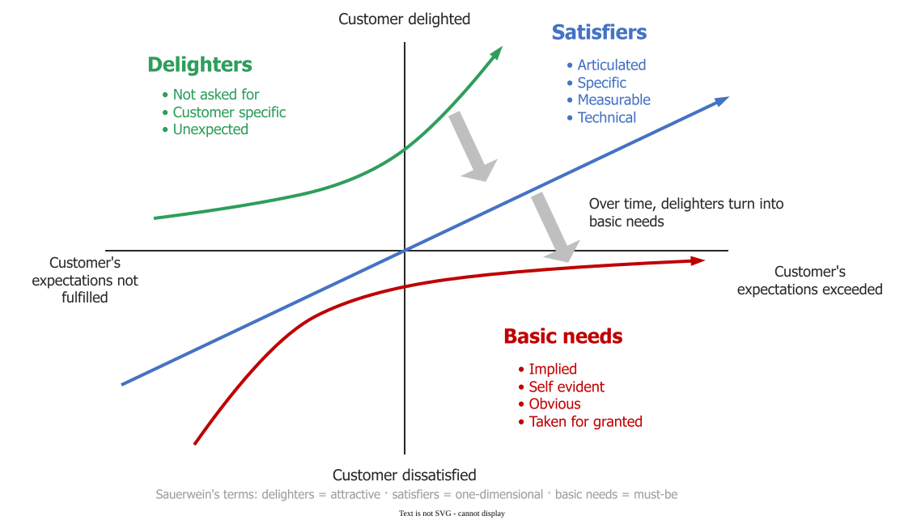

# Kano Classes

The Kano model sorts requirements by **how fulfilling them changes satisfaction**, and the answer is
not the same for all of them. Three classes matter : **must-be**,
**one-dimensional** and **attractive**. The class is a property of a customer segment, not of the
feature.

This answers the question the satisfaction ratio leaves open: *if satisfaction is performance over
expectation, why did delivering everything they asked for still disappoint them?*

## 1. The three classes

- **Must-be.** *"If these requirements are not fulfilled, the customer will be extremely
  dissatisfied. On the other hand, as the customer takes these requirements for granted, their
  fulfillment will not increase his satisfaction."* In software: the login works, the data is not
  lost, the page loads. These can only lose you points.
- **One-dimensional.** Satisfaction is *"proportional to the level of fulfillment"* — a straight
  line. Speed, storage quota, API rate limit. This is usually what the customer asks for.
- **Attractive.** *"Neither explicitly expressed nor expected by the customer. Fulfilling these
  requirements leads to more than proportional satisfaction. If they are not met, however, there is
  no feeling of dissatisfaction."* These can only win points.

The software readings are ours; the source's examples are all skis.

_Industry names above, Sauerwein's below. **The migration arrows are not in the 1996 paper.**_ 

There is a tie-break rule, and it is the practical payload: **must-be beats one-dimensional beats
attractive beats indifferent.** Failing a must-be cannot be compensated by any amount of delight.

## 2. How a class is determined

Not by asking how important something is. Kano uses a **question pair** for each requirement — a
*functional* question (how would you feel if the product had this?) and a *dysfunctional* one (how
would you feel if it did not?), each answered on a five-point scale, then read through a
classification matrix. One question cannot produce a category, which is exactly why an
importance-weighted backlog cannot either.

The method yields two **satisfaction coefficients** per requirement — one for how much
fulfilling it raises satisfaction, one for how much omitting it lowers satisfaction. For example, in the study's own worked case ski edge grip scored **+0.40 / −0.83** while ski servicing scored **+0.89 / −0.25**.
Read those as investment cases rather than as ratings: the first is insurance — getting it right
buys little, getting it wrong is punished hard — and the second is the opposite. A single importance
score cannot distinguish them, and that is the failure mode this model exists to fix.

## 3. Two boundary conditions that carry as much weight as the model

**The category belongs to the segment.** In the study, edge grip was *must-be* to expert skiers and
*one-dimensional* to novices. The same is true of a software feature: single sign-on is a must-be
for your enterprise accounts and an irrelevance to your free tier. A Kano study run over an
unsegmented population produces averages describing nobody.

**Attractive decays into must-be.** A phone camera delighted in 2007; its absence is disqualifying
now. Free HTTPS, dark mode and single sign-on have all made the same journey. So a classification
has a half-life, and a roadmap built on a three-year-old one is defending a position that has
already moved. *(That example is ours, not the study's.)*

There is also a cost ceiling worth knowing before commissioning the work: the study reports that
**20 to 30 interviews per homogeneous segment reach 90–95% of the requirements**. Elicitation has a
knee, and interviewing past it is waste.

## 4. When not to use it

Kano needs a segment you can name and customers you can ask a paired question. It has nothing to
offer where the requirement is non-negotiable — a legal or safety obligation is a must-be by
definition, and classifying it wastes the study. It also says nothing about cost, so a Kano class is
an input to prioritisation and never a prioritisation on its own: an attractive requirement costing
three months loses to a one-dimensional one costing three days.

## How solid is this?

- **Where it comes from.** One 1996 study of ski equipment, with more than 1,500 respondents and a
  questionable-response rate under 2%, presented at a production-economics working seminar.
- **What is contested.** The paper does not bound its own method, and later work on the model's
  reliability is not held here.
- **What we do not hold.** No replication on a software product in this bibliography. The model
  transfers as a way of thinking; the categories and coefficients do not transfer from skis.

---

### References



---

{: .highlight }
**Disclaimer:** AI is used for text summarization, polishing and explaining. Authors have verified all facts and claims. In case of an error, feel free to file an issue.
