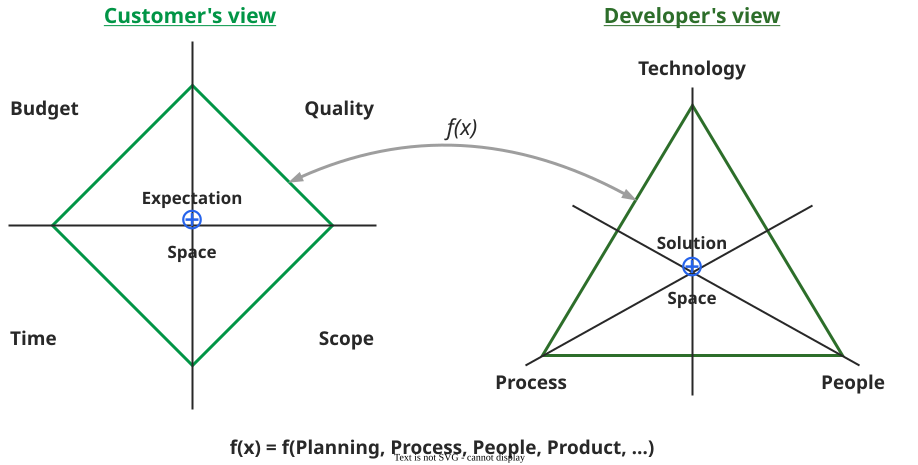
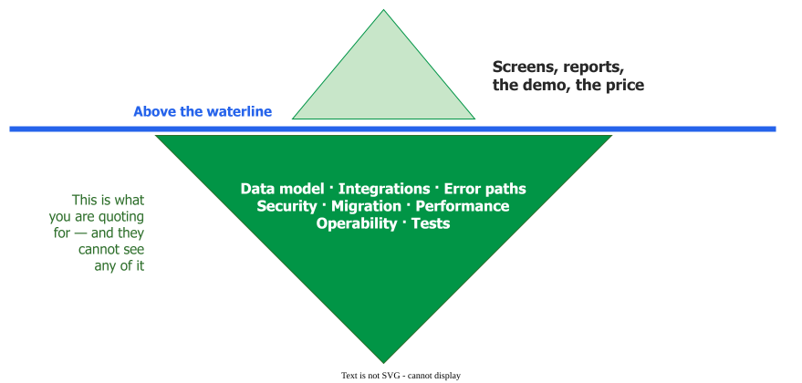
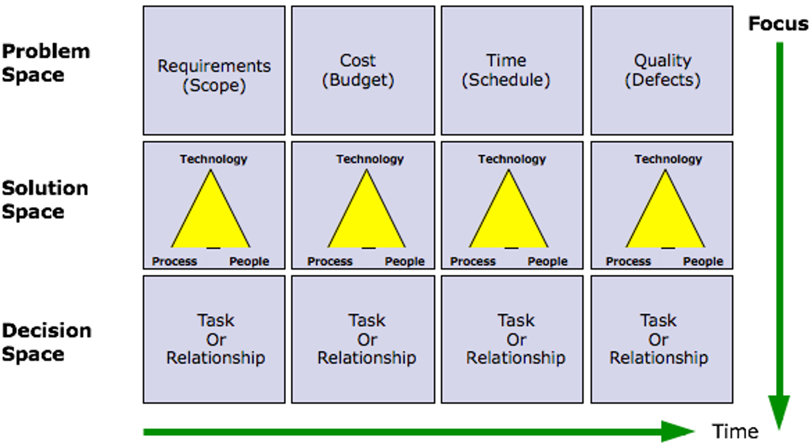

# Expectation Space and Solution Space

The **expectation space** is the set of things a customer can actually control and therefore trade —
scope, time, quality and cost. The **solution space** is the developer's equivalent: people, process
and technology. Negotiation happens between the two, and each side can only offer what it holds
.

This pairing is widely taught as *"Hoover's quadrant"*, which is the name to recognise in a question
paper. The book's own term is the expectation space, and its fourth customer-side element is
**cost** — you will also meet it as *budget* or *resources*.

_An expectation is a **point**, not a list; **f(x)** is the manager's job._ 

## 1. Each side can only trade what it controls

| Customer controls | Developer controls |
|---|---|
| **Scope** — what gets delivered | **People** — who is on the team, and their skills |
| **Time** — when it is needed | **Process** — how the work is organised and checked |
| **Quality** — how good it must be | **Technology** — languages, platforms, architecture |
| **Cost** — what it may cost | |

The manager's job is translation. A developer-side decision only becomes negotiable once it is
restated in the customer's four terms: choosing an unfamiliar framework (technology) is a **time**
and **cost** claim; adding a code review stage (process) is a **quality** claim paid for in
**time**.

Hoover's framing matters more than the grid. The object of negotiation is to **enlarge** the space —
*"the negotiation process stimulates stakeholders to explore options that optimize the expectation
space for all"* — not to divide a fixed budget across four corners.

## 2. The reason the two sides cannot negotiate unaided

Boehm names the underlying problem the **Two Cultures**: neither side has a feel for what is cheap
or expensive on the other's side . The consequence is specific —
*"if the customers have no idea of the relative cost and difficulty of a requirement, they are more
likely to enter infeasible requirements as statements of need."*

The blindness runs both ways. Boehm's developer-side example is the misapplied Golden Rule: build a
friendly interface as *you* would want one, and you have built a programmer-friendly interface.

## 3. What happens when cost becomes visible

For example, a Windows beta customer in 1992 brought two change requests to the team, both labelled *must have*
. One was a toolbar button: **half a day**. The other was hot-linked
drag-and-drop page import, requiring full OLE support: **six to nine staff months**. Once the
customer knew the two costs, their own response to the expensive one was *"No way! It's not that
important."*

Nobody negotiated and nobody refused. The information did the work, and the customer got their
toolbar button *and* the release date — an outcome no division of a fixed pie produces. That is what
"educate the customer" means in practice: make the cost structure legible, with a task breakdown, an
impact statement or a prototype, rather than explaining that software is hard.

_What they price is what they can see._

## 4. Where this stops working

The model assumes both sides have authority to trade. A customer representative who cannot move
scope, and a team that cannot change its own process or staffing, have no space between them to
enlarge — the negotiation is theatre, and the real decision sits with people who are not in the
room. Identify them before the meeting rather than after it; see
[stakeholders](../reqs/stakeholders).

The four dimensions also shift in prominence as a project runs: scope dominates the early
conversation, cost and schedule the middle, and quality the end, when the question becomes whether
the delivered thing actually works.

_Problem, solution and decision spaces over the life of a project._ 

## How solid is this?

- **Where it comes from.** Hoover, Rosso-Llopart and Taran is a software textbook built on case
  studies, read here for chapters 2, 7 and 9. It establishes definitions and method; nothing in it
  measures whether negotiating this way improves outcomes.
- **What is contested.** Nothing substantive — but the naming is unstable. *Quadrant* is not the
  book's word, and *budget* and *resources* both circulate for what Hoover calls *cost*.
- **What we do not hold.** McConnell's 1992 anecdote is a practitioner account, not a study.

---

### Acknowledgments

This page adapts material from lectures by Eduardo Miranda and David Root
 on software project management.

### References



---

{: .highlight }
**Disclaimer:** AI is used for text summarization, polishing and explaining. Authors have verified all facts and claims. In case of an error, feel free to file an issue.
