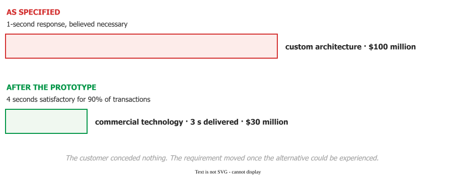

# Setting Expectations

Managing user expectations is *"the actions of a software project manager to ensure that the
assumptions held by the user for a software project are realistic and consistent with the software
deliverable promised by the project team"* . Every mechanism below
works the same way: **expectations move when information moves, not when arguments are won.**

## 1. Reconcile before you commit, not in change control afterwards

Boehm's definition puts the emphasis on timing — *"a reconciliation of customer expectations with
developer capabilities **before firmly committing** to a set of requirements"*
. His instrument is a **simplifier and complicator list**: a page
per application domain, in the client's own vocabulary, naming the choices that make this kind of
system cheap and the choices that make it explode.

For example, for a multimedia archive the *simplifiers* were standard query languages, standard
search engines and standard media formats; the *complicators* were natural-language processing,
automated metadata determination, and simultaneous rapid access with high-fidelity presentation.

Half the list is about the **client's** organisation, and that half is the one teams forget: scope
crossing organisational boundaries, a solution that creates more user work, shifting power or
confusing lines of authority, outside parties on the critical path, hidden costs, and *creeping
elegance*. Two requirements nobody could price show what the list is for:
a natural-language query interface on an otherwise simple query system overran by a **factor of
five** and was cancelled, and a records digitisation escalated by a **factor of ten**.

Across three annual cohorts of real-client projects, introducing the lists took failures at the
feasibility gate from a **25–27%** baseline to **5%**.

## 2. Show it. Do not argue about it

A government transaction-processing system was specified around a **one-second** response time,
believed necessary for user productivity, implying a **$100 million** custom architecture. Prototype
testing showed **four seconds was satisfactory for 90% of transactions**. It was delivered on
commercial technology at **$30 million** with a three-second response .

_Seventy million dollars, moved by a prototype._ 

The customer conceded nothing. The requirement moved once the alternative could be experienced —
hence the rule: **when an expectation is quantitative, build the cheapest thing that lets the
customer experience the number.**

The same instrument works at project cadence. One manager found a prototype was only **40%
correct** and replaced status emails with a fortnightly walk-through of the working build across a
six-month cycle . A status email reports on the thing; a
walk-through *is* the thing.

## 3. You are setting expectations with your price list, not just your roadmap

Some of what sets a customer's standard was never decided by anyone .
**Explicit promises** — the demo, the roadmap slide, the changelog — raise what the customer wants
*and* what they predict at once. **Implicit promises** do the same without being made: an enterprise
price tier sets an enterprise bar for documentation, support latency and onboarding polish, whatever
the contract says.

## 4. They should hear it from you, and early

*"Bad news doesn't get better with time"* is old advice with a real mechanism. Among Petter's
tactics drawn from 24 project cases, the Trust strategy includes reporting the bad with the good and
making sure *"problems reach the user from you first"*
.

Why that works: a cause the customer perceives as outside your control is the **only** thing in the
expectations model that *widens* their tolerance  — and it only
operates if they can see it. An unexplained slip is your fault. An explained upstream failure, told
first-hand and early, is a situational factor. Telling them late converts the second into the first,
because by the time they hear it elsewhere they have priced it as concealment.

## 5. The limits of under-promising

Lowering what the customer predicts protects satisfaction, but it is not free: it also raises the
level they will *accept*, so the tactic has a floor. Nor does it improve the product — a team that
has trained its customer to expect lateness gets a satisfying fourth late sprint and a bad product.
And none of it reaches a customer who will not engage at all; that problem is on
[customer involvement](involvement).

## How solid is this?

- **Where it comes from.** Boehm's result is a three-cohort natural experiment on a university
  course — 51 projects, professional clients, with a pre-existing outcome gate. Petter's framework
  is 24 recalled cases from 12 project managers at a single firm.
- **What is contested.** Boehm's cohorts are consecutive years, not randomised, so anything else
  that changed between them is confounded with the intervention.
- **What we do not hold.** No measured effect for any of Petter's 24 tactics — the study records
  what managers did, not whether it worked.

---

### Acknowledgments

This page adapts material from lectures by Eduardo Miranda and David Root
 on software project management.

### References



---

{: .highlight }
**Disclaimer:** AI is used for text summarization, polishing and explaining. Authors have verified all facts and claims. In case of an error, feel free to file an issue.
