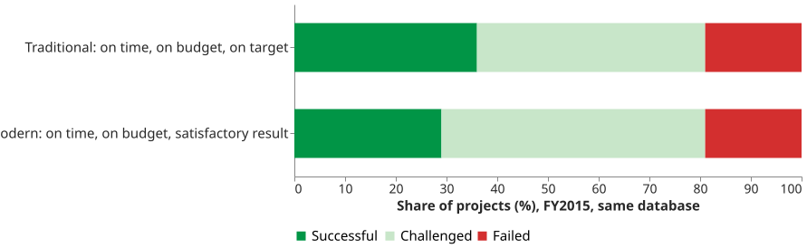
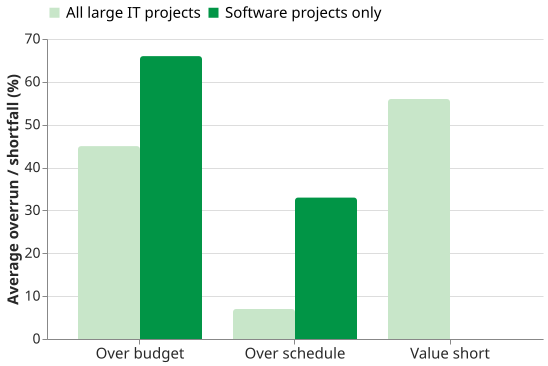

# Defining Success

Project success is a **definition somebody writes**, not a property a project turns out to have.
Change the definition and the same projects change from successes to failures without anything
happening to the software — which is why the industry failure rates students are quoted disagree so
widely.

## 1. The same database, two answers

The Standish Group's CHAOS reports publish two success definitions side by side
:

- **Traditional Resolution** — on time, on budget, and **on target**, meaning the delivery
  *"contained a good number of the estimated features and functions"*.
- **Modern Resolution** — on time, on budget, and **a satisfactory result**, *"regardless of the
  original scope"*.

For FY2015 the same database gives **36% successful** under the first definition and **29%** under
the second — the report itself puts the difference at about seven points. Nothing about the projects
changed. When someone quotes you a failure rate, the first question is which definition produced it.

_The same projects, scored two ways._ 

## 2. Why the definition matters more than the number

Eveleens and Verhoef examined what those definitions actually measure :
a "successful" project is one that **matched its own forecast**, so an organisation can improve its
score by estimating worse. They demonstrate it on **5,457 forecasts across 1,211 real projects**.

The result worth remembering is a single organisation in that study. For example, **Org X had the worst
forecasting accuracy in the whole sample** — half its projects were out by 233% or more — and the
**second-highest CHAOS-style success rate, 67%**. In the same analysis, two datasets with
*identical* forecast quality score **5.8%** and **94.2%**, differing only in the direction of the
bias. The authors conclude the figures *"are misleading, one-sided, pervert the estimation practice,
and result in meaningless figures."*

That is Goodhart's law arriving early: a measure that rewards matching your estimate rewards padding
your estimate.

{: .warning }
**Never quote a CHAOS figure without this critique attached.** The reports carry no named author, no
peer review, no sampling frame and no response rate, and Standish's own disclaimer asks readers to
treat the contents as opinion.

## 3. What the evidence does support

A McKinsey study with the University of Oxford examined **more than 5,400 IT projects with initial
budgets above $15 million** . Its headline is three separate numbers
rather than one verdict: on average these projects ran **45% over budget**, **7% over time**, and
delivered **56% less value** than predicted.

**Software projects were worse than the headline: 66% cost overrun and 33% schedule overrun.** That
is the figure this subject should carry, and it is the one a CHAOS-only slide does not give you.

_All large IT against software alone, on the same study._ 

Two further findings change decisions:

- **17%** of large IT projects go so badly that *"they can threaten the very existence of the
  company"*.
- The cost-overrun rate rises about **15% for each additional project year** — which makes
  shortening a project a risk control, not merely a delivery preference.

## 4. The limitation, and it is a real one

Every figure above is about **large** projects: the $15M threshold bounds the McKinsey dataset
entirely, and it is consultancy research with no peer review and no independently auditable method.
None of it is evidence about a small team's first release. What transfers is not the percentage but
the mechanism — that outcomes are measured against a forecast somebody chose, and that longer
projects drift further from it.

The practical response is on the [threshold of success](tos) page: write the criteria down in
advance, make each one binary, and you do not have to argue afterwards about which definition
applied.

## How solid is this?

- **Where it comes from.** Eveleens and Verhoef is peer-reviewed (*IEEE Software*, 2010) and is the
  strongest source here; McKinsey is grey literature with a stated population and method; the CHAOS
  reports are vendor publications and are used only as evidence of what they themselves claim.
- **What is contested.** Eveleens does **not** claim projects succeed more often than reported, only
  that the Standish figures cannot tell you either way. Its own case-study rates are an upper bound,
  because cancelled projects are excluded.
- **What we do not hold.** McKinsey's causal attributions are the authors' coding of their own
  dataset, not measured causes, and are not reproduced here.

---

### Acknowledgments

This page adapts material from lectures by Eduardo Miranda and David Root
 on software project management.

### References



---

{: .highlight }
**Disclaimer:** AI is used for text summarization, polishing and explaining. Authors have verified all facts and claims. In case of an error, feel free to file an issue.
