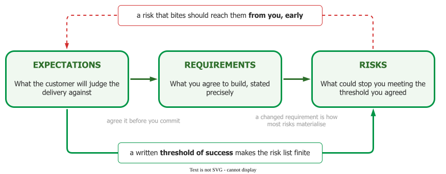

# Needs

This area is about working out what to build and what could stop you — before the code makes the
answer expensive. Fred Brooks put the case in one sentence :

> The hardest single part of building a software system is deciding precisely what to build. …
> Therefore the most important function that software builders do for their clients is the
> iterative extraction and refinement of the product requirements.

Note the two words that carry it. **Precisely**, because a vague agreement is not an agreement. And
**iterative**, because Brooks's point is that clients cannot state requirements correctly in advance
— not that they should try harder.

Three topics follow from that, in the order a project meets them.

- **[Expectations](exp/)** — what the customer will judge the delivery against, and how a manager
  moves that standard before the commitment rather than arguing with it afterwards.
- **[Requirements](reqs/)** — what a requirement is, who it comes from, how to elicit it, write it
  so it can be tested, and manage it when it changes.
- **[Risks](risks/)** — what could stop the project meeting the threshold it agreed to, how to
  state it so someone can act on it, and how to analyse and track it.

The three are one loop rather than three phases: a written definition of success is what makes a
risk list finite, and a changed requirement is the most common way a risk materialises.

_One loop, not three phases._

---

### References



---

{: .highlight }
**Disclaimer:** AI is used for text summarization, polishing and explaining. Authors have verified all facts and claims. In case of an error, feel free to file an issue.
