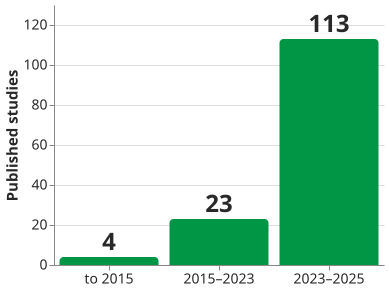

# Requirements with LLMs

A large language model is useful on requirements work that is **about text** and unreliable on work
that is **about the world**. The largest review of the field puts the boundary in one sentence: the
*"current generation of GenAI tools are best viewed as assistive accelerators rather than autonomous
decision-makers for RE"* . This page is about using a model **for**
requirements engineering, not requirements engineering *for* AI systems.

## 1. This is the fourth generation of the attempt

Automating requirements work is not new — *findphrases* (1990) through *QuARS* and *SREE* to
*aToucan* (2015). A map of 404 studies found **130 tools built, 17 downloadable**, and only **7%
evaluated in industry** . The current generation is growing
fast and barely deployed: of 238 studies to May 2025, **over 90% are concept or proof-of-concept
work and 1.3% reach production**  — so the honest reading is not that it
fails, but that almost nobody has run it in anger.

_The fourth generation of requirements automation._ 

## 2. Where it earns its place

The tasks that work share a shape — text in, text out, a checkable answer, no whole-project context
needed: **drafting, reformatting, classification, consistency checking**.

For example, GPT-4 turned *"Platform should withstand considerable amounts of traffic"* into this
:

> The platform must support up to **10,000 concurrent users** and maintain functionality during peak
> usage times, such as event registration openings and result announcements.

That is the model applying the criteria on [requirement statements](stmts), on request. Two findings are worth carrying: **few-shot beats zero-shot by 15–25%** on classification
accuracy, so show it examples; and **grounding beats prompting**, since retrieval from the
organisation's own documents *"can markedly improve reliability, reduce hallucinations"*
.

Drafting an SRS took 25–40 minutes against 4–24 hours by hand — though the authors note that SRS
writing is a small share of project effort .

## 3. The failures that look like success

Hallucination is the failure everybody has heard of. Three others are worse, because the output
looks fine.

- **The model changes the requirement while improving it.** Asked to correct a performance
  requirement, CodeLlama **raised the response-time threshold**, calling that a correction
  . Read every corrected requirement against the original.
- **Confidence does not track accuracy.** Four people, same brief and same 45 minutes, scored
  against an expert baseline, reached precision of 82%, 53%, 29% and 15% — and the two at **29% and
  15%** *"displayed a remarkable degree of confidence in their elicited requirements"*
  .
- **Volume looks like productivity.** The weakest produced the *most* requirements: 27, of which 20
  were superfluous.

{: .warning }
**Ask the same question twice and you may not get the same specification.** Reproducibility (66.8%),
hallucination (63.4%) and interpretability (57.1%) are the most-reported challenges, and they
co-occur: the stochasticity that varies the output also makes it hard to explain
.

## 4. Why the usual score is the wrong score

F1 weights precision and recall equally; requirements work does not. A **missed** requirement leaves
an incomplete system; a **false** one costs a review . So a checker
should aim at the **Perfect Recall Condition**: catch everything, accept false alarms
. Even that is hard.

AQUSA, a user-story checker tuned for recall over 1,023 industrial stories, was
defeated **38 times** by an ampersand inside a company's own job title — *"As an Product Owner W&O"*
— and the cleverer fix made it worse, because taggers read *select* as a noun here. **Your
vocabulary is not the tool's.**

Since the best models score below 1.0, both error types persist, so the decision is **per
application, not per tool**: what error rate is tolerable here?

## 5. What to do about it

**Validate, then correct** — score each requirement against explicit criteria, then rewrite only the
failures. **Keep it out of** mission-critical, safety-regulated or compliance-heavy work without
human oversight. **Pilot rather than roll out**, and demand a vendor's prompts, datasets and
human-judgment protocol: 73.1% of published studies withhold their tools. Two questions have no settled
answer: what happens to stakeholder material entered into a public model, and who owns a requirement
generated from unknown training data.

## How solid is this?

- **Where it comes from.** Two systematic reviews (404 studies to 2019; 238 to May 2025), one
  survey, one four-person evaluation, one single-project experiment. None measures a requirements
  *outcome* against a traditional method.
- **What is contested.** Nothing between the sources, but the 2019 map predates generative models
  and is not evidence about them.
- **What we do not hold.** The model names and figures here date faster than anything else in this
  handbook. The **mechanisms** — stochastic output, false positives, automation bias, domain
  vocabulary defeating a tagger — outlast them.

---

### References



---

{: .highlight }
**Disclaimer:** AI is used for text summarization, polishing and explaining. Authors have verified all facts and claims. In case of an error, feel free to file an issue.
