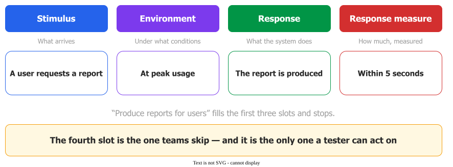

# Requirement Statements

A requirement statement is a single sentence asserting one property the system must exhibit, written
so that someone can check whether it holds. Most of the craft is in that last clause: **if you
cannot describe how you would check it, it is not a requirement yet.**

## 1. Classify by concern, not by wording

The rule usually taught — *what* the system does is functional, *how* it behaves is non-functional —
breaks as soon as the sentence is rephrased. Glinz shows this with one security requirement written
three ways :

| Wording | The old rule says |
|---|---|
| *"The system shall prevent any unauthorized access to the customer data"* | non-functional |
| *"The probability for successful access … shall be smaller than 10⁻⁵"* | non-functional |
| *"The database shall grant access to the customer data only to those users that have been authorized by their user name and password"* | **functional** |

Same requirement, three sentences, two answers: *"the kind of a requirement depends on the way we
represent it."*

The repair is to ask what the requirement was stated **for**, taking the first yes:

1. The system's **behaviour, data, input or reaction to input** — *regardless of how this is done*?
   → **functional**.
2. A restriction on **timing, processing speed, data volume or throughput**? → **performance**.
3. A **particular quality** the system shall have? → **specific quality**.
4. Any other restriction, or a prescribed solution element? → **constraint**.

Performance gets its own box for a practical reason: time, volume and throughput have agreed
measures and no other quality does, so elsewhere **agreeing the measure is part of the work**.

## 2. A quality attribute qualifies a function; it is not a parallel list

This is the relationship most often got wrong, by learning two columns — "functional requirements"
on the left, "the ilities" on the right. A quality requirement has no meaning except as a qualifier
of some behaviour .

For example, *"the system shall produce reports for users"* becomes
:

> A remote user requests a database report via the Web during peak usage and receives the report
> within five seconds.

The report's own comment is the teaching point: *"the initial requirement hasn't been lost, but the
scenario further explores the performance aspect of this requirement."* The scenario has four slots
— **stimulus, environment, response, response measure** — and the fourth turns an aspiration into a
requirement. *Modifiable* means nothing until it reads *"in less than two person-weeks"*.

## 3. Six things you can check on a sentence, four only on a document

Wiegers separates the two levels, and the split matters: a review checking all ten against every
sentence is doing the wrong work twice .

_The fourth slot is the one teams skip._ 

**On one statement:** correct · feasible · necessary · prioritised · **unambiguous** (*"the reader
should be able to draw only one interpretation of it"*) · **verifiable**.

**On the whole document:** complete · consistent · modifiable · traceable.

Two checks are cheap enough to use every time. **Testability sets granularity**: a few closely
related tests means the level is right, many different kinds of test means several requirements have
been welded together — so treat every *and* and *or* as a signal to split. And the **"call me when
you're done" test**: read the requirement from the developer's side, mentally add that phrase, and
notice whether it makes you nervous.

Wiegers also gives a closed list of words to avoid: *user-friendly, easy, simple, rapid, efficient,
several, state-of-the-art, improved, maximize, minimize, quick, if possible* — plus *support*, since
*"any requirement that says the product shall 'support' something is not verifiable."*

## 4. The limits

None of this makes a requirement set correct. Wiegers is blunt: *"there is no formulaic way to write
excellent requirements. It is largely a matter of experience."* The characteristics are a review
aid, not a gate to pass at 100%.

The deeper limit is structural: a **qualitative** requirement has no direct verification at all,
only stakeholder judgement, a prototype, refinement into sub-goals, or a proxy metric. That is the
principled reason *"the system shall be user-friendly"* is not a requirement, and it says what to do
instead.

## How solid is this?

- **Where it comes from.** A terminology paper, an SEI method description and a practitioner
  article. None reports a study or a measurement; they establish definition, classification and
  method, which is a different kind of claim from a measured finding.
- **What is contested.** Glinz's vocabulary is a **proposal** argued against competing definitions,
  not a standard. The decision rule works whether or not the field adopts the terms.
- **What we do not hold.** The six-part scenario pattern originates with Bass, Clements and Kazman
  rather than with the SEI report quoted above; and a quality attribute workshop is a one-day event
  with 5–30 stakeholders, so what transfers to a small team is the scenario form, not the workshop.

---

### Acknowledgments

This page adapts material from lectures by Eduardo Miranda and David Root
 on software project management.

### References



---

{: .highlight }
**Disclaimer:** AI is used for text summarization, polishing and explaining. Authors have verified all facts and claims. In case of an error, feel free to file an issue.
