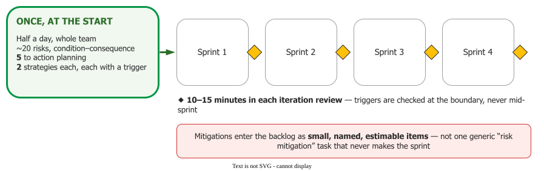

# Risk Management in Agile

Agile processes manage risk, but implicitly: *"the techniques in these processes inherently deal
with risks. However, by doing so, important steps in risk management are neglected"*
. Short iterations, demos and a risk-ordered backlog are all risk
responses; what they leave out is everything that makes a risk trackable.

## 1. Ordering the backlog is not managing risk

When a product owner puts the risky item first, they **are** thinking about risk — and then the
thinking stops, because *"the risks that make a task risky are not typically identified."* The task
is analysed; the risk is not. So there is nothing to mitigate, nothing to track, and no way to tell
afterwards whether the risk went away or has simply not bitten yet. The paper states it flatly:
**"Simply placing a higher priority on riskier tasks is not managing risk."** Four things go missing:
defined guidelines, mitigation strategies, a repository for tracking risks, and triggers saying when
to change strategy.

## 2. The case, and its diagnosis

For example, one sixteen-month build with five engineers, two paying customers and a 5,100-hour
budget did the obvious things — a risk manager, brainstorming sessions, a spreadsheet — and then
passed **several iterations without mitigating a single risk**.

The diagnosis is the transferable part. The mitigation work existed in the sprint plan as **one
generic "risk mitigation" task**: nobody could estimate it, nobody could say what *done* meant, it
never ranked high enough to make the sprint, and when other work slipped it went first.

**The fix is to break a mitigation strategy into small, named, estimable backlog items**, so it
competes for capacity instead of being a block nobody wants to pick up.

## 3. What explicit risk management costs

Not much, once it is set up :

- **Once, at the start:** a condensed taxonomy-based evaluation in **half a day with the whole team
  present**, producing about **20 risks** in condition–consequence form, of which **5** reach action
  planning with **two** strategies each.
- **Thereafter:** **10 to 15 minutes** in each iteration review.

_Half a day once, then minutes a sprint._ 

Two mechanisms make that work. Risks are identified **against an explicit
[threshold of success](../exp/tos)** — *"a set of minimum objectives that needed to be met by
projects' end for it to be called a success and against which those risks were identified."*

And each strategy carries a **trigger**: *"a specific event that may occur in the future"*, with what
to do if it occurs. Triggers are evaluated **at the iteration boundary, never mid-sprint**, since
switching strategies mid-iteration means pulling tasks out of a frozen backlog — which resolves the
apparent conflict between *respond to change* and *do not touch the sprint backlog*. Ownership
rotates, and the register lives on a team wiki.

## 4. What agile already has under other names

Two instruments in ordinary Scrum are risk work without the label . A
**knowledge-acquisition story**, or spike, delivers **information rather than function** — exactly
the response to a risk nobody can estimate yet. And **technical debt**, with its unpredictable
tipping point, is a risk register nobody wrote down.

Be honest about the gap: *Essential Scrum* contains **no formal risk log, no ownership matrix and no
risk burndown**. That machinery is absent by design, so a team that wants it must add it.

{: .note }
**Risk burndown is not from this literature.** It is defined in defence-acquisition guidance as a
**time-phased plan with measurable activities** — and its warning is the relevant one for a sprint
team: *"meetings do not burn down risks"* . The agile study's own tracking
mechanism is a top-5 risk list with triggers.

## 5. When implicit is enough

Short iterations do retire some risks by themselves: a two-week cycle limits how far a wrong
assumption travels, and a demo surfaces misunderstandings a document would not. On a small,
low-consequence project with a responsive customer, that may be all the risk management needed.

It stops being enough when a risk is **larger than an iteration** — an external dependency, a
regulatory deadline, a platform decision, a key person. Those cannot be retired by delivering a
story; they need a written statement, an owner and a trigger. If you are still addressing risks by
fixing failures as they happen, the schedule battle is lost .

## How solid is this?

- **Where it comes from.** One well-documented project — a graduate capstone with paying customers
  and experienced engineers — plus a practitioner textbook and a guidance document.
- **What is contested.** Nothing between the sources; the paper's framing is a recommendation, not a
  measured effect.
- **What we do not hold.** No evidence that explicit risk management made that project succeed. What
  is reported is that risks started being mitigated — a process outcome, not a project one.

---

### Acknowledgments

This page adapts material from lectures by Eduardo Miranda, David Root and Gil Taran
 on software project management.

### References



---

{: .highlight }
**Disclaimer:** AI is used for text summarization, polishing and explaining. Authors have verified all facts and claims. In case of an error, feel free to file an issue.
