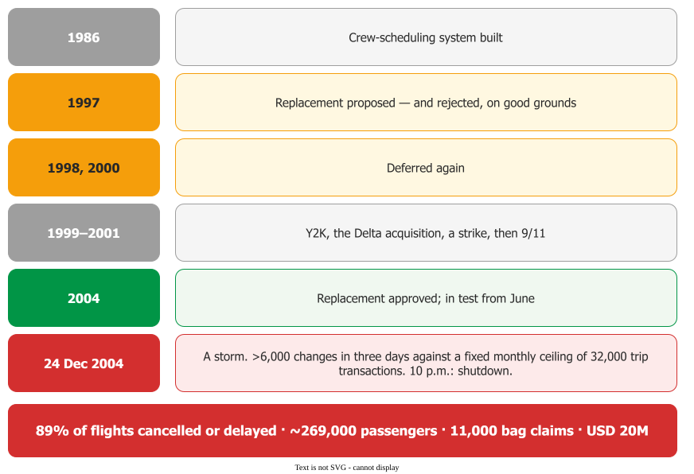
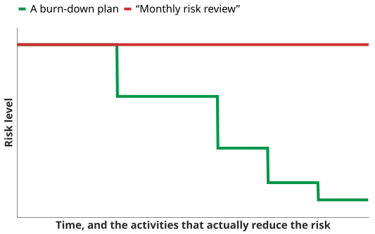
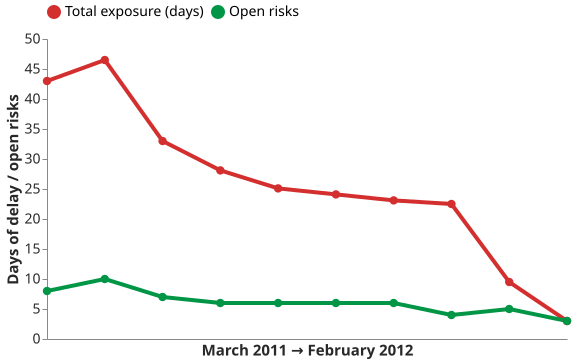

# Capturing, Owning and Mitigating Risks

A risk statement records a **condition that is true today** and the **concern** that follows. The
standard form is one line : *"Given that condition then there is concern that
(possibly) consequence."*

The minimal version needs two parts — condition plus concern. The transition may be implied; the
condition may not. That is what separates a register entry from a fear.

## 1. Start from something you can check today

Students write risks as predictions: *"the vendor might be late."* The repair is to write the
present-tense fact first. For example, on one programme the recorded conditions were **25% of the
code written against 50% of the schedule consumed**, **five workstations for a team of ten**, and
**the vendor's compiler two weeks late** . Each is observable, so nobody has
to be persuaded of the concern.

This also settles the risk-versus-problem question better than "a risk has not happened yet". Both
carry a present condition; what differs is the judgement — about the condition itself (a problem) or
about what it may lead to (a risk).

## 2. Three formats, one content

*If–then*, *condition–consequence* and *because–event–consequence* carry the same three elements:
the event or condition, the consequence, and the cause where known. Pick one and use it consistently
— a register is readable across teams because the shape is the same
.

One from a real evaluation : *"Have to support 50 terminals with 3-second
response time, but have only tested with 25; might have to buy more computers."*

**Consequences carry a number and a unit.** *"Supplier quality problems may cause program delays"*
is not a consequence; *"a 30-day delay to the start of testing"* is. Refinement sharpens the condition
while holding the consequence fixed .

{: .warning }
**A well-formed statement can still be a bad one.** *"If funding is withheld due to poor test
results, the schedule will be jeopardised"* points away from what the team controls — the real
subject is the test results .

## 3. A worked case: Comair, December 2004

Comair's crew-scheduling system was eleven years old, written in Fortran nobody at the airline was
fluent in, and the last application on an obsolete platform. It had a **fixed ceiling of 32,000 trip
transactions per month**. Severe weather forced more than 6,000 crew changes between 22 and 24
December 2004; the system hit the limit and shut down just after 10 p.m. on Christmas Eve. The
airline **cancelled or delayed 89% of its scheduled holiday-period departures**, affecting about
191,000 passengers by cancellation and 78,000 by delay , at a cost to
Comair and Delta of about $20 million .

_Not the storm. A hard-coded limit._ 

Every element of a register was present years in advance. A replacement was proposed in 1997,
rejected on good grounds, deferred four times for defensible reasons — Y2K, an acquisition, a
pilots' strike, a downturn — approved in 2004, and still in testing when the failure beat it by
months. It *"could have been avoided if Comair or Delta had done a comprehensive analysis of the risk
that this critical system posed."*

## 4. Owning and tracking

A risk with no owner is not managed. Planning one means choosing the control action, the
**observables**, the **thresholds** that say performance is still acceptable, the protocol on
exceedance, and the owner. **A mitigation with no threshold cannot trigger.**

_Mitigations burn risks down. Meetings do not._ 

_Growing early is good news._ 

The cheapest continuous practice is a **top-10 list**, and its value is one column: *last week's
rank* . Review it weekly with the project manager's boss present, opening
with every item's rank, its previous rank, how long it has been listed and what has been done since.
Two details save it from ritual: it need not hold exactly ten, and it should carry the risks that
**dropped off** .

Mitigation needs to be a plan rather than a meeting: *"risk burn-down plans should be time-phased and
include specific measurable mitigation activities; **meetings do not burn down risks**"*
. And **expect total exposure to rise before it falls** — on one twelve-month
project it went from 43 days of expected delay to 46.5, then down to 3
. A growing list early is evidence the process works; a flat or rising
line **late** is the warning.

## How solid is this?

- **Where it comes from.** Two SEI reports, a defence guidance document, a textbook and a
  practitioner conference paper. None measures whether any of this improves outcomes.
- **What is contested.** Nothing in the format, but no source shows that condition–consequence
  registers outperform free text.
- **What we do not hold.** The Comair figures come from the federal audit; the decision history is
  trade journalism, not independently corroborated here.

---

### Acknowledgments

This page adapts material from lectures by Eduardo Miranda and David Root
 on software project management.

### References



---

{: .highlight }
**Disclaimer:** AI is used for text summarization, polishing and explaining. Authors have verified all facts and claims. In case of an error, feel free to file an issue.
