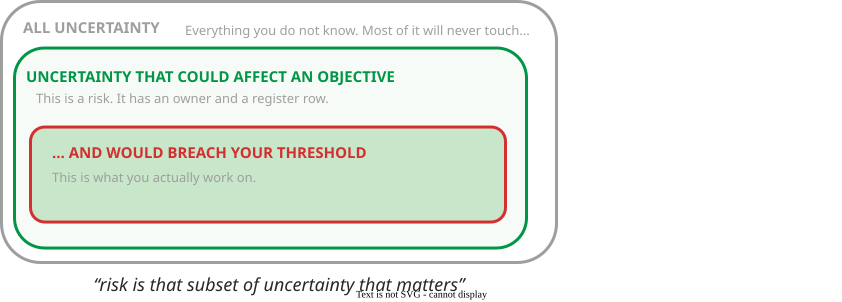
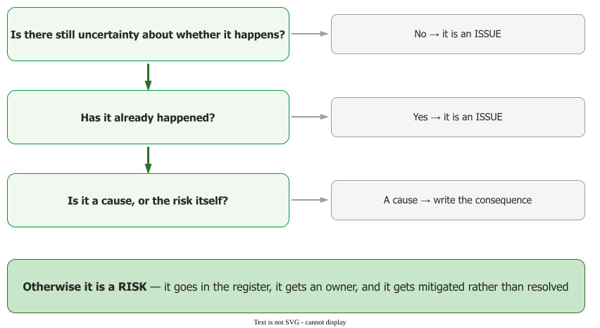
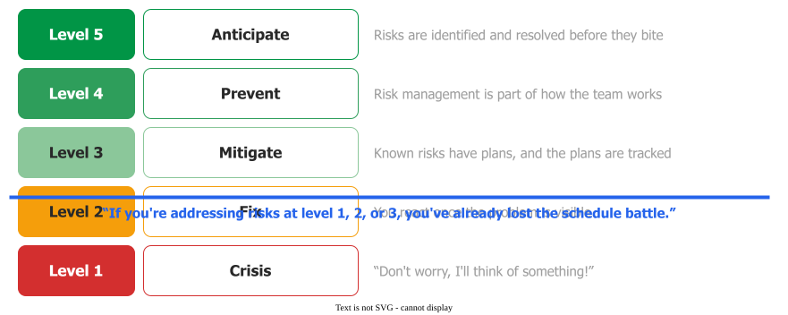
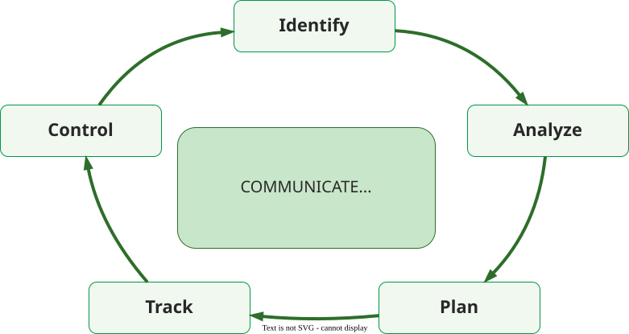

# Risk Management

A **risk** is *"uncertainty that, if it occurs, will affect achievement of objectives"*
. Not every uncertainty is a risk: the test is whether you can **name the
objective it would affect**. If you cannot, it does not belong in the register. Two components
follow, the same in every standard: a **probability** that it occurs and a **loss** if it does
.

_Risk is the subset of uncertainty that matters._ 

## 1. Risk, issue, cause

Three things routinely get filed as risks and are not.

_No uncertainty left: an issue._ 

- **An issue has already happened**, or is certain to. With no probability left to reduce, an issue
  is *resolved* rather than *mitigated*: a 100-percent-probable risk is a constraint
  .
- **A cause is not a risk.** *"Inadequate staffing"* may produce several risks — reduced quality,
  delays, turnover — and only those can be mitigated .
- **The meteor is not a risk either.** Uncertainty that could not breach your
  [threshold of success](../exp/tos) is just an event.

The SEI adopted the dictionary definition — *risk is the possibility of suffering loss* — after
printing two scholarly alternatives beside it : a documented choice.

## 2. Risk is not bad. Unmanaged risk is

*"Risk in itself is not bad; risk is essential to progress, and failure is often a key part of
learning"* . The manager balances a risk's consequences against the
opportunity attached to it — which is why the SEI's continuous practice manages **opportunities as
well as threats** .

_Risk is not bad. Unmanaged risk is._ 

The failure mode has a name: the *"Indiana Jones school of risk management"* — never worry about a
problem until it happens, then react heroically . The ladder out runs
crisis management → fix on failure → mitigation → prevention → elimination of root causes; at the
first three levels the schedule battle is already lost .

## 3. The paradigm

Five steps in a loop, with **communication running through all of them**: **identify → analyse →
plan → track → control** . Communication sits at the centre rather than as
a sixth step; without it the approach fails.

_Communicate is the hub, not a step._ 

Three named practices sit on that loop : a **Software Risk Evaluation** is
an event, **Continuous Risk Management** is a habit, **Team Risk Management** adds the customer. The
frameworks a student will meet — SEI, ISO 31000, PMI, NASA, DoD, NIST's AI framework — are that same
loop with different governance; NIST adopts ISO's definition . And risk management *"cannot be an audit, a check mark on a standard, or
something done only during 'risk management season.'"*

## 4. What the pages cover

| Page | The question it answers |
|---|---|
| [Identification](identification) | How do you find risks nobody has said out loud? |
| [Capturing, owning and mitigating](capturing) | How do you write one, own it and track it? |
| [Analysis and prioritisation](analysis) | Which few do you act on? |
| [Why we misjudge risk](biases) | Why is the estimate optimistic, and what do you do? |
| [Risk management in agile](agile) | What does this look like inside a two-week cycle? |

---

### Acknowledgments

This page adapts material from lectures by Eduardo Miranda and David Root
 on software project management.

### References



---

{: .highlight }
**Disclaimer:** AI is used for text summarization, polishing and explaining. Authors have verified all facts and claims. In case of an error, feel free to file an issue.
