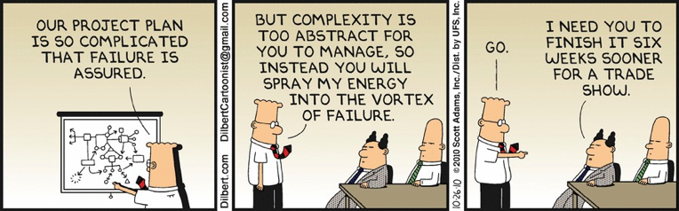
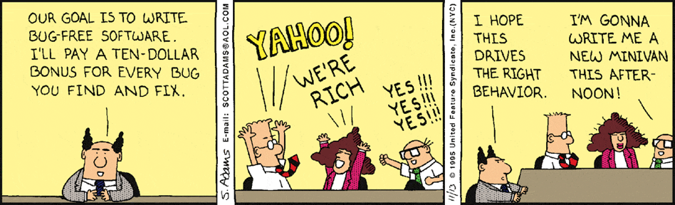
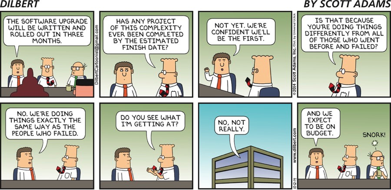

# Why do we need Management of Software Development?
_Adapted from David Root (2014)_

## Why do so many projects fail?

**CHAOS Report 2015 - Project Success Rates by Size:**

| Project Size | Successful | Challenged | Failed | Total |
|--------------|-----------|-----------|---------|-------|
| **Grand** | 6% | 51% | 43% | 100% |
| **Large** | 11% | 59% | 30% | 100% |
| **Medium** | 12% | 62% | 26% | 100% |
| **Moderate** | 24% | 64% | 12% | 100% |
| **Small** | 61% | 32% | 7% | 100% |

The Standish Group CHAOS report (2015) shows a clear correlation between project size and failure rates. Larger projects face significantly worse outcomes:
- **Grand projects**: Only 6% succeed, with 51% challenged and 43% failed
- **Small projects**: 61% succeed, with 32% challenged and only 7% failed

Overall across all project sizes, approximately 36% of projects are successful, 45% are challenged, and 19% fail.

**Success**: Delivered on time, within budget, and with the required features  
**Failure**: Cancelled before completion, or delivered but never used  
**Challenged**: Late, over budget, and/or missing required functions

Despite decades of experience:
- CMU CS department is 60 years old
- UC Berkeley’s is 40 years old
- NASA has used software since the 1950s

Yet, software development remains unpredictable compared to other engineering disciplines.

---

## Few Thoughts

### Software is Different

- **Orders of magnitude complexity**: Software systems can be vastly more complex than physical systems.
- **Intangible**: You can't touch or see software; it's abstract.
- **Perceived as "soft"**: Easy to change, but changes can have unexpected consequences.
- **Abstraction**: Both the product and the process are abstract.
- **Stakeholder understanding**: Many stakeholders do not fully understand software or its development.
- **Uniqueness**: Every software project is different; there are few universal solutions.

> **Example Question:**  
> Can code written in BASIC and in C# compile to the same machine code?  
> *Answer: Yes, if both are compiled for the same architecture, but the process and efficiency may differ greatly.*

### The Human Variable

- **#1 problem for managers:** How to motivate people?
- **Standardization challenges:**  
    - Experience varies  
    - Abilities to learn and execute tasks differ  
    - Interpersonal relationships affect team dynamics
- **Unpredictability:** Human behavior is hard to predict and control.
- **First fit problem:** Matching people to tasks is rarely perfect.

### Constraining the Human Variable

- **Processes:**  
    - Define acceptable behavior norms  
    - Direct behavior and actions  
    - Standardize responses: "See A, do B" (first fit)
        - *Pitfall:* Over-standardization can lead to "assembly line" problems—loss of creativity and adaptability.
- **Process improvement:** Continuously refine how work is done.
- **Process checking:** Ensure processes are followed and effective.
- **Communication:** Historically, communication in software teams is poor, leading to misunderstandings and mistakes.

---

## Why Study Management of Software Development?

- To understand **why projects fail** and how to improve success rates.
- To learn how to **manage complexity** and **human factors**.
- To apply **engineering discipline** to software, while recognizing its unique challenges.
- To develop skills in **process design**, **team leadership**, and **effective communication**.

---

## Acknowledgments

This content is heavily inspired by and adapted from lectures by **Eduardo Miranda** and **David Root** on software project management. The structure, examples, and pedagogical approach reflect their teaching materials and frameworks.

---

## Sources

- Root, David. *Managing Software Development*. Lecture materials, 2014.

---

{: .highlight }
**Disclaimer:** AI is used for text polishing and explaining. Authors have verified all facts and claims. In case of an error, feel free to file an issue.
