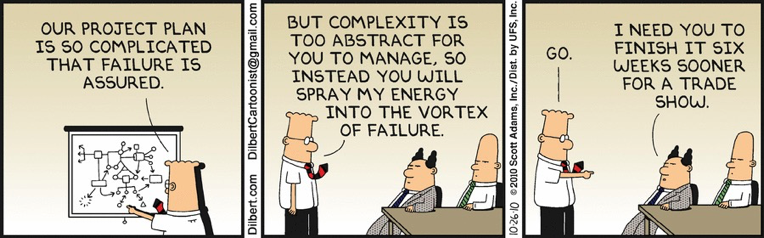
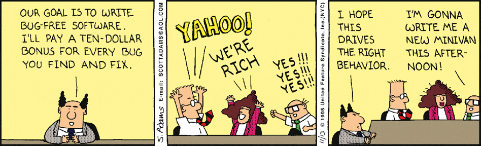
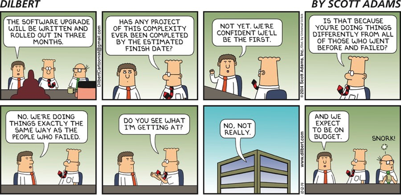

# Why do we need Management of Software Development?

_Adapted from lecture materials by David Root ._

## Why do so many projects fail?

The most-quoted answer comes from the Standish Group's CHAOS reports .
It is worth reading closely — not because the numbers are dependable, but because seeing why they
are not is the first lesson of this course.

**CHAOS 2015 — outcomes by project size, under the Modern Resolution definition:**

| Project Size | Successful | Challenged | Failed | Total |
|--------------|-----------|-----------|---------|-------|
| **Grand** | 6% | 51% | 43% | 100% |
| **Large** | 11% | 59% | 30% | 100% |
| **Medium** | 12% | 62% | 26% | 100% |
| **Moderate** | 24% | 64% | 12% | 100% |
| **Small** | 61% | 32% | 7% | 100% |

Larger projects do fare worse in this data: 6% of Grand projects are recorded successful against
61% of Small ones.

### The same projects, two answers

Standish reports outcomes under **two different definitions**, and the choice moves the headline
by seven percentage points across the same 25,000 projects:

| Definition | What counts as success | FY2015 result |
|---|---|---|
| **Traditional** | OnTime, OnBudget, **OnTarget** — the required features | 36% successful · 45% challenged · 19% failed |
| **Modern** | OnTime, OnBudget, **with a satisfactory result** | **29%** successful · **52%** challenged · 19% failed |

The table above uses the **Modern** definition; the report states that "for the rest of this
report CHAOS Resolution will refer to the Modern Resolution definition." So quoting the size
table alongside a "36% succeed" headline mixes the two — a mistake this page previously made.

{: .warning }
**Neither figure measures what it appears to measure.** Both definitions score a project by
whether it matched its own *forecast*. Eveleens and Verhoef  analysed
5,457 forecasts across 1,211 real projects and showed what follows: an organization can raise its
CHAOS score by inflating estimates. In their data the portfolio with the **worst** forecasting —
half its projects out by 233% or more — scored **67% "successful"**, because its managers
systematically overstated budgets. Two datasets with *identical* forecast quality scored 5.8% and
94.2%, differing only in the direction of the bias.

### Three things to check before using any figure like this

1. **The definition is chosen by whoever publishes the number.** Standish's own disclaimer, quoted
   by Eveleens and Verhoef, says its reports "should be considered Standish opinion and the reader
   bears all risk in the use of this opinion."
2. **The publisher may sell the remedy.** The report's top-weighted success factor is
   "Optimization" — the name of Standish's own paid service — and the text beside the size table
   offers to "break up large software projects into multiple small projects."
3. **The report disagrees with itself on its corpus**, giving "25,000-plus projects" on page 1 and
   50,000 on page 13.

None of this shows that software projects go well. It shows why, of any project metric you are
handed, the question to ask is **who chose the definition, and what happens to them if the number
moves.** That question returns in [Tracking](../track/).

Despite decades of accumulated experience — Carnegie Mellon's computer science department was
founded in 1965, and NASA has been building software since the 1950s — software development
remains harder to predict than most engineering disciplines.

---

## Few Thoughts

### Software is Different

- **Orders of magnitude complexity**: Software systems can be vastly more complex than physical systems.
- **Intangible**: You can't touch or see software; it's abstract.
- **Perceived as "soft"**: Easy to change, but changes can have unexpected consequences.
- **Abstraction**: Both the product and the process are abstract.
- **Stakeholder understanding**: Many stakeholders do not fully understand software or its development.
- **Uniqueness**: Every software project is different; there are few universal solutions.

> **Example Question:**  
> Can code written in BASIC and in C# compile to the same machine code?  
> *Answer: Yes, if both are compiled for the same architecture, but the process and efficiency may differ greatly.*

### The Human Variable

- **#1 problem for managers:** How to motivate people?
- **Standardization challenges:**  
    - Experience varies  
    - Abilities to learn and execute tasks differ  
    - Interpersonal relationships affect team dynamics
- **Unpredictability:** Human behavior is hard to predict and control.
- **First fit problem:** Matching people to tasks is rarely perfect.

### Constraining the Human Variable

- **Processes:**  
    - Define acceptable behavior norms  
    - Direct behavior and actions  
    - Standardize responses: "See A, do B" (first fit)
        - *Pitfall:* Over-standardization can lead to "assembly line" problems—loss of creativity and adaptability.
- **Process improvement:** Continuously refine how work is done.
- **Process checking:** Ensure processes are followed and effective.
- **Communication:** Historically, communication in software teams is poor, leading to misunderstandings and mistakes.

---

## Why Study Management of Software Development?

- To understand **why projects fail** and how to improve success rates.
- To learn how to **manage complexity** and **human factors**.
- To apply **engineering discipline** to software, while recognizing its unique challenges.
- To develop skills in **process design**, **team leadership**, and **effective communication**.

---

## Acknowledgments

This content is heavily inspired by and adapted from lectures by **Eduardo Miranda** and **David Root** on software project management. The structure, examples, and pedagogical approach reflect their teaching materials and frameworks.

---

### References



---

{: .highlight }
**Disclaimer:** AI is used for text polishing and explaining. Authors have verified all facts and claims. In case of an error, feel free to file an issue.
