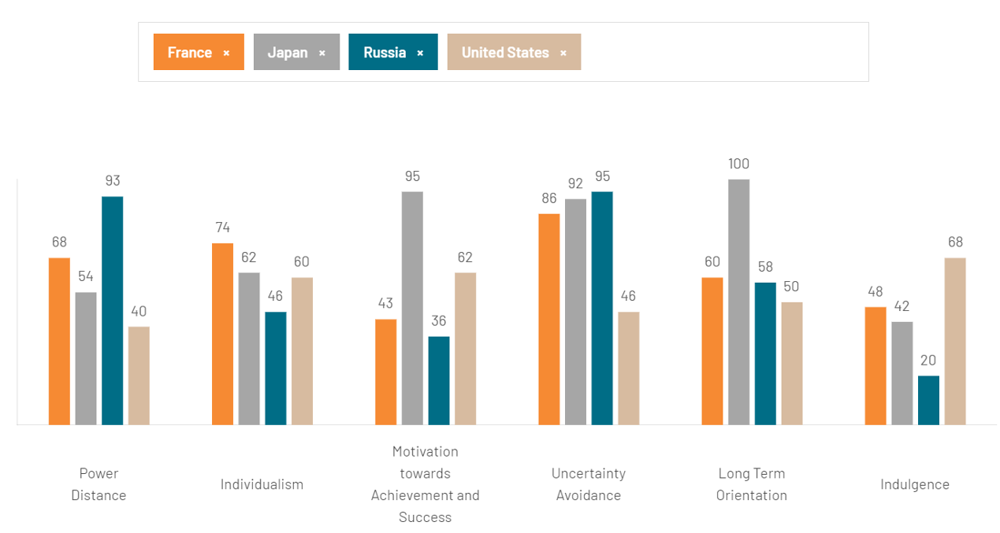

# National Culture: Hofstede's Dimensions

Hofstede's model scores a **country** — not a person — on six value dimensions, each normalised to
0–100 . They come from a 1960s–70s survey of IBM
employees: workplace-values questionnaires aggregated by country, factor-analysed into four
dimensions, later extended to six.

## 1. The six dimensions

US and France show how far comparable engineering cultures sit apart.

| Dimension | A high score means | US | France |
|---|---|---|---|
| **Power Distance (PDI)** | hierarchy and formal approval accepted; juniors defer publicly | 40 | 68 |
| **Individualism (IDV)** | personal goals and individual credit over group loyalty | 60 | 74 |
| **Motivation toward achievement (MAS)** | competition and visible success over consensus and balance | 62 | 43 |
| **Uncertainty Avoidance (UAI)** | rules, specs and formal procedure over learn-as-you-go | 48 | 76 |
| **Long-term Orientation (LTO)** | deferred payoff — architecture, debt repayment — over quick wins | 50 | 60 |
| **Indulgence (IVR)** | leisure and expressiveness over restraint and entitlement | 68 | 48 |

Hofstede called the third dimension Masculinity/Femininity; The Culture Factor now calls it
motivation towards achievement. The dimensions are **complementary lenses**: high UAI with high PDI
amplifies the preference for formal approval beyond what either predicts alone. Read the scores
*relatively* — France at 76 on UAI against the US 48 says the French half of a team wants the test
plan written down, not that any French engineer does.

*Source: [Hofstede Insights](https://www.hofstede-insights.com/country-comparison/).*

## 2. What to do with them

Use them to anticipate friction and design practices that serve both ends. Advance agendas,
architecture decision records, runbooks and post-incident reports reassure high-UAI and high-LTO
colleagues at no cost to the others; naming who decides, and by when, settles the PDI gap;
individual objectives paired with team OKRs keep credit attributable without a leaderboard. Where
public dissent is unlikely, add an anonymous channel.

## 3. A worked example

**Example — a mid-sprint scope change.** A product manager asks a mixed US–French squad to swap two
stories mid-sprint for a market window. The American engineers start that afternoon; the
French engineers want an impact assessment and a formal schedule change first, and the sprint
stalls in an argument about process. France scores 76 on Uncertainty Avoidance against the US 48
and 68 on Power Distance against 40: a change with no written impact and no named approver reads as
responsiveness to one half of the team and as an unmanaged risk to the other.

**The fix was two lanes.** A change inside a squad's own code takes the fast lane, priced at a
rollback plan and a test; anything touching a cross-team API needs a one-page change request and a
named approver. The same logic fixed code review: open discussion on the pull request, every
comment written down, module owner decides ties.

## How solid is this?

- **The IDV and LTO scores above are the post-2023 revision.** In October
  2023 The Culture Factor **replaced** its Individualism and Long-Term Orientation scores with
  figures from Michael Minkov's work, citing the age and representativeness of the original IBM
  data . The new index rests on a 2015 survey of 55 countries plus World
  Values Survey data for 47 more and correlates with the original at **r = .75**. The United States
  scored **91** on Individualism originally and **60** after the revision; **Japan now scores 62,
  above the US**, inverting the most-repeated contrast in cross-cultural teaching. If a textbook
  disagrees, check the vintage.
- **The items do not hold together at the individual level.** Venaik and Brewer
   show Hofstede's three Uncertainty Avoidance items correlating
  **0.58, 0.46 and 0.44** between countries but **0.14, 0.00 and −0.11** between individuals; the
  same holds for GLOBE. A score built from unrelated items, they conclude, is "as meaningless in
  describing individuals as would be a scale ... created by adding an individual's age, height and
  income." Country scores are valid *between* countries and invalid *within* them.
- **The current instrument performs poorly.** Gerlach and Eriksson  tested
  the VSM 2013 scales across **22,863 people in 57 countries** and found Cronbach's alpha of
  **0.04, −0.71 and 0.31** against the conventional 0.70 threshold — a *negative* alpha means the
  items pull against each other. Hofstede's own 1980 figures were 0.84 and 0.77. Their country
  scores correlated only **0.14–0.28** with the official ones, while the same samples reproduced
  nationally representative World Values Survey data at **r = 0.65** — sound samples, faulty
  instrument.
- **What follows.** National scores are statistical, not deterministic: variation within a country
  is wide and occupational cultures differ from the average. As heuristics for anticipating friction
  they stay useful; as measurements of a person they do not work.

---

### Acknowledgments

This page adapts material from lectures by Eduardo Miranda and David Root
 on software project management.

### References



---

{: .highlight }
**Disclaimer:** AI is used for text summarization, polishing and explaining. Authors have verified all facts and claims. In case of an error, feel free to file an issue.
