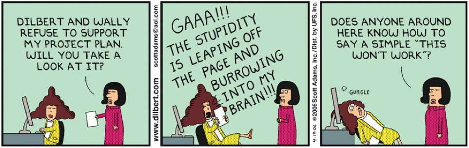

# Paul Glen: "Leading Geeks"

*Leading Geeks*  is a practitioner framework built on one claim:
technical people deliver their value through **thought rather than behaviour**, so managing them by
controlling behaviour destroys the thing being paid for.

## 1. The archetype

Because the work is cognitive and invisible, a manager cannot inspect it in progress: activity
targets, presence and process compliance all measure the wrong thing. Glen's portrait of the people
doing it is drawn to match:

- They trust technical reasoning over positional authority, grant leadership to whoever
  demonstrates competence rather than to whoever holds the title, and ignore rules and dress codes
  they have no reason to respect.
- They work in **flow** (Csikszentmihalyi) and treat interruption as loss — a day broken by meetings
  is not half a day of output — and dislike open-ended tasks and ambiguous goals.
- They are driven by the problem as much as the solution, and disengage from work requiring no
  thought.
- They read self-expression as communication, which makes them blunt, slow to notice they have been
  misunderstood, and prone to blurring facts, inferences and assumptions — especially outside the
  business domain.
- They want autonomy and peer recognition, compete in ways that cut against teamwork, and attach
  loyalty to the craft or the immediate manager rather than the company.

## 2. Motivators and de-motivators

Glen's practical core is a matched pair of lists. What motivates: inclusion in the decisions that
shape the work, a visible big picture, responsibility matched by real control, work that uses the
skills someone has, consistent rewards, room to grow, an environment worth being in. What
de-motivates is the mirror image — exclusion, hidden context, favouritism, responsibility without
authority, micromanagement, attention to *how* rather than results, evaluation against criteria
nobody stated, blame for outcomes outside one's control, and extrinsic rewards aimed at the wrong
thing.

**Example: a reward that de-motivates.** A team ships a release two weeks early because one
engineer spent a fortnight rewriting a flaky test harness. Management then hands gift cards to
everyone who logged overtime that month; the test-harness engineer kept normal hours and gets
nothing. The reward has named attendance as the valued behaviour, and the next flaky harness stays
flaky.

## 3. What Glen tells managers to do

Mentor rather than boss; manage by goals rather than quotas; let the domain expert lead inside the
domain; be honest rather than superficially positive; encourage interdependence where the work
needs it. Defend the working environment, including the unglamorous parts — HR paperwork,
parking and broken tooling demoralise teams out of proportion to the time they cost. Build the
culture deliberately: fairness, open feedback, learning from mistakes, information accessible
rather than siloed, and trust maintained through transparency so that ambiguity is survivable. When
conflict appears, go after root causes rather than symptoms, and know when to step in and when to
let the team solve it.

## 4. Does this still hold?

Glen's central claim turns out to be the sharpest available lens on AI-assisted development:

- Working through a code-generating model **does not remove programming expertise** — it
  redistributes it toward context management, evaluating generated code, and judging when to take
  manual control .
- Experienced developers describe the model as a **junior colleague**, less experienced ones as a
  **teacher** . Awareness of the tools is essentially unrelated to
  experience, so senior reluctance is a considered position rather than an information gap, and
  "more training" is the wrong response to it.
- The verification work lands on **core** developers, who in one large study reviewed 6.5% more
  code while their own output fell 19% .

Read with Glen: work that removes the thinking and adds verification burden is a de-motivator by
his own account — and it falls hardest on the people the team can least afford to lose.

## How solid is this?

- **Where it comes from.** Glen rests the account on "more than fifteen years working with,
  leading, managing, coaching, and cajoling geeks in academic and business environments" —
  experience presented as argument, with no study behind it. Useful vocabulary, not evidence, and
  a **2003** characterisation of a workforce that has changed considerably since.
- **What is contested.** Cruz and colleagues  found no consistent
  personality profile across forty years of software-engineering studies, so §1 is a vocabulary,
  not a description of the population.
- **Heuristics, not measurements.** Glen's "80/20" framing of conflict causes is a rule of thumb;
  no measured distribution of team conflict is being claimed.
- **Where the evidence actually is.** For what motivates software engineers, see Beecham and
  colleagues' systematic review . Herzberg's original
  motivator–hygiene work  — 12 investigations, 1,685 employees — was
  carried out on **engineers and accountants**, which makes it unusually well matched to this
  audience.

---

### Acknowledgments

This page adapts material from lectures by Eduardo Miranda and David Root
 on software project management.

### References



---

{: .highlight }
**Disclaimer:** AI is used for text summarization, polishing and explaining. Authors have verified all facts and claims. In case of an error, feel free to file an issue.
