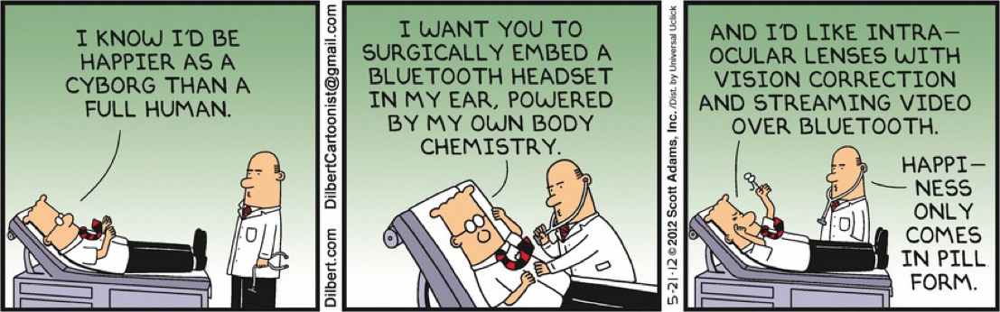
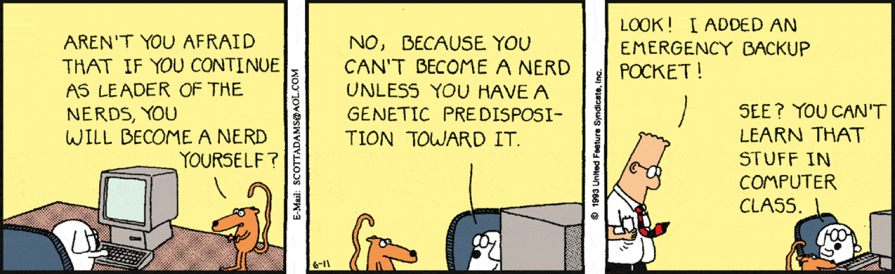

# Personalities and Management Styles

_Adapted from lecture materials by David Root ._

Technical people require management approaches that account for their characteristics,
communication styles and motivations. This section covers four things:

- **[Paul Glen's "Leading Geeks" framework](glen.html)** — the archetype this area is built on,
  and what has since been tested
- **[MBTI and personality types](mbti.html)** — widely used, weakly evidenced; read the caveats
- **[National culture](culture.html)** — Hofstede's dimensions and the two criticisms that carry
  numbers
- **[Leadership styles](lead.html)** — Goleman's six styles and where their evidence comes from

---

## Who Are Technical People?

**Definitions:**  
Technical people are not just IT specialists—they include anyone working with technical subjects:
- Medicine
- Research
- Engineering
- Science
- Data analysis
- And more

**Stereotypes:**  
Often called techies, geeks, nerds, dweebs, etc.  
- Not always computer-focused
- Stereotypes about dress and hygiene (often exaggerated)
- May be less sociable outside their domain
- Affinity for games, role-playing, and niche hobbies (e.g., D&D, online games)
- Sometimes seen as blunt or direct

{: .warning }
**Treat this list as history, not description.** It is a characterisation from the early 2000s
management literature — see [Glen](glen.html) — and it has not held up. Cruz and colleagues
 reviewed forty years of personality research in software engineering and
found **no consistent profile** across the studies that reported one. Managing on the basis of an
archetype is precisely what the evidence does not support.

---

---

## What has actually changed

The more useful question in 2026 is not what a technical person is *like*, but what their work
now consists of.

- Working through a code-generating model **does not remove programming expertise** — it
  redistributes it toward context management, evaluating generated code, and judging when to take
  manual control .
- Experience does not predict whether someone adopts these tools, but it strongly shapes how they
  frame them: experienced developers describe the model as a **junior colleague**, less
  experienced ones as a **teacher** . Awareness of the tools is
  essentially unrelated to experience — so senior reluctance is a considered position rather than
  an information gap, and "more training" is the wrong response to it.

---

## Acknowledgments

This content is heavily inspired by and adapted from lectures by **Eduardo Miranda** and
**David Root**  on software project management. The structure,
examples, and pedagogical approach reflect their teaching materials and frameworks.

---

### References



---

{: .highlight }
**Disclaimer:** AI is used for text polishing and explaining. Authors have verified all facts and claims. In case of an error, feel free to file an issue.
