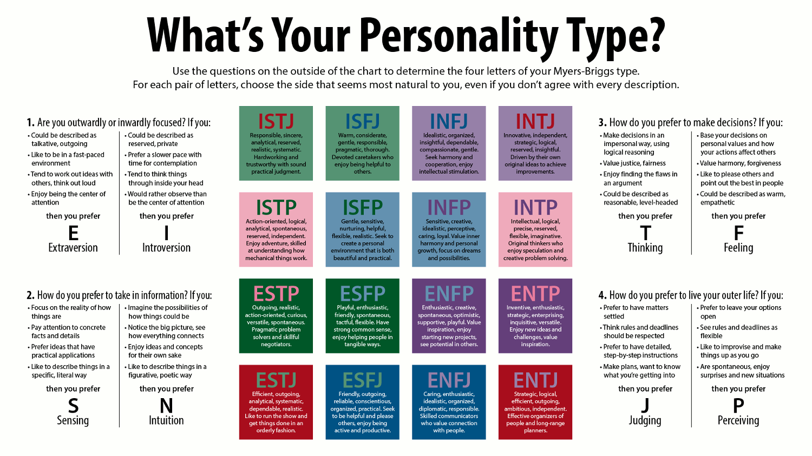
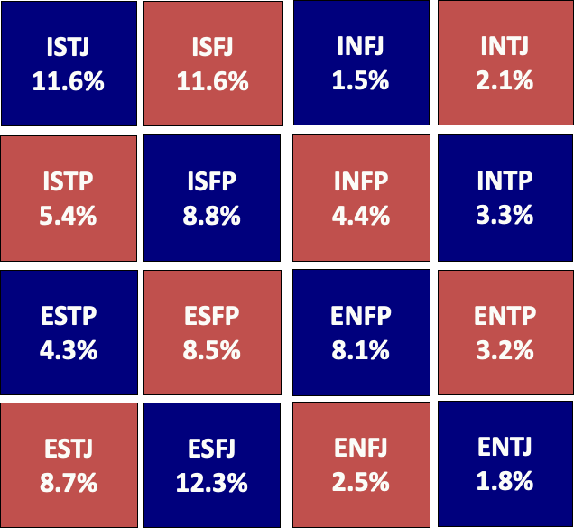
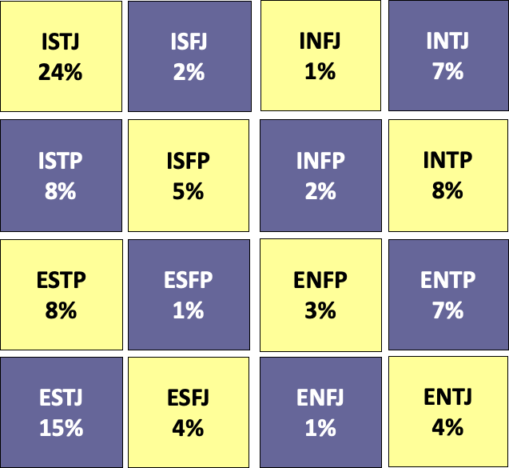

# MBTI: An Example of Personality Typing

The Myers-Briggs Type Indicator (MBTI) is a popular framework for understanding personality differences.  
It is based on research by Carl Jung, Katherine C. Briggs, and Isabel Briggs Myers.

## Four Basic Personality Areas

- **Extraverted (E) or Introverted (I):**  
  Where do you get your energy?  
  - E: From external sources, social interaction, and activity  
  - I: From within, reflection, and solitude

- **Sensing (S) or iNtuitive (N):**  
  How do you absorb information?  
  - S: Through the senses, focusing on facts and details  
  - N: Via instincts, patterns, and possibilities

- **Thinking (T) or Feeling (F):**  
  How do you make decisions?  
  - T: Using logic and objectivity  
  - F: Using personal, subjective values and empathy

- **Judging (J) or Perceiving (P):**  
  How do you approach the external world?  
  - J: Prefer organized, scheduled, and structured environments  
  - P: Prefer flexible, adaptable, and open-ended environments

---

## MBTI with Software Engineers

**Source:** Capretz, Luiz Fernando. "Personality types in software engineering." International Journal of Human-Computer Studies 58.2 (2003): 207-214.

Research shows that the distribution of MBTI types among software engineers is very different from the general US population.

*MBTI distribution in the general US population*

*MBTI distribution among software engineers*

### Notable MBTI Differences in Software Engineers

Research highlights significant differences between the MBTI profiles of software engineers and the general US population:

- **ISTJ:** About twice as common among software engineers (24% vs 12%).  
  *ISTJs are detail-oriented, logical, and reliable—traits that fit well with the demands of software development.*
- **ISFJ:** About five times less common among software engineers.  
  *ISFJs tend to be more focused on harmony and personal values, which may be less emphasized in technical roles.*
- **INTJ:** Roughly three times more common among software engineers.  
  *INTJs are strategic, independent, and enjoy solving complex problems—qualities highly valued in engineering.*
- **ESFP:** About eight times less common among software engineers.  
  *ESFPs are outgoing and spontaneous, preferring hands-on activities and social interaction, which are less central in most software roles.*

---

## Why is this the case?

Software engineering tends to attract people who:
- Prefer working independently or in small groups (**Introverts**)
- Value logic, structure, and detail (**Thinking**, **Judging**, **Sensing**)
- Enjoy solving complex problems and thinking abstractly (**Intuitive**, **Thinking**)
- Appreciate clear goals and organized environments (**Judging**)

**Example:**  
An ISTJ (Introverted, Sensing, Thinking, Judging) may thrive in roles requiring careful analysis, attention to detail, and methodical problem-solving—traits highly valued in software development.  
An INTJ (Introverted, Intuitive, Thinking, Judging) might excel at designing system architecture or developing innovative solutions, thanks to their strategic and analytical mindset.

---

## Applying MBTI Insights to Team Leadership

Understanding MBTI profiles can help managers:

- **Tailor communication:**  
  - *Introverts* may prefer written updates or one-on-one meetings.  
  - *Extraverts* may enjoy group discussions and brainstorming sessions.
- **Assign tasks:**  
  - *Judging types* often excel at planning, meeting deadlines, and organizing work.  
  - *Perceiving types* may be better at adapting to change, handling uncertainty, and generating creative ideas.
- **Motivate teams:**  
  - *Thinking types* respond well to logical arguments, clear goals, and constructive feedback.  
  - *Feeling types* appreciate recognition, team harmony, and supportive environments.
- **Build balanced teams:**  
  - Mix personality types to cover strengths and weaknesses.  
  - For example, pair detail-oriented ISTJs with big-picture INTJs, or add Perceiving types to encourage flexibility and innovation.

**Example:**  
If your team is mostly INTJs and ISTJs, you may need to consciously encourage brainstorming and creative risk-taking, or recruit more Perceiving types to foster adaptability and openness to new
---

{: .highlight }
**Disclaimer:** AI is used for text polishing and explaining. Authors have verified all facts and claims. In case of an error, feel free to file an issue.
