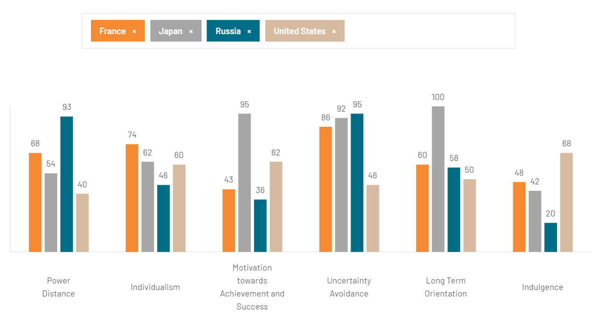
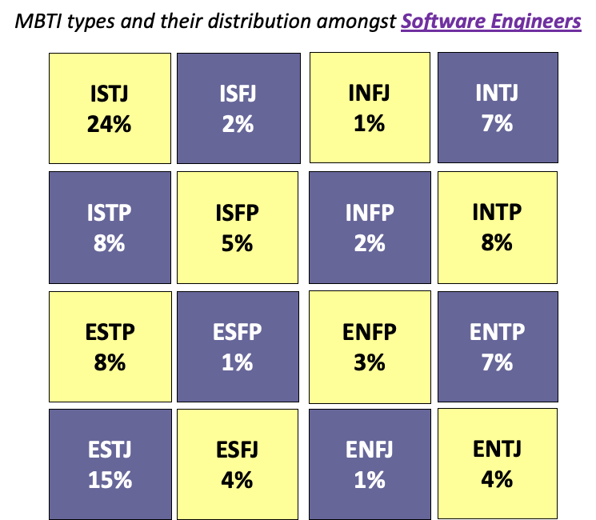

# MBTI: An Example of Personality Typing

The Myers-Briggs Type Indicator (MBTI) is a popular framework for understanding personality differences.  
It is based on research by Carl Jung, Katherine C. Briggs, and Isabel Briggs Myers.

## Four Basic Personality Areas

- **Extraverted (E) or Introverted (I):**  
  Where do you get your energy?  
  - E: From external sources, social interaction, and activity  
  - I: From within, reflection, and solitude

- **Sensing (S) or iNtuitive (N):**  
  How do you absorb information?  
  - S: Through the senses, focusing on facts and details  
  - N: Via instincts, patterns, and possibilities

- **Thinking (T) or Feeling (F):**  
  How do you make decisions?  
  - T: Using logic and objectivity  
  - F: Using personal, subjective values and empathy

- **Judging (J) or Perceiving (P):**  
  How do you approach the external world?  
  - J: Prefer organized, scheduled, and structured environments  
  - P: Prefer flexible, adaptable, and open-ended environments

---

## MBTI with Software Engineers

**Source:** Capretz, Luiz Fernando. "Personality types in software engineering." International Journal of Human-Computer Studies 58.2 (2003): 207-214.

Research shows that the distribution of MBTI types among software engineers is very different from the general US population.

*MBTI distribution in the general US population*

*MBTI distribution among software engineers*

### Huge disproportion/difference examples:
- **ISTJ:** 2x more common among software engineers (24% vs 12%)
- **ISFJ:** 10x more common
- **INTJ:** 3x more common
- **ESFP:** 8x more common

---

## How can this be explained?

Software engineering tends to attract people who:
- Prefer working independently or in small groups (Introverts)
- Value logic, structure, and detail (Thinking, Judging, Sensing)
- Enjoy solving complex problems and thinking abstractly (Intuitive, Thinking)
- Appreciate clear goals and organized environments (Judging)

**Example:**  
An ISTJ (Introverted, Sensing, Thinking, Judging) may thrive in roles requiring careful analysis, attention to detail, and methodical problem-solving—traits highly valued in software development.

---

## How can this knowledge be used in leading software engineers?

Understanding MBTI profiles can help managers:
- **Tailor communication:** Introverts may prefer written updates or one-on-one meetings; extraverts may enjoy group discussions.
- **Assign tasks:** Judging types may excel at planning and deadlines; Perceiving types may be better at adapting to change and brainstorming.
- **Motivate teams:** Thinking types respond well to logical arguments and clear goals; Feeling types appreciate recognition and team harmony.
- **Build balanced teams:** Mix personality types to cover strengths and weaknesses (e.g., pair detail-oriented ISTJs with big-picture INTJs).

**Example:**  
If your team is mostly INTJs and ISTJs, you may need to consciously encourage brainstorming and creative risk-taking, or add more Perceiving types to foster adaptability.

---

{: .highlight }
**Disclaimer:** AI is used for text polishing and explaining. Authors have verified all facts and claims.

