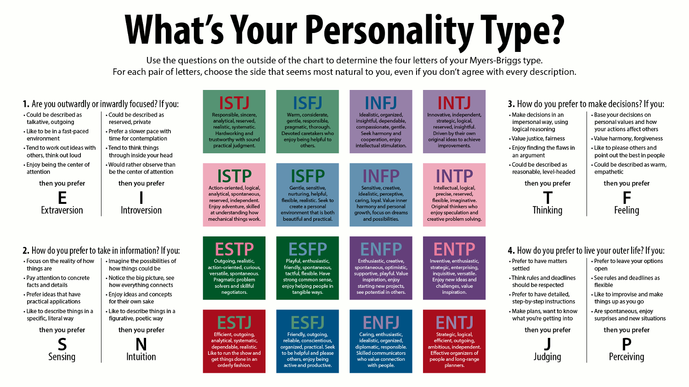

# MBTI: An Example of Personality Typing

The Myers-Briggs Type Indicator sorts people into sixteen types along four preference pairs, and is
the personality instrument software managers meet most often. It descends from Carl Jung, via
Katherine C. Briggs and Isabel Briggs Myers.

## 1. The four preference pairs

Each pair asks one question; each answer contributes a letter:

- **Extraverted (E) or Introverted (I)** — where energy comes from: external activity, or
  reflection.
- **Sensing (S) or iNtuitive (N)** — how information arrives: through the senses, facts and detail,
  or through instinct and patterns.
- **Thinking (T) or Feeling (F)** — how decisions are made: by logic, or by personal values and
  empathy.
- **Judging (J) or Perceiving (P)** — how the outside world is met: organised and scheduled, or
  flexible and open-ended.

_Myers-Briggs personality types._ ([Source](https://commons.wikimedia.org/wiki/File:MyersBriggsTypes.svg))

## 2. Software engineers against the population

Capretz  compared software engineers' MBTI types against a US
population baseline. Read *How solid is this?* before quoting either row.

**MBTI distribution in the general US population:**

| Type | ISTJ | ISFJ | INFJ | INTJ |
|---|---|---|---|---|
| **%** | 11.6% | 13.8% | 1.5% | 2.1% |
| **Type** | **ISTP** | **ISFP** | **INFP** | **INTP** |
| **%** | 5.4% | 8.8% | 4.4% | 3.3% |
| **Type** | **ESTP** | **ESFP** | **ENFP** | **ENTP** |
| **%** | 4.3% | 8.5% | 8.1% | 3.2% |
| **Type** | **ESTJ** | **ESFJ** | **ENFJ** | **ENTJ** |
| **%** | 8.7% | 12.3% | 2.5% | 1.8% |

**MBTI distribution among software engineers:**

| Type | ISTJ | ISFJ | INFJ | INTJ |
|---|---|---|---|---|
| **%** | 24% | 2% | 1% | 7% |
| **Type** | **ISTP** | **ISFP** | **INFP** | **INTP** |
| **%** | 8% | 5% | 2% | 8% |
| **Type** | **ESTP** | **ESFP** | **ENFP** | **ENTP** |
| **%** | 8% | 1% | 3% | 7% |
| **Type** | **ESTJ** | **ESFJ** | **ENFJ** | **ENTJ** |
| **%** | 15% | 4% | 1% | 4% |

Four contrasts carry the comparison. **ISTJ** is about twice as common among software engineers
(24% against 11.6%) and **INTJ** about three times as common (7% against 2.1%) — the detail-driven
and strategy-driven variants of one preference set. In the other
direction **ISFJ** is roughly seven times rarer (2% against 13.8%) and **ESFP** roughly eight times
rarer (1% against 8.5%); both are the sociable, harmony-oriented types. This is self-selection into
an occupation, not a description of any individual engineer.

## 3. Can you build a team from personality types?

This is the question managers want answered, and where the literature stops helping.

{: .warning }
**There is no evidence that personality composition predicts how a software team performs.**
Soomro and colleagues  searched 22 years of literature for this
link and found no association. Advice to "mix personality types" or pair particular four-letter
codes is folk practice, not a finding — and this handbook previously presented it as guidance. The
same applies to type-based prescriptions for communication, task assignment and motivation:
plausible, widely repeated, untested.

What does predict team performance is a different list:

- **Psychological safety** — whether people can admit mistakes and raise problems without penalty —
  predicts team behaviour and software quality with real effect sizes ,
  and outranks every diversity variable tested . See
  [Trust and psychological safety](../teams/).
- **Stable membership** matters more than co-location: occasional recomposition degrades a team's
  behaviour considerably more than distance does .
- **Autonomy** is the work-design factor most reliably associated with psychological safety
  .

A manager can change all three; personality type is not one of them.

## 4. So what is MBTI good for here?

As a vocabulary for self-reflection and a prompt for conversations about working style — roughly
how Capretz uses it. **For example,** an engineer who says in a retrospective "I need the design
written down before the meeting rather than discovered during it" has started a useful
conversation; routing that engineer to documentation because a table says ISTJ has not. As a
selection or team-composition instrument MBTI is unsupported, and Capretz notes that no personality
instrument reliably predicts success in the field.

## How solid is this?

- **The sample behind the tables.** Capretz surveyed **100** people (80% men) with MBTI Form G — a
  convenience sample of students, government employees and company staff selected by occupation,
  with no sampling frame and **no significance test reported**. Respondents were Canadian; the
  baseline is the 1998 *MBTI Manual* US figures. Capretz notes the 81/19 thinking–feeling split may
  partly reflect the 80/20 gender split. Treat the contrast as suggestive, not as a measured
  population difference.
- **No profile replicates.** Cruz and colleagues  surveyed forty years of
  this literature and found **no consistent software-engineering personality profile** across the
  studies reporting one.
- **Absence of evidence, not evidence of absence.** Soomro retrieved **35** studies, of which only
  **12** addressed the personality–team-climate question at all and only **9** measured
  personality; **none** found an association. Too few asked, too inconsistently, to support a
  pooled estimate either way. What the review rules out is confident advice, in either direction.

---

### Acknowledgments

This page adapts material from lectures by Eduardo Miranda and David Root
 on software project management.

### References



---

{: .highlight }
**Disclaimer:** AI is used for text summarization, polishing and explaining. Authors have verified all facts and claims. In case of an error, feel free to file an issue.
