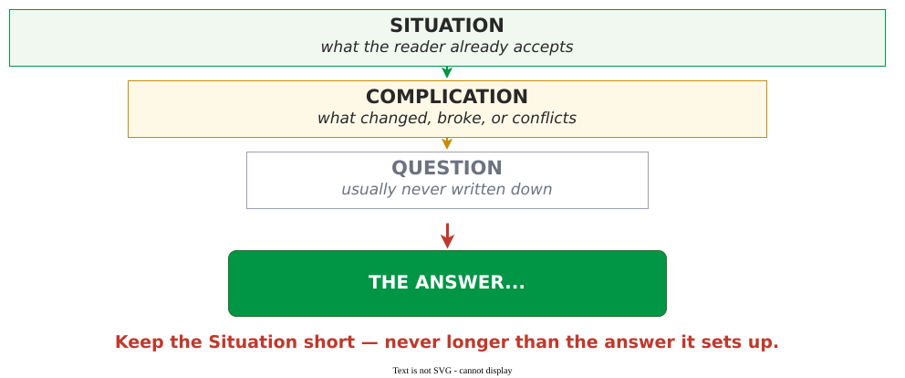

# The Minto Pyramid

The Minto pyramid is a rule for ordering a document: **state your answer first, then the reasons
that support it, then the evidence under each reason** . You think
bottom-up, from data to finding; you present top-down, from finding to data.

Barbara Minto developed it at McKinsey in the 1960s while teaching consultants to write. Her
diagnosis was that unclear writing is rarely a problem of sentences or vocabulary but of order:
most prose follows the sequence the thinking happened in, which is the one sequence a reader
cannot use.

## The shape

Every document supports **one** governing claim; beneath it sit the reasons, and beneath each
reason, the evidence. Minto gives three rules:

- Ideas at any level must be **summaries** of the ideas grouped below them.
- Ideas in a grouping must be the **same kind** of idea.
- Ideas in a grouping must be **logically ordered** — deductively, chronologically, structurally,
  or by importance.

Any claim that tells the reader something new raises a *why?* or *how?*, which the level below
must answer — so the discipline is to *"refrain from raising any questions in the reader's mind
before you are ready to answer them"* .

## Grouping: the plural-noun test

A grouping holds only if you can name it. Minto's check is that *"you can clearly label the ideas
with a plural noun"*  — reasons, problems, steps, options. If the only
word covering your list is *points* or *things*, the grouping is wrong, and the fix is in the
analysis rather than the wording. This is the requirement usually called MECE, in a form you can
apply in seconds.

Three is a convention, not a rule. Minto grounds the count in short-term memory: the mind holds
about seven items, and *"a convenient number is three, but of course the easiest number is one."*
Two reasons that genuinely cover the question beat three where one is a detail in disguise.

## Deductive and inductive groupings

Reasons are joined one of two ways, never both at once. A **deductive** grouping is a chain —
this is true, that follows, therefore. An **inductive** grouping is a set of independent points
sharing one characteristic, from which you draw an inference.

Deduction is how problems get solved; induction is how findings should be presented. A deductive
document makes the reader re-enact the analysis before learning anything, and it fails at its
weakest link — knock out one reason of three in an inductive grouping and two still stand.

## The introduction: SCQA

The answer should not arrive cold. Minto's introduction puts the reader on ground they already
accept, so the conclusion lands as the answer to a question they now hold:

The **Question** is usually never written down — a Complication that does its job raises it
unaided, and if you must spell it out, the Complication was too weak. Keep the Situation short; a
bloated Situation is the commonest failure, because it is the safest part to write.

## In practice

For example, a proposal to replace a logging library arrives bottom-up: a terabyte a day, three
services failing in a cascade at peak load, sixteen engineer-hours a week lost to firefighting, a
rewrite estimated at two engineer-months, and — in the last line — a recommendation to rewrite it.
In pyramid order it opens *"rewrite the logging library this quarter: two engineer-months, breaking
even in five"*, then the three reasons with their measurements beneath. Nothing is added and nothing
cut; only the order changes, and the hedge disappears because the evidence never supported it.

The same holds for a heading: *"Logging library analysis"* asserts nothing, while *"the logging
library costs sixteen engineer-hours a week"* is a claim a reader can act on or dispute. A useful
check is to read only your titles, in order — an argument, or a table of contents?

## Limitations

The pyramid is for documents asking a reader to accept a judgment or make a decision. **It is the
wrong shape where chronology is the content** — incident write-ups, runbooks, procedures, project
timelines — because time order is already the logical order. It is also wrong for exploratory work:
it demands a conclusion, and forcing one you have not reached yields a confident document built on
nothing.

Where the audience will reject the conclusion before hearing why, lead with the shared problem
and let the answer land a beat later — still in the first paragraph. And structure is no guarantee
of correctness: a well-built pyramid over bad evidence only makes a wrong conclusion easier to
find.

## How solid is this?

This is a **practitioner framework, not an empirical finding.** It rests on Minto's experience
teaching writing at McKinsey from 1966 and argues from worked examples rather than studies. There is
no controlled evidence that pyramid-ordered documents produce better decisions.

Its one external support is George Miller's *"The Magical Number Seven, Plus or Minus Two"*. Miller's
limit is real but concerns short-term recall of unrelated items — a weaker claim than "a reader can
follow only three reasons." That inference is Minto's, not Miller's.

Note also that the **revised 2009 edition has no chapter on oral presentations**: Chapter 6, *How to
highlight the structure*, concerns headings, underlining and numbering on the page. Advice about
delivering slides is an application of her structure by others, not the book's.

---

### References



---

{: .highlight }
**Disclaimer:** AI is used for text summarization, polishing and explaining. Authors have verified all facts and claims. In case of an error, feel free to file an issue.
