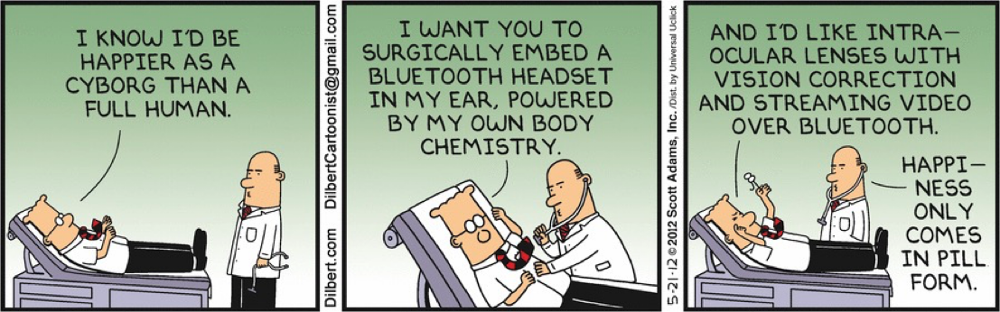

# Personalities and Management Styles

## Objectives

Technical people are still people!  
To manage effectively, you must:
- Communicate clearly and listen actively
- Be predictable and transparent
- Show appreciation and respect

**Goals for this section:**
- Refine your understanding of technical people
- Recognize how various factors impact human interactions
- Learn to understand others by reflecting on yourself
- Analyze and address people-related problems in teams
- Strengthen your skills in managing people

---

## Who Are Technical People?

**Definitions:**  
Technical people are not just IT specialists—they include anyone working with technical subjects:
- Medicine
- Research
- Engineering
- Science
- Data analysis
- And more

**Stereotypes:**  
Often called techies, geeks, nerds, dweebs, etc.  
- Not always computer-focused
- Stereotypes about dress and hygiene (often exaggerated)
- May be less sociable outside their domain
- Affinity for games, role-playing, and niche hobbies (e.g., D&D, online games)
- Sometimes seen as blunt or direct

---

## Paul Glen: "Leading Geeks"

**General Characteristics:**
- Respect for technology and rational thinking
- Prefer logical, analytical decisions; dislike emotional reasoning
- May struggle with ambiguity and "grey areas"
- Driven by problem-solving, sometimes more than solutions
- Dislike rote, non-creative work
- Value autonomy and personal space

**Flow (Csikszentmihalyi):**
- Thrive when moving from problem to solution
- Dislike open-ended tasks and interruptions
- Disruption of flow can be disastrous (e.g., constant meetings, unclear goals)

---

## Communication

- May equate self-expression with communication, but not always recognize miscommunication
- Can be blunt or direct; value intelligence and quick thinking
- Sometimes struggle to distinguish facts, inferences, and assumptions
- Loyalty often to job type or immediate manager, not company
- Distrust of authority and rigid rules
- May not always understand the business domain, leading to gaps in communication

---

## Groups & Authority

- Seek peer recognition and acceptance
- Competitive, which can challenge teamwork
- Prefer working alone but recognize group dynamics
- Often ignore rules, dress codes, and standards unless respected
- Value domain expertise over formal authority
- Rebels in spirit; value autonomy and personal space
- Defacto leaders may emerge based on expertise, not title

---

## Motivation & De-motivators

**What motivates technical people?**
- Inclusion in decision making
- Clear understanding of the big picture and project goals
- Consistent rewards and recognition
- Responsibility matched to control
- Effective use of technical skills
- Positive work environment and perks (e.g., flexible hours, free food)
- Opportunities for growth and learning

**De-motivators:**
- Exclusion from decisions
- Lack of transparency or hiding the big picture
- Inconsistent rewards/punishments
- Favoritism ("pet" focus on individuals)
- Responsibility without authority or control
- Poor use of extrinsic motivators (e.g., meaningless bonuses)
- Micromanagement
- Focus on tasks and "how" instead of results
- Evaluations without clear criteria
- Assigning blame for issues outside their control

*Examples of poor extrinsic motivators:*  
Giving gift cards for attendance, but not for innovation or problem-solving.  
Rewarding only those who work overtime, rather than those who deliver quality solutions.

---

## Leadership: Glen’s Ideas

- Mentor, don’t boss—guide and support rather than control
- Manage by goals, not quotas—focus on outcomes, not just numbers
- Recognize and use technical competency—let experts lead in their domain
- Accentuate the positive—be honest, not superficial
- Foster a supportive physical and social environment—address annoyances and create space for focused work
- Promote healthy interdependencies—encourage collaboration where appropriate

---

## Common Obstacles

- **Conflict resolution:**  
  Most issues stem from a few sources (80/20 rule). Address root causes, not just symptoms.
- **Annoying tasks:**  
  HR paperwork, parking, and other non-technical hassles can demotivate teams.
- **Culture building:**  
  Promote honesty, fairness, and a helping team spirit. Encourage open feedback and learning from mistakes.
- **Communication flows:**  
  Facilitate open communication—avoid secrecy and silos. Make information accessible.
- **Trust and ambiguity:**  
  Build trust through transparency and consistency. Help teams manage uncertainty and change.
- **Patience and intervention:**  
  Know when to step in and when to let teams solve problems independently. Practice patience and support.

---

{: .highlight }
**Disclaimer:** AI is used for text polishing and explaining. Authors have verified all facts and claims. In case of an error, feel free to file an