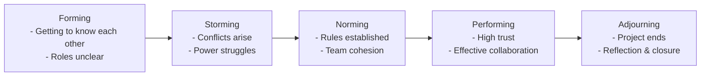

# Team Formation
_*Adapted from David Root (2014)_

## Building a Team: Tasks, People, Relationships

When forming a software development team, consider three key areas (Source: Thomson 1973):

### 1. Task Analysis
- **What work needs to be performed?**  
  *Example:* Coding, testing, documentation, deployment.
- **How much authority does the group have to manage its own work?**  
  *Example:* Can the team choose its own tools and processes?
- **What is the focus of the group's work?**  
  *Example:* Feature development, bug fixing, research.
- **Degree of interdependence among team members?**  
  *Example:* Pair programming vs. solo tasks.
- **Is there only one correct solution, or are there several possibilities?**  
  *Example:* Algorithm selection may have multiple valid approaches.
- **Are team members' interests aligned or competitive?**  
  *Example:* Shared goal of shipping a product vs. competing for recognition.

### 2. People
- **How many people should be on the team?**  
  *Example:* Small teams (3-7) for Agile; larger for waterfall projects.
- **Who is ideally suited to do the work?**  
  *Example:* Backend developer for API tasks, QA for testing.
- **What technical, task-management, and interpersonal skills are required?**  
  *Example:* Python expertise, project management, communication.
- **What type and level of diversity is optimal?**  
  *Example:* Mix of junior and senior engineers, varied backgrounds.

### 3. Relationships
- **How do team members socialize each other?**  
  *Example:* Team lunches, online chats, onboarding buddies.
- **What roles are (implicitly) negotiated among team members?**  
  *Example:* Natural leaders, mentors, note-takers.
- **What norms are conducive or harmful for the group?**  
  *Example:* Code review etiquette, meeting punctuality.
- **Is cohesion among team members important?**  
  *Example:* High cohesion boosts morale and productivity.
- **How is trust developed, threatened, and rebuilt?**  
  *Example:* Trust grows through reliability; is threatened by missed deadlines; rebuilt via transparency.

---

## Successful Team Performance: An Integrated Model (Source: Steiner 1972)

### Team Context
- **Organizational Context:**  
  *Example:* Company culture, management support.
- **Team Design:**  
  *Example:* Roles, responsibilities, structure.
- **Team Culture:**  
  *Example:* Shared values, communication style.

### Essential Conditions
- **Ability:**  
  - Knowledge, skills, education, information.
  - *Example:* Experienced developers, access to documentation.
- **Motivation:**  
  - Intrinsic (personal satisfaction), extrinsic (rewards).
  - *Example:* Passion for coding, bonuses for delivery.
- **Strategy:**  
  - Communication, coordination.
  - *Example:* Daily stand-ups, Slack channels.

### Team Performance
- **Productivity:**  
  *Example:* Number of features delivered.
- **Cohesion:**  
  *Example:* Team members support each other.
- **Learning:**  
  *Example:* Sharing new tools or techniques.
- **Integration:**  
  *Example:* Seamless collaboration across roles.

---

## Team Development Stages (Bruce Tuckman, 1965)

Tuckman’s model describes how teams evolve through five stages. Understanding these helps software teams work more effectively.

### 1. Forming
- **Definition:** Team members meet and start to understand the project.
- **Characteristics:** Polite, uncertain, roles unclear, leader-driven.
- **Strategies:** Clarify goals, encourage introductions, set expectations.
- **Example:** A new Scrum team meets for sprint planning, learning about each other and the project.

### 2. Storming
- **Definition:** Conflicts and differences emerge.
- **Characteristics:** Disagreements, power struggles, frustration.
- **Strategies:** Facilitate open communication, mediate conflicts, set ground rules.
- **Example:** Developers debate whether to use GitHub Actions or Jenkins for CI/CD.

### 3. Norming
- **Definition:** Team establishes harmony and shared norms.
- **Characteristics:** Cohesion, agreed rules, mutual support.
- **Strategies:** Reinforce collaboration, define working agreements, recognize contributions.
- **Example:** Team agrees on coding standards and regular stand-ups.

### 4. Performing
- **Definition:** Team works productively toward goals.
- **Characteristics:** Clear roles, high trust, autonomy, problem-solving focus.
- **Strategies:** Empower decision-making, minimize supervision, encourage improvement.
- **Example:** Team delivers features smoothly and adapts to changes quickly.

### 5. Adjourning (added 1977)
- **Definition:** Team disbands after achieving its purpose.
- **Characteristics:** Accomplishment, reflection, transition.
- **Strategies:** Celebrate success, conduct retrospectives, support transitions.
- **Example:** Team holds a final retrospective after project release and moves to new assignments.

---

## Building Winning Cycles

Three major cycles to manage for team success:

### 1. Kickoff Cycle
- Team building
- Communication, organization, collaboration
- Charter and mission
- *Example:* Initial project kickoff meeting, setting team norms.

### 2. Working Cycle
- Performance goals derived from mission
- Monitoring progress
- Feedback and recognition
- *Example:* Regular sprint reviews, progress tracking, celebrating milestones.

### 3. Review Cycle
- Happens when change is needed
- Situational assessment
- Redirection
- *Example:* Pivoting project direction after stakeholder feedback.

## Sources

- Thompson, Leigh L. *Making the Team: A Guide for Managers*, 3rd ed. Pearson Education, 2008.
- Steiner, I. D. (1966). Models for inferring relationship between group size and potential productivity. *Behavioural Science*, 11, 273–283.
- Steiner, I. D. (1972). *Group process and productivity*. New York: Academic Press.
- Steiner, I. D. (1974). Whatever happened to the group in social psychology? *Journal of Experimental Social Psychology*, 10, 94–108.
- Steiner, I. D. (1976). Task-performing groups. In J. W. Thibaut, J. T. Spence, & R. C. Carson (Eds.), *Contemporary topics in social psychology* (pp. 393–422). Morristown, NJ: General learning Press.
- Steiner, I. D. (1983). Whatever happened to the touted revival of the group? In H. H. Blumberg, P. A. Hare, M. V. Kent, & M. Davies (Eds.), *Small groups and social interaction* (pp. 539–547). New York: John Wiley & Sons Ltd.
- Steiner, I. D. (1986). Paradigms and groups. *Advances in Experimental Social Psychology*, 19, 251–289.
- Tuckman, Bruce W. “Developmental Sequence in Small Groups.” *Psychological Bulletin*, vol. 63, no. 6, 1965, pp. 384–399. Adjourning added later in: Tuckman, Bruce W., and Mary Ann C. Jensen. “Stability and Changes in Group Development.” *Group & Organizational Studies*, vol. 2, no. 4, 1977, pp. 419–427.

---

## Acknowledgments

This content is heavily inspired by and adapted from lectures by **Eduardo Miranda** and **David Root** on software project management. The structure, examples, and pedagogical approach reflect their teaching materials and frameworks.

---

## Sources

- Root, David. *Managing Software Development*. Lecture materials, 2014.

---

---

{: .highlight }
**Disclaimer:** AI is used for text polishing and explaining. Authors have verified all facts and claims. In case of an error, feel free to file an issue.