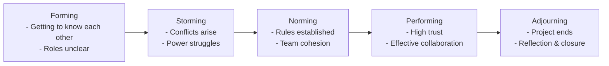

# Team Formation
_*Adapted from David Root (2014)_

## Building a Team: Tasks, People, Relationships

When forming a software development team, consider three key areas
:

### 1. Task Analysis
- **What work needs to be performed?**  
  *Example:* Coding, testing, documentation, deployment.
- **How much authority does the group have to manage its own work?**  
  *Example:* Can the team choose its own tools and processes?
- **What is the focus of the group's work?**  
  *Example:* Feature development, bug fixing, research.
- **Degree of interdependence among team members?**  
  *Example:* Pair programming vs. solo tasks.
- **Is there only one correct solution, or are there several possibilities?**  
  *Example:* Algorithm selection may have multiple valid approaches.
- **Are team members' interests aligned or competitive?**  
  *Example:* Shared goal of shipping a product vs. competing for recognition.

### 2. People
- **How many people should be on the team?**  
  *Example:* Small teams (3-7) for Agile; larger for waterfall projects.
- **Who is ideally suited to do the work?**  
  *Example:* Backend developer for API tasks, QA for testing.
- **What technical, task-management, and interpersonal skills are required?**  
  *Example:* Python expertise, project management, communication.
- **What type and level of diversity is optimal?**  
  *Example:* Mix of junior and senior engineers, varied backgrounds.

### 3. Relationships
- **How do team members socialize each other?**  
  *Example:* Team lunches, online chats, onboarding buddies.
- **What roles are (implicitly) negotiated among team members?**  
  *Example:* Natural leaders, mentors, note-takers.
- **What norms are conducive or harmful for the group?**  
  *Example:* Code review etiquette, meeting punctuality.
- **Is cohesion among team members important?**  
  *Example:* High cohesion boosts morale and productivity.
- **How is trust developed, threatened, and rebuilt?**  
  *Example:* Trust grows through reliability; is threatened by missed deadlines; rebuilt via transparency.

---

## Successful Team Performance: An Integrated Model

This framework comes from Thompson , who in turn credits the
essential-conditions criteria to Hackman and Gruenfeld. It was previously attributed on this page
to Steiner (1972); that attribution was incorrect.

### Team Context
- **Organizational Context:**  
  *Example:* Company culture, management support.
- **Team Design:**  
  *Example:* Roles, responsibilities, structure.
- **Team Culture:**  
  *Example:* Shared values, communication style.

### Essential Conditions
- **Ability:**  
  - Knowledge, skills, education, information.
  - *Example:* Experienced developers, access to documentation.
- **Motivation:**  
  - Intrinsic (personal satisfaction), extrinsic (rewards).
  - *Example:* Passion for coding, bonuses for delivery.
- **Strategy:**  
  - Communication, coordination.
  - *Example:* Daily stand-ups, Slack channels.

### Team Performance
- **Productivity:**  
  *Example:* Number of features delivered.
- **Cohesion:**  
  *Example:* Team members support each other.
- **Learning:**  
  *Example:* Sharing new tools or techniques.
- **Integration:**  
  *Example:* Seamless collaboration across roles.

---

## Team Development Stages (Tuckman 1965; Tuckman & Jensen 1977)

Tuckman  proposed **four** stages — forming, storming,
norming, performing. The fifth, **adjourning**, was added twelve years later by Tuckman and
Jensen . Attributing five stages to the 1965 paper is a common
error, and this page previously made it.

{: .warning }
**Know where this model comes from before relying on it.** Tuckman's 1965 review covered **50
articles**, of which **26 were therapy groups and 11 were human-relations training groups** — not
work teams, and not software teams. The 1977 follow-up is candid that in the intervening twelve
years **exactly one study** was designed to test the hypothesis, and its observers were given the
stage descriptions and asked to fit their observations to them — a design that can confirm but
cannot disconfirm. The authors call for statistical evidence that had not been supplied.

Teach it as useful shared **vocabulary** for an experience most people recognise — the storming
phase is familiar to anyone who has done group work — and put the evidential weight on the
factors below, which were measured in actual software teams.

```mermaid
flowchart LR
    A[Forming<br/>- Getting to know each other<br/>- Roles unclear] --> B[Storming<br/>- Conflicts arise<br/>- Power struggles]
    B --> C[Norming<br/>- Rules established<br/>- Team cohesion]
    C --> D[Performing<br/>- High trust<br/>- Effective collaboration]
    D --> E[Adjourning<br/>- Project ends<br/>- Reflection & closure]
```

### 1. Forming
- **Definition:** Team members meet and start to understand the project.
- **Characteristics:** Polite, uncertain, roles unclear, leader-driven.
- **Strategies:** Clarify goals, encourage introductions, set expectations.
- **Example:** A new Scrum team meets for sprint planning, learning about each other and the project.

### 2. Storming
- **Definition:** Conflicts and differences emerge.
- **Characteristics:** Disagreements, power struggles, frustration.
- **Strategies:** Facilitate open communication, mediate conflicts, set ground rules.
- **Example:** Developers debate whether to use GitHub Actions or Jenkins for CI/CD.

### 3. Norming
- **Definition:** Team establishes harmony and shared norms.
- **Characteristics:** Cohesion, agreed rules, mutual support.
- **Strategies:** Reinforce collaboration, define working agreements, recognize contributions.
- **Example:** Team agrees on coding standards and regular stand-ups.

### 4. Performing
- **Definition:** Team works productively toward goals.
- **Characteristics:** Clear roles, high trust, autonomy, problem-solving focus.
- **Strategies:** Empower decision-making, minimize supervision, encourage improvement.
- **Example:** Team delivers features smoothly and adapts to changes quickly.

### 5. Adjourning (added 1977)
- **Definition:** Team disbands after achieving its purpose.
- **Characteristics:** Accomplishment, reflection, transition.
- **Strategies:** Celebrate success, conduct retrospectives, support transitions.
- **Example:** Team holds a final retrospective after project release and moves to new assignments.

---

## Building Winning Cycles

Three major cycles to manage for team success:

### 1. Kickoff Cycle
- Team building
- Communication, organization, collaboration
- Charter and mission
- *Example:* Initial project kickoff meeting, setting team norms.

### 2. Working Cycle
- Performance goals derived from mission
- Monitoring progress
- Feedback and recognition
- *Example:* Regular sprint reviews, progress tracking, celebrating milestones.

### 3. Review Cycle
- Happens when change is needed
- Situational assessment
- Redirection
- *Example:* Pivoting project direction after stakeholder feedback.

## What predicts how a team actually performs

Stage models describe a trajectory. They do not identify anything a manager can change. Two
factors measured in software teams do:

- **Autonomy** is the work-design factor most reliably associated with psychological safety
   — and notably, interdependence and role clarity were *not*,
  against expectation.
- **Membership stability.** Occasional recomposition of a team degrades its behaviour
  substantially more than geographic distance does , and it is
  the only factor in that study that affects mutual respect and interpersonal conflict rather
  than merely coordination.

Neither appears in Tuckman. Both are available to whoever forms the team.

---

## Acknowledgments

This content is heavily inspired by and adapted from lectures by **Eduardo Miranda** and
**David Root**  on software project management. The structure,
examples, and pedagogical approach reflect their teaching materials and frameworks.

---

### References



---

{: .highlight }
**Disclaimer:** AI is used for text polishing and explaining. Authors have verified all facts and claims. In case of an error, feel free to file an issue.