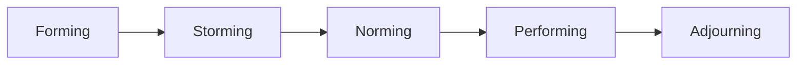

# Team Formation

Forming a team is the set of decisions taken **before** it starts work: what the task demands, who
is on it, and what the relationships among those people are expected to be
.

## 1. Three things to settle before the first sprint

**The task.** Decide what work the team actually owns and how much authority it has over it — can
it choose its own tools, branching model and definition of done? Decide how interdependent that
work is, because a team doing pair programming and a team working a queue of solo tickets are
staffed differently, and decide whether the problem has one right answer or several defensible
ones. Where members compete for recognition rather than share a shipping goal, expect the
coordination cost to rise.

**The people.** Size the team to the task — three to seven for an agile team, more only when the
work genuinely divides — and staff it for three skill families rather than one: technical depth,
task management, and the interpersonal skill of raising a problem early. *Example:* an API
migration staffed with two backend engineers, a QA engineer and one developer who has done the
migration before is a different team from four strong generalists, and it will fail differently.

**The relationships.** Roles, norms and trust get negotiated whether or not anyone plans them, so
it is cheaper to state them: how a new member is onboarded, what counts as acceptable code-review
tone, what happens when a date is missed. Trust grows through reliability, is threatened by silent
slippage, and is rebuilt through transparency rather than through team-building events.

## 2. What a formed team needs in order to perform

Thompson's integrated model — she credits the essential-conditions criteria to Hackman and
Gruenfeld, and an earlier version of this page wrongly attributed the model to Steiner (1972) —
holds that performance rests on three conditions inside a team context
. **Ability** is knowledge, skills and access to the
information the work needs. **Motivation** covers both the intrinsic pull of the work and the
extrinsic rewards attached to it. **Strategy** is how the team communicates and coordinates: the
stand-up, the channel, the handover. Around them sits the context — organisational support, team
design and team culture — and out of them come productivity, cohesion, learning and integration.

## 3. Tuckman's stages

Tuckman  described **four** stages. The fifth, **adjourning**,
was added twelve years later ; attributing five stages to the 1965
paper is a common error, and this page used to make it.

```mermaid
flowchart LR
    A[Forming] --> B[Storming] --> C[Norming] --> D[Performing] --> E[Adjourning]
```

- **Forming** is polite and leader-driven, and roles are still unclear — so the useful move is to
  state goals and expectations out loud rather than assume them.
- **Storming** produces the first real disagreement: developers argue whether CI runs on GitHub
  Actions or Jenkins. It needs mediation and ground rules, not suppression.
- **Norming** is where the working agreements appear — coding standards, review turnaround, when
  the stand-up happens and who may skip it.
- **Performing** runs on trust and autonomy, and is the stage where close supervision costs more
  than it returns.
- **Adjourning** disbands the team, and a closing retrospective is what turns the experience into
  something the next team inherits.

Use the stages as shared vocabulary for something most people recognise. They describe a
trajectory, but they name nothing a manager can change: for that, [Team
Performance](performance.html) has autonomy and stable membership, both measured in real software
teams.

## 4. The cycles a team runs after forming

Formation is not one event. A **kickoff cycle** sets the charter, the mission and the working
agreements; a **working cycle** turns that mission into performance goals and feeds back progress
and recognition; a **review cycle** runs whenever something changes, assesses the situation and
redirects the team. *Example:* a team that pivots after stakeholder feedback re-runs the kickoff
conversation about scope and roles instead of continuing to report against the old plan.

## How solid is this?

- **Where Tuckman comes from.** The 1965 review covered **50 articles**, of which **26 were therapy
  groups** and **11 human-relations training groups** — not work teams, and not software teams.
- **What is contested.** The 1977 follow-up is candid that in twelve years **exactly one study** was
  designed to test the hypothesis, and its observers were given the stage descriptions and asked to
  fit their observations to them — a design that can confirm but cannot disconfirm
  . The authors call for statistical evidence that had not been
  supplied.
- **The integrated model is a framework, not a finding.** It organises what to look at; no effect
  sizes attach to it, and the factors on [Team Performance](performance.html) are the ones with
  numbers.

---

### Acknowledgments

This page adapts material from lectures by **Eduardo Miranda** and **David Root**
 on software project management.

### References



---

{: .highlight }
**Disclaimer:** AI is used for text summarization, polishing and explaining. Authors have verified
all facts and claims. In case of an error, feel free to file an issue.
