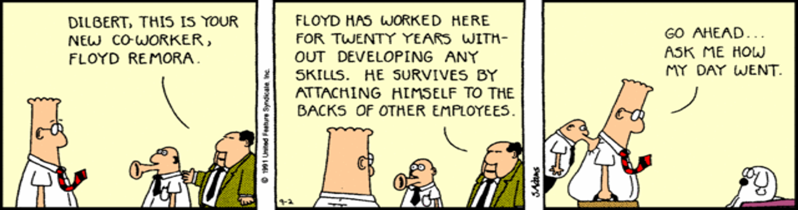

# Social Loafing

**Social loafing** is the tendency of people in groups not to work as hard as they do alone
 (p. 47). Team output still rises with team size, but "the rate
of increase is negatively accelerated, such that the addition of new members to the team has
diminishing returns on productivity" (p. 47).

## 1. Ringelmann, and the mechanism

The classic demonstration is Ringelmann's rope-pulling experiment: "as more people pulled the rope,
the total force exerted by the group as a whole rose but the average force exerted per person
dropped"  (p. 296). The potential-versus-actual arithmetic behind
it is on [Team Performance](performance.html), where loafing is the *motivation-loss* half of
Steiner's equation.

The mechanism has a name: **social impact theory**. The social force acting on a group is divided
among its members, so "the responsibility for doing the job is diffused over more people" and the
larger the group, the less pressure any individual feels (p. 296).

Thompson gives three causes  (p. 49). **Diffusion of
responsibility**: individual contributions cannot be told apart, so nobody feels accountable. **A
reduced sense of self-efficacy**: members come to believe their own effort cannot change the
outcome. **Sucker aversion**: the fear of doing all the work and getting a fifth of the credit.
*Example:* at a hackathon one person codes all night while the others brainstorm, and all four put
the project on their CV.

## 2. The free-rider problem, old and new

A **free rider** contributes less and relies on others to carry the workload. The classic case is
withdrawal of effort; the modern one is not. In 2,755 open-source repositories around the arrival
of AI coding assistance, peripheral contributors did **not** withdraw — they produced **43.5% more
commits** and 17.7% more pull requests, while **core** developers reviewed **6.5% more** code and
their own commit output fell **19%** . The cost still landed on the core,
through volume rather than idleness. Free riding here is structural: nobody has to feel anything
for the imbalance to appear, and the resource being consumed — senior attention — appears on no
dashboard.

## 3. What reduces it

Thompson's remedies, in her order (pp. 50–53), all attack one of the three causes: **increase
identifiability** so contributions can be seen, **promote involvement** in the work itself, **reward
members for performance**, **strengthen cohesion**, **increase personal responsibility** through
clear individual ownership, **give the team performance and review feedback**, and **keep staffing
appropriate** to the task rather than generous.

{: .warning }
The qualification that is usually dropped: "the key is **not identifiability per se**, but rather
the **evaluation that identifiability makes possible**" (p. 51)
. A dashboard of who committed what reduces nothing unless
somebody acts on it — and in a team where a growing share of the code is generated rather than
written, that evaluation is the first thing to degrade.

## 4. Loafing with a machine in the loop

Stieglitz and colleagues measured loafing tendencies when the collaborator is a **virtual
assistant** . A self-reported tendency to loaf in human groups still
predicted low-effort behaviour with the assistant (r = 0.344), but the traits that protect a human
team stopped predicting: conscientiousness fell from r = −0.496 (p < .001) to −0.125 (ns), need for
cognition from −0.406 to −0.187 (ns). With no colleague to feel the slack, agreeableness has
nothing to act on. Effort correlated negatively with loafing (r = −0.309) while frustration did not
move (r = −0.034, ns), which the authors read as **task offloading rather than disengagement** —
*smart loafing*, which they argue may be benign.

Put beside the free-rider finding above: offloading effort is smart only if nobody downstream is
paying for it. Stieglitz's claim that "no other human team member needs to compensate" is exactly
what  tests at scale and does not find.

## How solid is this?

- **Loafing is not a human universal.** Greenberg's own section asks the question and reports that
  the effect **reversed** in the People's Republic of China and in Israel, where working in a group
  produced *more* effort, not less (p. 297). That is one reported study rather than a meta-analysis,
  so it is not a finding about any individual student either. Teach loafing as contingent on
  context.
- **Which Greenberg.** This material was long attributed to "Greenberg, 1996, *Managing Behaviors
  in Organizations*" — a title that does not exist. The copy this handbook works from is Jerald
  Greenberg, *Behavior in Organizations*, 10th ed., 2011 .
- **The virtual-assistant study has no control condition.** Every participant had the assistant and
  nobody worked alone, so no effort decrement against a solo baseline was ever measured. Two of its
  six loafing items measure *tool usefulness*, so a participant who was genuinely helped scores as
  a loafer. The sample was 102 people, 81.4% still studying — and the authors carve out an
  exception worth saying aloud in a university: "smart loafing in, for instance, **learning
  environments** might be hindering and not 'smart'."
- **The AI free-rider study is observational.** Its treatment is *a programming language in a
  period* rather than observed tool use, `*` denotes p < 0.1 throughout, and its own headline
  "42.9%" is miscomputed — for the stated coefficient the change is −30.0%.

---

### Acknowledgments

This page adapts material from lectures by **Eduardo Miranda** and **David Root**
 on software project management.

### References



---

{: .highlight }
**Disclaimer:** AI is used for text summarization, polishing and explaining. Authors have verified
all facts and claims. In case of an error, feel free to file an issue.
