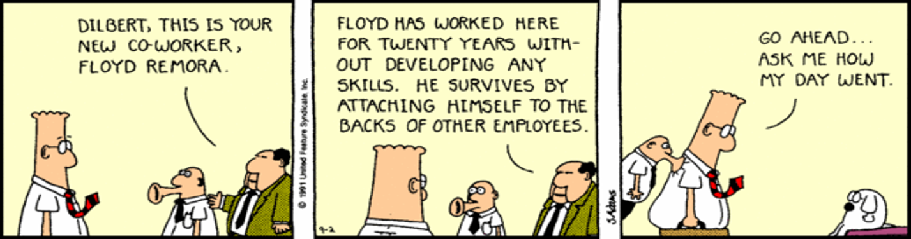

# Teams Problems & Motivation
_Adapted from David Root (2014)_

## The Classic Team Story

A very common scenario in teams:

> "This is the story of four people named Everybody, Somebody, Anybody, and Nobody.  
> There was an important job to be done and Everybody was asked to do it.  
> Anybody could have done it, but Nobody did it. Somebody got angry about that because it was Everybody's job.  
> Everybody thought Anybody could do it, but Nobody realized that Everybody wouldn't do it.  
> Consequently, it wound up that Nobody told Anybody, so Everybody blamed Somebody."

**Lesson:**  
Lack of clarity in roles and accountability leads to confusion, frustration, and blame.

**Software Example:**  
In a Scrum team, if “Everybody” assumes someone else will write unit tests, tests never get written. The sprint fails, and “Somebody” complains—but no one feels directly responsible.

---

## Social Loafing & The Freerider Problem

**Social Loafing**  
(Source: Greenberg, 1996, *Managing Behaviors in Organizations*)  
People in groups or teams often don’t work as hard as they do when working alone.  
While team performance increases with team size, the rate of increase slows down—sometimes individual effort drops. A few motivated members carry the workload, while others contribute less.

### What is the Freerider Problem?

- **Free riders** are team members who contribute less, relying on others to carry the workload.

#### Causes of Social Loafing

- **Diffusion of responsibility:**  
  It’s difficult to distinguish individual contributions, so people feel less accountable.
- **Lack of recognition:**  
  People don’t feel their efforts will be noticed or rewarded.
- **Dispensability of effort:**  
  Members may feel their work isn’t essential or impactful.
- **Sucker aversion:**  
  Fear of being taken advantage of—doing all the work and getting little credit.

**Software Example:**  
In a hackathon, one person ends up coding all night while others just brainstorm, then all claim equal credit.

---

## Enhancing Team Performance

(Source: Leigh Thompson, *Making the Team*)

- **Increase identifiability:**  
  Make individual contributions visible and recognized.
- **Promote involvement:**  
  Encourage active participation and engagement from all members.
- **Reward team members for performance:**  
  Use incentives and recognition to motivate effort.
- **Strengthen team cohesion:**  
  Build trust, shared goals, and a sense of belonging.

### How to Strengthen Teams

- **Increase personal responsibility:**  
  Assign clear roles and tasks.
- **Provide team performance and review feedback:**  
  Give constructive feedback regularly.
- **Maintain appropriate staffing levels:**  
  Avoid teams that are too large or too small for the task.

**Tip:**  
Feedback and accountability should be positive and supportive, not punitive.  
Celebrate successes and address issues constructively.

---

## Additional Motivational Theories for Teams

### 1. Herzberg’s Two-Factor Theory

- **Motivators:** Achievement, recognition, responsibility, growth.
- **Hygiene factors:** Pay, working conditions, policies (removes dissatisfaction but doesn’t motivate by itself).

*Example:*  
Developers stay motivated when trusted to design solutions (motivator), but poor tooling (hygiene) can frustrate them.

### 2. Self-Determination Theory (Deci & Ryan)

People are motivated when three needs are met:
- **Autonomy:** Control over work.
- **Competence:** Ability to grow skills.
- **Relatedness:** Belonging to a team.

*Example:*  
Giving a developer freedom to choose a framework (autonomy), providing learning resources (competence), and fostering supportive stand-ups (relatedness).

### 3. Expectancy Theory (Vroom)

Motivation depends on:
- **Expectancy:** Effort → performance link.
- **Instrumentality:** Performance → reward link.
- **Valence:** Value of the reward.

*Example:*  
If a developer knows that fixing bugs quickly (effort) will be noticed (performance) and lead to recognition or promotion (reward), they’re more motivated.

---

## Practical Motivation Techniques in Software Teams

- **Gamification:** Use leaderboards for bug fixes, coding challenges, or test coverage.
- **Visible progress:** Kanban boards or burndown charts to show team achievements.
- **Celebrating wins:** End-of-sprint demos and pizza Fridays to acknowledge progress.
- **Peer recognition:** “Kudos” channels in Slack or Trello cards highlighting contributions.
- **Job rotation:** Switch between front-end, back-end, and testing tasks to keep skills fresh.
- **Team rituals:** Regular stand-ups, retrospectives, or fun check-ins to build team spirit.

---

## Sources

- Greenberg, Jerald. *Managing Behavior in Organizations: Science in Service to Practice*. 2nd ed., Prentice Hall, 1999.
- Thompson, Leigh L. *Making the Team: A Guide for Managers*. 6th ed., Pearson Education, 2017.
- Baron, Robert A., and Jerald Greenberg. *Behavior in Organizations*. 9th ed., Pearson, 2008.
- Herzberg, Frederick. "One More Time: How Do You Motivate Employees." Vol. 65, Harvard Business Review, Boston, MA, 1968.
- Deci, Edward L., and Richard M. Ryan. “Self-Determination Theory.” *Handbook of Theories of Social Psychology*, Vol. 1, Ch. 20, 2012, pp. 416-436.
- Vroom, Victor H., Lyman W. Porter, and Edward E. Lawler. “Expectancy Theories.” In *Organizational Behavior*, Vol. 1, Routledge, 2015, pp. 94-113.
- Wikipedia contributors. "Social loafing." Wikipedia, Wikimedia Foundation. https://en.wikipedia.org/wiki/Social_loafing

---

## Acknowledgments

This content is heavily inspired by and adapted from lectures by **Eduardo Miranda** and **David Root** on software project management. The structure, examples, and pedagogical approach reflect their teaching materials and frameworks.

---

## Sources

- Root, David. *Managing Software Development*. Lecture materials, 2014.

---

---

{: .highlight }
**Disclaimer:** AI is used for text polishing and explaining. Authors have verified all facts and claims. In case of an error, feel free to file an issue.
