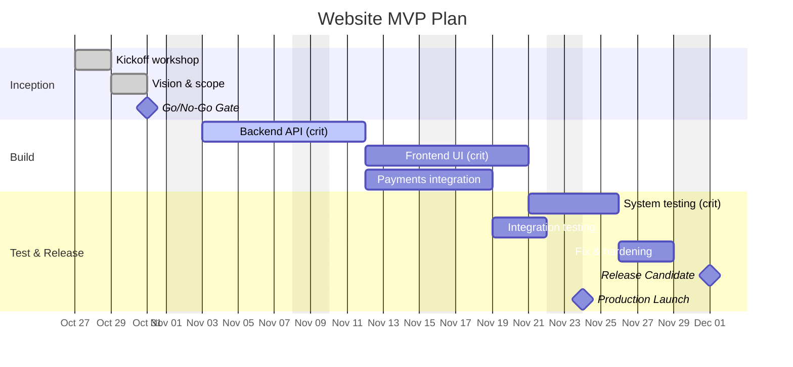
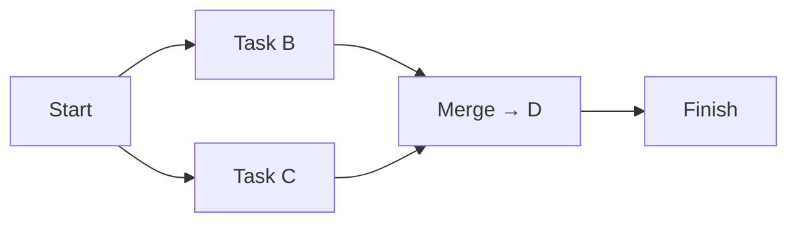
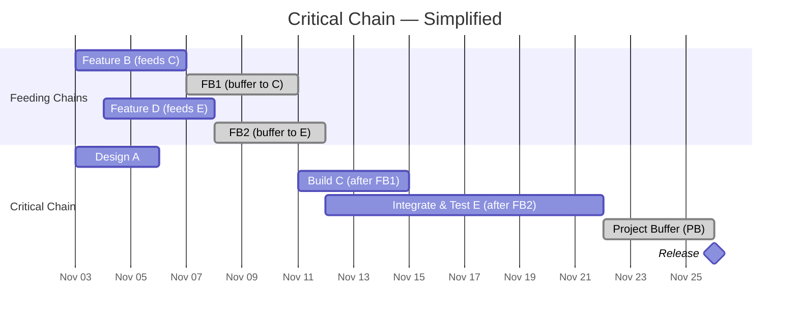

# Activity Planning
_Adapted from Eduardo Miranda (2014)_

---

## 1. Introduction

**Purpose of activity planning**  
Activity planning defines **how work will be done** and **in what sequence**, turning project scope and milestones into an executable schedule.

It provides visibility into:
- **Dependencies** among tasks  
- **Order and duration** of activities  
- **Responsibility allocation**

Two major styles exist:
- **Agile (Scrum-based)** — lightweight, pull-driven, adaptive  
- **Plan-oriented** — structured, push-driven, dependency- and date-based

---

## 2. Activity Planning in Scrum and Plan-Oriented Approaches

### 2.1 Scrum-Based Activity Planning

| **When** | **Artifacts / Events** | **Characteristics** |
|---|---|---|
| Sprint Planning | Sprint Backlog | Defines stories and tasks for the sprint. |
| Daily Scrum | Task Board | Tasks are “pulled” as the team progresses. |

**Key features:**
- No explicit global sequencing or individual resource allocation.  
- **Pull mechanism:** team members select tasks as they become available.  
- **Collective ownership:** the team is responsible as a whole (discourages “I did my part”).  
- **Adaptive execution:** work evolves based on current task states.

**Process summary:**
1. Determine hours available in the sprint.  
2. Estimate stories and set sprint “budget.”  
3. Move selected stories and tasks to the sprint backlog.  
4. Reprioritize or defer unselected stories.  
5. During Scrum, update task status and pull new ones as needed.

---

### 2.2 Plan-Oriented Activity Planning

| **When** | **Mechanism** | **Artifacts** |
|---|---|---|
| Beginning of project (rare) or rolling waves | **Push mechanism** | Activity networks, Gantt charts, Responsibility matrices |

**Characteristics:**
- Explicit task **sequencing**, **scheduling**, and **responsibility** allocation.  
- Activities are executed according to a **predefined order and dates**.  
- Updated periodically via **rolling wave planning** cycles.

---

## 3. Activity Networks (Nodes)

**Purpose:** show how tasks depend on one another — the **flow of work** via dependencies.

**Two representations:**
1. **Activity on Node (AoN)** — tasks are nodes, arrows are dependencies.  
   _Pros:_ no dummy activities; activity emphasis.  
   _Cons:_ path tracing can be harder on large graphs.
2. **Activity on Arrow (AoA)** — tasks are arrows, nodes are events.  
   _Pros:_ path tracing often easier; highlights events.  
   _Cons:_ may require dummy activities; de-emphasizes task details.

**Primary attributes:**
- **Dependencies:** informational or material links between tasks.  
- **Duration:** estimated effort/elapsed time per task.

**Precedence relationships:**
- **Finish-to-Start (FS):** B starts after A finishes (default).  
- **Finish-to-Finish (FF):** B finishes after A finishes.  
- **Start-to-Start (SS):** B starts when A starts.  
- **Start-to-Finish (SF):** B finishes after A starts (rare).  
- **Percent-complete gate:** e.g., B starts when A is 70% done.

---

## 4. Critical Path

**Definition:** the **longest path** through the activity network — determines the **minimum project duration**.

**Key points:**
- There may be **multiple** critical paths.  
- Tasks on the CP have **zero float (slack)**.  
- Changing any CP task duration changes the project duration.  
- Crashing non‑critical tasks has no impact on finish date.

**Calculations:**
- **Forward Pass**: ES₀=0; EFᵢ=ESᵢ+durᵢ; ESₖ=Max(EFⱼ), j∈Predₖ.  
- **Backward Pass**: LFₙ=EFₙ; LSₖ=LFₖ−durₖ; LFₖ=Min(LSⱼ), j∈Succₖ.  
- **Float**: Total Float=delay w/o affecting project finish (0 on CP). Free Float=delay w/o delaying any successor.

---

## 5. Gantt Charts

**What it is:** a task‑oriented view that uses horizontal bars on a time scale to depict:  
- When tasks are **planned** to run  
- When they **actually** ran and finish  
- Who is assigned (optional)

**Key concepts:**
- Incorporates **resource availability**  
- Anchored in time; shows **absolute dates**  
- Supports **roll‑up** (summary) and **drill‑down**  
- Common presentation tool (e.g., **MS Project**)

**Limitations of CPM (context for Gantt):** under uncertainty, CPM can understate finish; cannot directly model alternatives/iterations — complements like buffers or probabilistic methods are helpful.

**Legend suggestion:**  
- _done_ = completed as planned  
- _active_ = in progress  
- unstyled = planned (not yet started)

---

## 6. Alternatives to CPM

| Method | Description | Distinct Feature |
|---|---|---|
| **CPM** | Critical Path Method (DuPont, 1956) | Deterministic durations |
| **PERT** | Program Evaluation and Review Technique (US Navy, 1958) | Probabilistic durations: E=(O+4M+P)/6; σ=(P−O)/6 |
| **DSM / GERT** | Design Structure Matrix / Graphical E&RT | Handles conditional branching, iteration, overlap |
| **Critical Chain (Goldratt, 1997)** | Adds buffers; considers resources & multitasking | Aggregated buffers; focus on uncertainty |

---

## 7. Merge Bias and Critical Chain

### 7.1 Merge Path Bias (why CPM underestimates)
Definition. In networks where multiple parallel paths merge into one successor, the project’s completion time depends on the maximum of those path durations. Using only expected path times (as in vanilla PERT) underestimates the true expected completion time — this is merge path bias.

Why it happens (intuition). At a merge, all predecessors must finish. With variability, there’s a good chance at least one path runs late → the merge waits → project finish skews later than the longest mean path.

Tiny example.  
Two parallel paths before D:

- Path 1 mean = 10 weeks (σ ≈ 2)
- Path 2 mean = 9 weeks (σ ≈ 2)

Naively, finish ≈ 10 weeks.  
With a merge, expected finish is > 10 because finish = max(Path1, Path2).

When it grows. More merges, more parallel variability → stronger bias.

---

### 7.2 Critical Chain Project Planning (CCPM)

**Premises (Goldratt):** uncertainty is pervasive; people add safety; Parkinson’s Law; Student Syndrome; resource contention matters; merging paths pass delays; multitasking hurts.

**Core ideas:**
- **Critical chain** = longest sequence considering both **task** and **resource** dependencies.  
- Add **buffers** to absorb variation: **project buffer** (end), **feeder buffers** (non‑critical joins), **resource buffers** (alerts).

**Illustration – Critical Chain with Buffers & Resources**

**Pros:** safety made explicit; aggregated protection; focus and single‑tasking; control via **buffer consumption**.  
**Cons:** assumes everyone adds safety; does not model correlated risks across tasks.

---

{: .highlight }
**Disclaimer:** AI is used for text summarization, explaining and formatting. Authors have verified all facts and claims. In case of an error, feel free to file an issue or fix with a pull request.