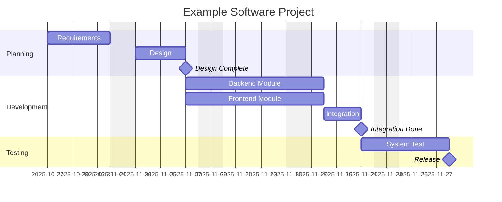

# Gantt Charts

---

## 1. Introduction

A Gantt chart is a visual project planning tool that shows tasks over time.  
It helps project managers see:

- When each task starts and ends
- How long it takes
- Which tasks overlap or depend on each other

Originally developed by Henry L. Gantt (1910s), it remains one of the most widely used tools in both plan-driven and Agile-adapted contexts.

---

## 2. Structure and Components

A Gantt chart is essentially a time-scaled bar chart:

| Element         | Description                                                      |
|-----------------|------------------------------------------------------------------|
| Tasks / Activities | Rows — represent units of work (from the WBS).                |
| Time Axis       | Columns — show calendar days, weeks, or sprints.                 |
| Bars            | Horizontal — show duration of each task.                         |
| Dependencies    | Show which tasks must finish before others can start (e.g., after A1). |
| Milestones      | Zero-duration events marking key dates or deliverables.          |
| Progress / Status | Often indicated with shading or color.                         |

---

## 3. Purpose and Use

Gantt charts serve to:

- Communicate the project timeline to stakeholders.
- Track progress against planned dates.
- Identify delays or bottlenecks.
- Support coordination between parallel activities.

They are often used together with:

- **Work Breakdown Structure (WBS)** — defines what must be done.
- **Activity network / Critical Path** — defines what must happen when.
- **Milestone plan** — defines what is delivered when.

---

## 4. Gantt Charts in Different Contexts

| Context        | Use                                                                 |
|----------------|---------------------------------------------------------------------|
| Plan-oriented (e.g., Waterfall) | Created early, used to control execution; detailed dependencies. |
| Agile / Scrum  | Simplified or rolling-wave versions; visualizing sprints, releases, or burndown trends. |
| Hybrid         | High-level Gantt for major milestones, Agile boards for iteration detail. |

---

## 5. Example

---

## 6. Strengths and Limitations

| Strengths                | Limitations                        |
|--------------------------|------------------------------------|
| Simple and visual        | Becomes cluttered for large projects |
| Shows dependencies clearly | Doesn’t show resource constraints |
| Easy progress tracking   | Doesn’t handle uncertainty well    |
| Communicates milestones  | Hard to maintain manually          |

---

## 7. Relation to Other Concepts

| Concept         | Relationship                                                      |
|-----------------|------------------------------------------------------------------|
| Critical Path   | Longest chain of dependent tasks; often highlighted in red.       |
| Merge Path Bias | Gantt charts can hide slack merging; critical chain refines this. |
| Critical Chain  | Extends Gantt by including resource constraints and buffers.      |
| Milestone Plan  | Gantt visualizes milestones in time context.                      |

---

## 8. Tools

Open source Gantt tools:

- **Ganter** – web-based, open source Gantt manager.
- **ProjectLibre** – desktop, MS Project compatible.
- **GanttProject** – cross-platform Java application.
- **Mermaid.js** – lightweight, code-based diagrams.
- **Redmine / OpenProject** – integrated project tracking with Gantt visualization.

---

{: .highlight }
**Disclaimer:** AI is used for text summarization, explaining and formatting. Authors have verified all facts and claims. In case of an error, feel free to file an issue or fix with a pull request.