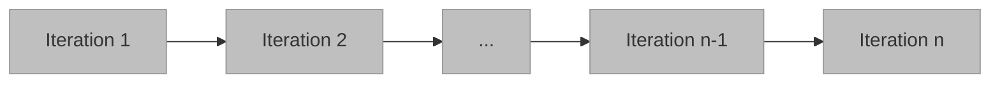
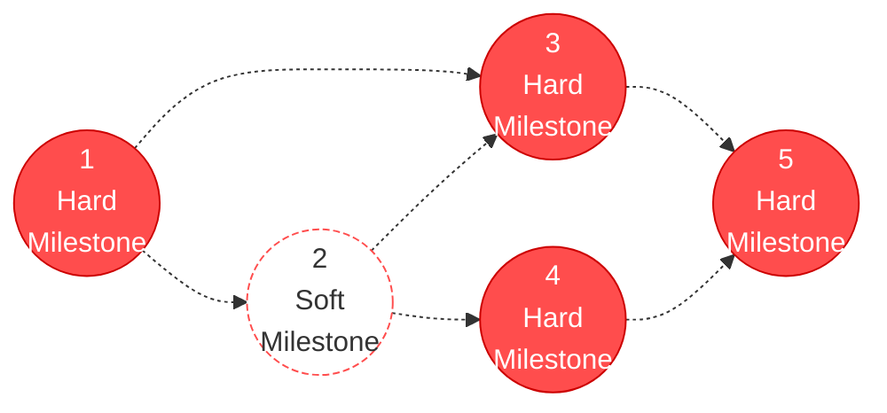
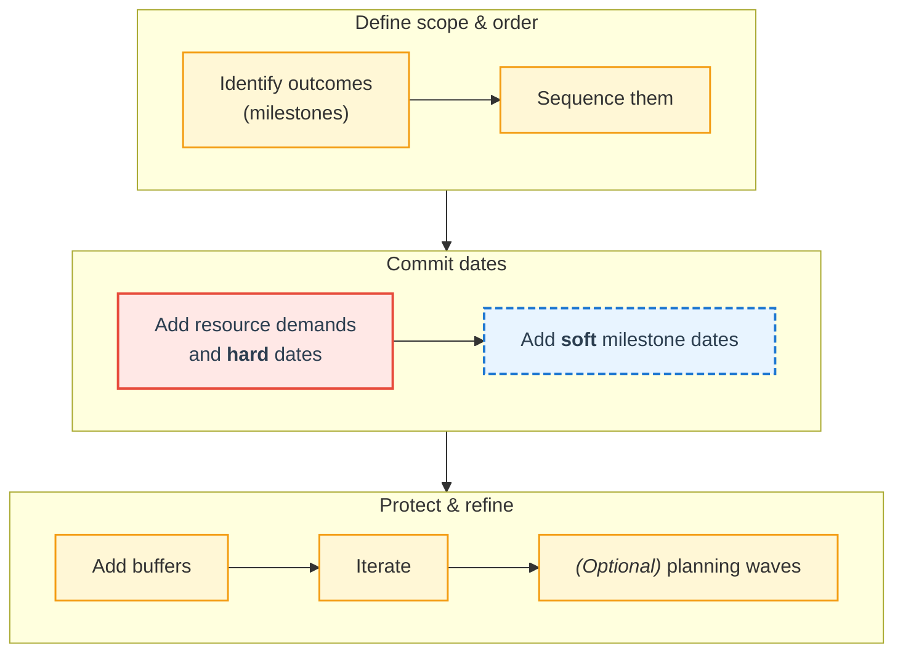

# Milestone Planning

_Adapted from Eduardo Miranda (2014)_

---

## 1. What Is a Milestone

A **milestone** is an **outcome or state** —  
**verifiable** and **relevant to the project sponsor** —  
that results from completing one or more tasks which the project should **reach or deliver by a specific time**.

**Examples**

- **Outcome:** a document, a partial or total system capability
- **Desired state:** an approval or measurable attainment (e.g., throughput, number of users trained)

**Milestone planning** defines:

1. The **order** in which outcomes or states must occur
2. The **dates** by which they must be achieved

This plan is what **sponsors and stakeholders** should see and use to track progress.  
If a milestone’s **date** or **success criteria** change, the plan must be **re-negotiated** and the change made **visible**.

---

## 2. Not Milestones – Bad Examples

### 2.1 Iterations Sequence

**Why not milestones?**

Iterations mark **timeboxes of work**, not **verifiable outcomes**.  
Completing “Iteration 2” just ends a cycle — it doesn’t mean the project achieved something the sponsor can verify.

- **No clear outcome:** “Iteration complete” isn’t tangible
- **Not verifiable:** Sponsors can’t confirm progress
- **Process-focused:** Tracks _effort_, not _achievement_

**Good milestone examples:**  
“Prototype approved by client” or “Core capability demo completed.”

---

### 2.2 Development Phases

Phases describe **activities**, not **project states**.

- **Activity-oriented:** “Low-level design done” is internal work, not a verified deliverable
- **Not sponsor-relevant:** Reflects _how_ the team works, not _what_ the sponsor gets
- **No clear success criteria:** Completion is subjective

**Good milestone examples:**  
“System design approved,” “Beta version deployed,” “Acceptance test passed.”

---

## 3. A Better Example – Sponsor-Oriented Plan

| **Date** | **Client** | **Team** | **Milestone Description** |
|---|---|---|---|
| Oct-1 | ⬤ | | Project kick-off |
| Nov-15 | ⬤──▶ | | Design concept approved |
| Nov-30 | | ⬤ | Infrastructure selected |
| Dec-15 | | ⬤ | Design completed |
| Jan-30 | | ⬤ | Release 1: CL*, BD, AC, CO, Data Base |
| Feb-15 | ⬤──▶ | | Cloud infrastructure available |
| Mar-1 | | ⬤ | Release 2: CBL, RC, SM |
| Mar-10 | | ⬤ | Beta testing launched |
| Mar-30 | ⬤──▶ | | Beta testing results reviewed |
| Apr-15 | | ⬤ | Release 3: PD, PP |
| Apr-20 | ⬤──▶ | | Acceptance testing procedure approved |
| May-15 | | ⬤ | Acceptance test completed |
| May-30 | | ⬤ | System deployed |
| Jun-30 | ⬤ | | Customer sign-off |
| _* Features listed in the WBS_ | | | |

**Why this works**

- **Outcome-oriented:** Each milestone marks a verifiable state (e.g., “Design concept approved”)
- **Verifiable:** Sponsors can see tangible proof (documents, software, approvals)
- **Stakeholder-focused:** Represents business value, not internal effort
- **Transparent:** Any change in dates or criteria must be re-negotiated and visible

---

## 4. Activity Planning vs Milestone Planning

| **Aspect** | **Activity Planning** | **Milestone Planning** |
|---|---|---|
| **Definition** | Decomposes project into tasks and their execution order | Breaks project into logical states or outcomes |
| **Requires** | Detailed project knowledge | High-level outcome understanding |
| **Volatility** | Highly volatile | Relatively stable |
| **Focus** | Task execution | Deliverables, approvals, commitments |
| **When used** | Later in lifecycle | Early in lifecycle |

**In short:**  
_Activities_ describe what the team **does**.  
_Milestones_ describe what the project **achieves and can verify**.

---

### 4.1 Example

| **Milestones** | **Activities** |
|---|---|
| Statement of Work signed | Identify requirements   Document major deliverables   Negotiate termination conditions   Write SOW   Legal review |
| Architecture approved | Perform Quality Attribute Workshop   Identify architectural drivers   Design   Study trade-offs   Review document |
| “Must-have” features completed | Design   Code   Test   Integrate |

---

## 5. Milestone Plan Semantics

- Milestone dependencies are often **Finish-to-Finish (FF)**
- To reach Milestone 4, the project must have reached the **state** of Milestone 2
- Tasks for Milestone 4 can start **before** all work in 2 is done

---

## 6. Defining a Milestone Plan

---

## 7. Before Starting

### 7.1 What Is Needed

- The **outcome** or **state** to be achieved (think WBS)
- The **evaluation criteria** to judge realization (exit criteria or Definition of Done)
- A **delivery date**
    - **Hard date:** imposed by a third party or loses value if late
    - **Soft date:** mutually agreed and flexible
- The **beneficiary or area of work**
- The **individual or organization** responsible for the milestone (think resource plan)

---

## 8. Milestone Exit Criteria / Definition of Done

**Origin:**

- Based on **ETVX (Entry, Task, Verification, eXit)**, Radice et al. (1985)
- Reintroduced by Agile as **Definition of Done (DoD)** around 2006

**DoD must be objectively decidable**, and includes:

- List of work items to be completed
- State or quantity to achieve
- Defined quality level, such as:
    - Acceptable bug counts
    - Quality attributes at required levels
    - Passing specific test cases
    - Reaching required test coverage

---

### 8.1 Example – Evolving Definition of Done

_Source: Sumeet Madan, 2019 ([https://www.scrum.org/](https://www.scrum.org/resources/blog/done-understanding-definition-done))_

| **Initial DoD** | **Mature DoD** | **Stringent DoD** |
|---|---|---|
| **All acceptance criteria met** | **All business functionality and acceptance criteria met** | **All business functionality and acceptance criteria met** |
| Unit test coverage > 85% | **No dependence unattended** | **No dependence unattended** |
| Functional test passed | Unit test coverage > 85% | No build failures |
| No known defects | No coding-standard errors | Integration testing passed |
| Peer code review | Technical debts < 5 days (subjective) | Unit test coverage > 85% |
| Peer code review passed | Maintainability index > 90 | No coding-standard errors |
| Documentation completed | Functional test automation > 75% | Technical debts < 5 days (subjective) |
| | Functional test passed | Maintainability index > 90 |
| | No known defects | Functional test automation 75% |
| | Peer review passed | Functional test passed |
| | Documentation completed | Regression, PEN, Load, and Performance tests passed |
| | | No known defects |
| | | Peer review passed |
| | | Documentation completed |
| | | Compliance and regulatory documents complete |
| | | UAT approved |

---

## 9. Guidance: Milestone Selection

Milestones must be:

- **Specific** – clearly defined outcome
- **Verifiable** – objectively measurable
- **Relevant** – meaningful to sponsor or customer
- **Timely** – achieved at the right moment in the schedule

**Typical examples**

- Life Cycle Objective (LCO)
- Life Cycle Architecture (LCA)
- Core Capability Demo (CCD)
- Initial Operational Capability (IOC)
- Incremental deliveries
- Proof-of-concept demos
- Key documents completed
- Technical performance levels reached
- Risk mitigation actions done
- Stakeholder commitments fulfilled

---

## 10. Creating the Resource Plan

- Draw the **resource-use curve** over time, _y = f(t) = number of FTEs_
- The **area under the curve** equals total effort
- Account for **holidays, absences, and training**
- Match **available skills** to **task needs**

---

## Acknowledgments

This content is heavily inspired by and adapted from lectures by **Eduardo Miranda** and **David Root** on software project management. The structure, examples, and pedagogical approach reflect their teaching materials and frameworks.

---

## Sources

- Radice, R. A., et al. "A Programming Process Architecture." *IBM Systems Journal*, vol. 24, no. 2, 1985, pp. 79–90.

- Madan, Sumeet. "Done - Understanding Definition of Done." *Scrum.org*, 2019. [https://www.scrum.org/resources/blog/done-understanding-definition-done](https://www.scrum.org/resources/blog/done-understanding-definition-done)

- Miranda, Eduardo. *Managing Software Development*. Lecture materials, 2014.

---

{: .highlight }
**Disclaimer:** AI is used for text summarization, explaining and formatting. Authors have verified all facts and claims. In case of an error, feel free to file an issue or fix with a pull request.