# The Buffered MoSCoW Method

_* adapted from Miranda, 2014_

---

## 1. MoSCoW vs Buffered MoSCoW

The **MoSCoW method** helps teams prioritize requirements by their importance.  
The **Buffered MoSCoW** approach extends this by adding _buffers_ to account for estimation uncertainty — making it practical for time-boxed projects.

| Priority      | Classic Definition                                 | Buffered MoSCoW Interpretation                      |
|:-------------|:---------------------------------------------------|:----------------------------------------------------|
| **Must Have**| Essential for project success. Without these, the project fails. | Features that the team can almost certainly deliver within the time box. |
| **Should Have**| Important but not vital.                          | Features with a fair chance of being completed if everything goes reasonably well. |
| **Could Have**| Desirable or nice to have.                         | Features delivered only if higher-priority items finish early. |
| **Won’t Have**| Out of scope for now.                              | Deferred to a future release.                        |

---

### 1.1 DSDM Buffering Scheme

This model assumes that only about **60% of total effort** can safely be allocated to _Must Have_ features.  
The remaining capacity acts as a **buffer** — absorbing overruns in estimates without extending the delivery date.

> 💡 **Key idea:** Protect the schedule by letting scope flex — not time.

---

## 2. The Six-Step Buffered MoSCoW Process

1. **List and rank** all features by business value (importance to the customer).
2. **Estimate** each feature’s _nominal_ (most likely) and _worst-case_ effort.
3. **Fill the time box** using _worst-case_ estimates — everything that fits becomes “Must Have.”
4. **Assign remaining capacity** to “Should” and “Could” features.
5. **Execute** using _nominal_ estimates — track progress against the buffer.
6. **Adjust scope, not schedule** — if overruns occur, drop lower-priority work.

---

## 3. Example

**Project:** Develop a **Customer Support Portal**  
**Budget:** 180 hours total

- 60 hours for management, design, and infrastructure
- 120 hours for feature development

### 3.1 Feature List

| Feature | Description              | Nominal (h) | Worst (h) | Dependencies |
|:--------|:------------------------|------------:|----------:|:------------|
| A       | Customer dashboard      | 20          | 40        | B, C        |
| B       | Login/authentication    | 7           | 9         | –           |
| C       | Ticket submission form  | 20          | 30        | –           |
| D       | FAQ section             | 5           | 7         | E           |
| E       | Search function         | 6           | 7         | –           |
| F       | Email notifications     | 5           | 6         | –           |
| G       | Chatbot integration     | 20          | 40        | –           |
| H       | Mobile layout           | 10          | 20        | J, K        |
| I       | Feedback/rating widget  | 15          | 30        | –           |
| J       | Admin tools             | 12          | 15        | –           |
| K       | Analytics dashboard     | 8           | 10        | –           |
| L       | Multi-language support  | 10          | 18        | –           |

---

### 3.2 Step 1 — Define “Must Have” (120-hour development budget)

Assume that the preferred order is: **F, D, A, G, K, E, L, J, H, I, B, C**

Using **worst-case** estimates and prioritizing by business value:  
`F + D + E + A + B + C + K ≈ 109 hours.`

These features form the **Must Have** set — the minimum viable release.

---

### 3.3 Step 2 — Assign “Should” and “Could”

- **G (Chatbot)** → _Should Have_ (40 h worst-case)
- **L (Multi-language)** → _Could Have_ (18 h worst-case)
- **H, I, J** → _Won’t Have_ (deferred to future release)

---

### 3.4 Buffered MoSCoW Project Structure

```mermaid
gantt
    title MoSCoW Example — 180h timebox (≈60h setup + 120h delivery)
    dateFormat  YYYY-MM-DD
    axisFormat  %b %d

    %% --- Setup (~60h) ---
    section Setup (≈60h)
    Increment Planning (≈24h)        :ip, 2025-01-01, 3d
    System Engineering (overlaps, ≈24–36h) :se, 2025-01-02, 5d
    System Architecting (overlaps, ≈24–36h):sa, 2025-01-04, 5d
    Gate to Delivery (T+≈60h)        :milestone, gate, 2025-01-09, 0d

    %% --- Delivery timebox (~120h) ---
    section Delivery Timebox (≈120h)
    Must Have — F, D, E, A, B, C, K (≈71h) :crit, must, 2025-01-09, 9d
    Buffer after Must (≈49h)               :milestone, b1, 2025-01-20, 0d

    Should Have — G (≈20h)                 :should, 2025-01-20, 3d
    Buffer after Should (≈29h)             :milestone, b2, 2025-01-23, 0d

    Could Have — L (≈10h)                  :could, 2025-01-23, 2d
    Buffer after Could (≈19h)              :milestone, b3, 2025-01-27, 0d

    %% --- Fixed date / end of timebox ---
    section Fixed date
    Fixed Delivery Date                    :milestone, dd, 2025-02-03, 0d

```

> 🧠 **Interpretation:** The Must set fits the worst-case budget;  
> the Should and Could sets use the remaining time if things go well.

---

### 3.5 Example Scenario

During execution, feature **A** (dashboard) takes **40 hours** instead of **20**.  
The buffer absorbs this overrun — **the release date stays fixed**, but the _Could Have_ feature (L) may be dropped.

This way, the project stays on time while still delivering the _essential_ functionality.

> “Scope flexes, but time stays firm.”

---

## 4. Behavior During Execution

Buffered MoSCoW supports **predictable delivery** by managing uncertainty:

- If everything goes smoothly → “Should” and “Could” features get delivered too.
- If delays occur → lower priorities drop, but “Must” features are safe.

You can apply this approach **at the project level** or **within each iteration or increment** — whichever fits your process best.

---

## 5. Handling Uncertainty, Changes, and Defects

### 5.1 Technical / Infrastructure Work

- Treated as background effort — consumes resources but isn’t prioritized by value.
- Split across releases or handled early as enabling work.

### 5.2 Changes

- New or modified requirements are accepted **only by trading off** other features.
- Always include **rework effort** in new estimates.

### 5.3 Defects

- **Critical or major** defects → fix immediately.
- **Minor** defects → postpone to the end or next release.

---

## 6. Extent of the Guarantee

The Buffered MoSCoW method provides a **structured assurance**:

- Results at the project level will match the assumptions made in estimates.
- If the underlying estimates are wrong, results will be **consistently wrong** — not random.

In other words: _The math works, but only if your inputs are honest._

---

## 7. Key Takeaways

- Protect deadlines with **buffers**, not by padding estimates.
- Deliver the **most valuable** features first.
- Accept that **uncertainty is normal** — plan for it.
- When in doubt, **adjust scope, not schedule**.

---

## 8. References

1. E. Miranda, “Time boxing planning: buffered moscow rules,” SIGSOFT Softw. Eng. Notes, vol. 36, no. 6, pp. 1–5, Nov. 2011, doi: 10.1145/2047414.2047428.

---

## Acknowledgments

This content is heavily inspired by and adapted from lectures by **Eduardo Miranda** and **David Root** on software project management. The structure, examples, and pedagogical approach reflect their teaching materials and frameworks.

---

## Sources

- Miranda, Eduardo. *Managing Software Development*. Lecture materials, 2014.

---

{: .highlight }
**Disclaimer:** AI is used for text summarization, explaining and formatting. Authors have verified all facts and claims. In case of an error, feel free to file an issue or fix with a pull request.