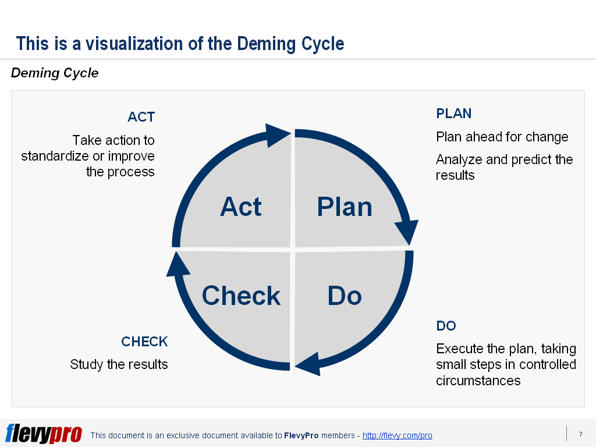

# Defining Process

A well-defined process is essential for consistent results and improvement in software engineering.  
Defining, applying, measuring, and improving processes helps teams deliver quality outcomes and adapt to change.

---

## Key Steps in Process Management

1. **Define the Process:**  
   - Clearly describe each step and its purpose.
   - Justify why each step exists (“the why”).
   - Avoid “just because” or “we’ve always done it that way” as sole reasons.

2. **Apply Standards:**  
   - Use industry or organizational standards to guide process definition.
   - Standards help ensure consistency and best practices.

3. **Measure Conformance and Results:**  
   - Check if the process is followed and if it delivers expected results.
   - Use inspections, reviews, audits, and checklists.

4. **Assess:**  
   - Analyze process effectiveness and identify areas for improvement.
   - Use both planned and random checks (e.g., Monte Carlo sampling).

5. **Suggest Improvements:**  
   - Recommend changes based on measurement and assessment.
   - Continuous improvement is key.

---

## Deming Cycle — PDCA

The PDCA (Plan-Do-Check-Act) cycle is a classic framework for process improvement:

- **Plan:**  
  Establish objectives and processes needed to achieve goals.
- **Do:**  
  Implement the plan and collect data.
- **Check:**  
  Analyze results, compare to expectations, and retain data.
- **Act:**  
  Take corrective action—change the process or metrics as needed.

  

---

## Process Definition Challenges

- Every team has a process, but not all are formalized.
- Formalization means documenting specific steps and their justification.
- Avoid defining a process just for tradition’s sake.
- The goal is to understand and improve, not just to follow blindly.
- Don’t use lack of definition as an excuse for poor practices (“hacking”).

---

## How to Define a Process

- Ask: “How do you do it?” or “How would I do it?”
- Keep asking until you can describe each step clearly.
- Good starting points:
  - Training materials
  - “Ride along” with experienced team members
  - Ask the “doers,” not just managers

---

## Measuring Your Process

- Similar to product quality checks:
  - Inspections, reviews, audits
  - Checklist compliance
- When to measure:
  - Planned cycles
  - Unannounced random checks (Monte Carlo)
  - Postmortem analysis/evaluation
  - Defect seeding (intentionally adding defects to test detection)

---

### How to Measure

- Use meaningful metrics:
  - Objective or relative measures
  - Establish a baseline (but beware of misleading baselines)
  - Metrics should show change and be analyzable
  - Not all metrics need to be quantitative
- Use goals carefully—poorly chosen goals can cause problems.

- Appropriate analysis:
  - Metrics should make sense and be useful for decision-making.

---

### Metrics Examples

- **Simple Boolean:**  
  Is the process being used or not?
- **Count of problems encountered:**  
  Compare to resources used to find them.
- **Change requests:**  
  Frequency and type.
- **Problem frequency:**  
  How often do issues repeat?
- **Accuracy and consistency:**  
  Estimation reliability.

---

## Example: Meeting Process and Metrics

- Define steps for organizing and running meetings.
- Measure attendance, agenda adherence, action item completion.
- Use feedback to improve future meetings.

---

{: .highlight }
**Disclaimer:** AI is used for text polishing and explaining. Authors have verified all facts and claims. In case of an error, feel free to file an issue.