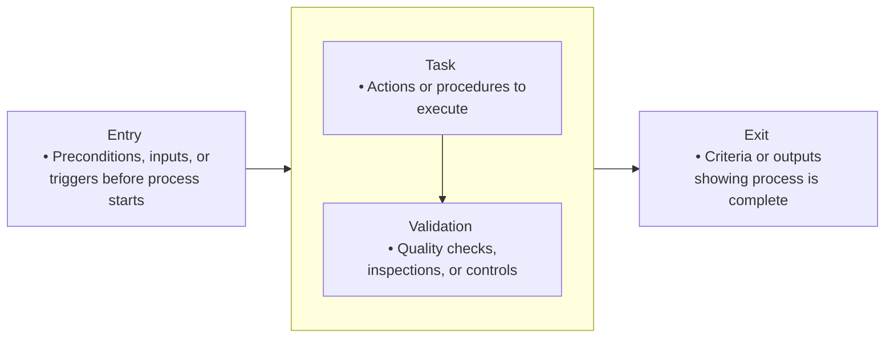

# Entry, Task, Validation, Exit

## Sources

Sources:
1. Radice, Ronald A., et al. "A programming process architecture." _IBM systems journal_ 24.2 (1985): 79-90.
2. Bechtold, Richard. _Process Definition and Modeling Guidebook. Version 01.00. 02_. No. SPC92041CMC. 1992. ([DTIC Apps](https://apps.dtic.mil/sti/tr/pdf/ADA258967.pdf?utm_source=chatgpt.com))
3. Fowler, P., and S. Rifkin. _Software Engineering Process Group Guide CMU_. SEI-90-TR-024. Carnegie Mellon University, Pittsburg, 1990. ( [SEI](https://www.sei.cmu.edu/documents/1014/1990_005_001_15881.pdf?utm_source=chatgpt.com))
4. Laporte, Claude Y., and Nicola R. Papiccio. "Software and systems engineering process improvement at Oerlikon Aerospace." (1996). ([espace2.etsmtl.ca](https://espace2.etsmtl.ca/id/eprint/14241/1/Software-and-Systems-Engineering-Process-Improvement-at-Oerlikon-Aerospace.pdf?utm_source=chatgpt.com))

## Origins of ETVX

- The **ETVX model** was introduced in the **1980s** by **a team at IBM**, notably **R. A. Radice and colleagues**, as part of efforts to formalize software process architecture. The model was detailed in published work such as _“A Programming Process Architecture”_ in the **IBM Systems Journal (1985)**.
    
- It served as a **quasi-diagrammatic method** for defining atomic-level activities within a **Process Definition Method (PDM)** or broader Programming Process Architecture.
    
- The ETVX paradigm then gained traction beyond IBM, being adopted in process improvement and measurement contexts— **notably within the Software Engineering Institute (SEI)**. For example, a **1993 CMU/SEI Technical Report (CMU/SEI-93-TR-16)** on software measurement processes explicitly uses ETVX diagrams to describe measurement process activities, tracing back to **Radice (1985)**.

## Essence

**ETVX** is a structured framework used to define and operationalize subprocesses or activities. It breaks down any process into four clear phases:

- **Entry** – Preconditions, inputs, or triggers that must be met before the process starts.
    
- **Task** – The specific actions or procedures to be executed.
    
- **Validation** (or Verification) – Quality checks, inspections, or controls to verify that tasks meet desired conditions.
    
- **Exit** – The criteria or outputs indicating that the process is complete and can move forward.
    

This model is typically used for defining lower-level, atomic activities rather than end-to-end organizational workflows.

## ETVX Example: Software Development Phase—“Design Review”

Imagine a simplified subprocess within a software development lifecycle, such as the “Design Review” step.

- **Entry Criteria**
    
    - Design specification document is complete and approved.
        
    - Review team (architects, developers) is available.
        
- **Tasks**
    
    - Conduct a structured walkthrough of the design.
        
    - Identify and log design issues or inconsistencies.
        
    - Resolve minor technical questions immediately.
        
- **Validation / Verification**
    
    - Ensure all critical design items are approved by at least one architect and one developer.
        
    - Confirm that all identified issues are documented and assigned for correction.
        
- **Exit Criteria**
    
    - Reviewed design document is approved or a formal list of revisions is created.
        
    - Sign-off recorded, enabling the process to flow to the next phase (e.g., coding).
        

### Example – Project Planning and Tracking Process

Source. Laporte, Claude Y., and Nicola R. Papiccio. "Software and systems engineering process improvement at Oerlikon Aerospace." (1996). ([espace2.etsmtl.ca](https://espace2.etsmtl.ca/id/eprint/14241/1/Software-and-Systems-Engineering-Process-Improvement-at-Oerlikon-Aerospace.pdf?utm_source=chatgpt.com))

- **Context:** The planning and tracking process was broken into three phases:
    
    1. **Proposal phase** (estimate size, cost, schedule, perform risk analysis → go/no-go decision).
        
    2. **Planning phase after contract award** (refine and finalize plans).
        
    3. **Tracking phase** (collect project data, analyze, adjust plans).
        
- **ETVX Example Step (SPP-120 – Prepare Project Estimates and Schedule):**
    
    - **Entry:** Inputs like RFP/SOW, project WBS/OBS, historical data, assumptions.
        
    - **Task:** Develop estimates and schedules using defined procedures.
        
    - **Validation:** Review assumptions, update historical database, perform checks.
        
    - **Exit:** Approved project WBS/OBS, schedule, cost estimates, list of alternatives.
        
- This ETVX structure ensured that each planning activity was **repeatable, measurable, and improvable**, supporting audits, lessons learned, and process institutionalization.

{: .highlight }
**Disclaimer:** AI is used for text extraction, sumarization, polishing and explaining. Authors have verified all facts and claims. In case of an error, feel free to file an issue.
