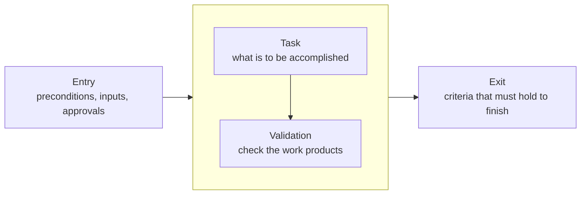

# Entry, Task, Validation, Exit

ETVX is a way of defining one unit of work so that it can be repeated, checked and improved. Every
activity is written as four parts: what must be true before it starts, what is done, how the result
is checked, and what must be true before it is allowed to finish.

It comes from Ronald Radice and colleagues at IBM, who set it out as the atomic element of a
programming process architecture .

## 1. The four parts, and which one does the work

**Entry** states the preconditions — inputs, approvals, availability — that *"should be satisfied
before beginning the tasks"*. **Task** is *"a set of task descriptions that indicate what is to be
accomplished"*. **Validation** is *"a validation procedure to verify the quality of the work items
produced by the tasks"*. **Exit** states what must hold for the activity to be considered done
.

```mermaid
flowchart LR
    A[Entry<br/>preconditions, inputs, approvals] --> G[ ]
    subgraph G[ ]
        direction TB
        B[Task<br/>what is to be accomplished] --> C[Validation<br/>check the work products]
    end
    G --> D[Exit<br/>criteria that must hold to finish]
```

The part that changes behaviour is **Exit**. Entry and Task are usually written down somewhere
already; explicit exit criteria are what stop work being declared complete because the calendar says
so. An activity whose exit criteria are *"the document exists"* has not been defined, it has been
named.

## 2. Sequence is not the same as blocking

ETVX means a stage cannot *start* until its predecessor *exits*. It is easy to read that as strict
serialisation, and Radice explicitly says otherwise: it *"does not imply that all activities or tasks
in a later stage must wait for completion of predecessor stages. The later stages may be functioning
in parallel with previous stages"* .

That clause is why ETVX sits underneath both plan-driven and iterative work. It constrains the
*handoff* between defined activities, not the calendar.

{: .note }
**A note on the V.** Validation in ETVX means checking the work products of *this* activity — a
design reviewed, a plan checked against its assumptions. It is often taught as "reviewing the
artefact, not testing the software", which is a useful teaching gloss but **not Radice's own
distinction**: he lists Unit Test, Functional Verification Test and System Verification Test among
the stages ETVX governs, so testing sits *inside* the scheme rather than outside it.

## 3. What it looks like on a real activity

**Example — estimating on a defence programme.** Oerlikon Aerospace, building a laser-guided
air-defence system with more than sixty engineers under MIL-STD-2167A, defined eight processes at
three levels of detail and chose ETVX *"because of its simplicity"*
. Their step SPP-120, *Prepare Project Estimates and Schedule*, is
written as:

- **Entry** — the RFP and statement of work, the work- and organisational-breakdown structures,
  historical data from previous programmes, and the stated assumptions.
- **Task** — produce estimates and a schedule using the defined estimation procedure.
- **Validation** — review the assumptions, run the checks, and update the historical database.
- **Exit** — an approved WBS and OBS, a schedule, cost estimates, and a list of alternatives
  considered.

The exit list is the interesting part. "A list of alternatives considered" cannot be produced
retrospectively, so requiring it at exit forces the estimating to have actually happened.

Radice's other lesson from deploying this is organisational rather than notational: *"Defining the
process and getting it accepted from the bottom up were the two essential parts of the solution"*
. A process defined for a team by people who do not do the work
gets complied with, not used — which is the subject of [defining a process](define.md).

## How solid is this?

- **ETVX is long-established and widely reused.** It has been the standard way of writing an atomic
  process element since 1985, and it underpins process-definition guidance well beyond IBM.
- **Radice's paper is an experience report from one company.** It describes a scheme and its
  deployment; it does not compare ETVX against an alternative or measure the improvement, so it
  supports *how to write an activity*, not *this notation outperforms others*.
- **Oerlikon is a single industrial case**  — a detailed and candid
  one, presented by its participants at a practitioner conference rather than independently
  evaluated.
- **The "validation is not testing" gloss is ours, not Radice's** — see the note above. Say so if you
  teach it.

---

### Acknowledgments

This page adapts material from lectures by **Eduardo Miranda** and **David Root**
 on software project management.

### References



---

{: .highlight }
**Disclaimer:** AI is used for text summarization, polishing and explaining. Authors have verified
all facts and claims. In case of an error, feel free to file an issue.
