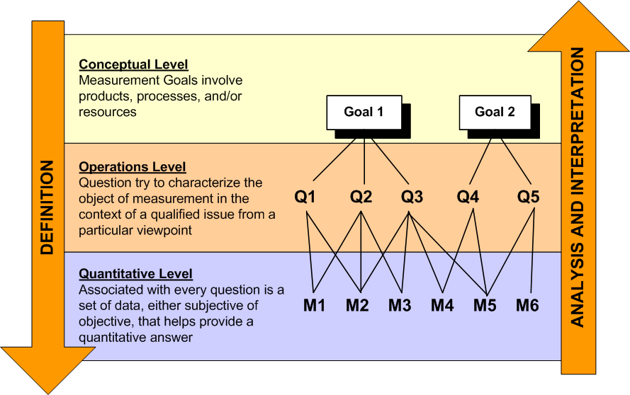

# Goal Question Metric (GQM) Approach by Victor Basili

**Sources:**  
- Caldiera, Victor R. Basili, Gianluigi, and H. Dieter Rombach. "The goal question metric approach." Encyclopedia of software engineering (1994): 528-532. ([PDF](https://www.ecs.csun.edu/~rlingard/COMP587/gqm.pdf))  
- Kruglov, Artem, Giancarlo Succi, and Anna Gorb. "GQM and Recommender System for Relevant Metrics." Developing Sustainable and Energy-Efficient Software Systems. Springer, 2022. ([Springer](https://link.springer.com/chapter/10.1007/978-3-031-11658-2_4))

---

## What is GQM?

The **Goal-Question-Metric (GQM)** approach is a structured method for defining and interpreting software metrics.  
It was developed by Victor Basili at NASA to ensure that all measurements are tied to clear, explicit goals.

**Key Principle:**  
> "If you cannot measure it, you cannot improve it." — Derek Huether

*GQM: If you cannot measure it, you cannot improve it.*

---

## How GQM Works

GQM is a **goal-driven** framework.  
You start by defining a high-level goal, break it down into specific questions, and then identify metrics to answer those questions.

### The GQM Hierarchy

1. **Goal:**  
   - What do you want to achieve or improve?  
   - *Example:* “Improve defect detection in code reviews.”

2. **Question:**  
   - What do you need to know to determine if the goal is met?  
   - *Example:* “What percentage of code review comments find defects before release?”

3. **Metric:**  
   - What data will you collect to answer the question?  
   - *Example:* “Number of defects found per review vs. defects found in testing.”

---

## GQM in Practice

A typical GQM program follows four phases:

1. **Planning:**  
   - Choose the project or process to improve and define initial goals.
2. **Definition:**  
   - Build the GQM model (goals → questions → metrics) and document it.
3. **Data Collection:**  
   - Gather and validate data according to the defined metrics.
4. **Interpretation:**  
   - Analyze the data to answer the questions and evaluate if goals are achieved.

**GQM is iterative:**  
Results are used to refine goals and drive continuous improvement.

---

## Why Use GQM?

- **Focus:**  
  - Measure only what matters for your goals—avoid “vanity metrics” and information overload.
- **Alignment:**  
  - Ensures metrics are relevant to project objectives.
- **Flexibility:**  
  - Works for both plan-driven and agile teams.
- **Continuous Improvement:**  
  - Supports ongoing learning and process refinement.

---

## Industry Examples

### NASA (GQM Origins)
- Used GQM to improve defect detection and overall software quality.
- Measured defect rates at each lifecycle phase to identify process weaknesses.
- Led to the Quality Improvement Paradigm (QIP), where GQM is the measurement step.

### IBM
- GQM for engineering teams.
- Tracks key metrics (e.g., bugs resolved, test cases run) to monitor project health.
- Focuses on a few impactful measures rather than many trivial ones.

### Microsoft
- Found that organizational metrics (team structure, code ownership) predicted software quality better than code metrics.
- Uses dashboards to track build success, MTTR, and customer satisfaction.
- GQM and Scorecards for code reviews help teams identify improvement opportunities.

### Other Companies
- HP, Intel, Ericsson use GQM for process improvement (CMMI/ISO 9001).
- Tech giants (Google, Amazon) use dashboards to monitor team performance and system reliability.

---

## Tips for Success

- **Choose clear, measurable goals.**
- **Involve stakeholders in defining questions.**
- **Select a few meaningful metrics—less is more.**
- **Review and refine metrics regularly.**
- **Act on the results—metrics should drive decisions and improvements.**

---

## Key Takeaways

- GQM helps teams measure what matters, not just what’s easy to count.
- It links every metric to a higher-level purpose, supporting better decision-making.
- Success depends on clear goals, stakeholder buy-in, and regular review.

---

{: .highlight }
**Disclaimer:** AI is used for text polishing and explaining. Authors have verified all facts and claims. In case of an error, feel free to file an issue.