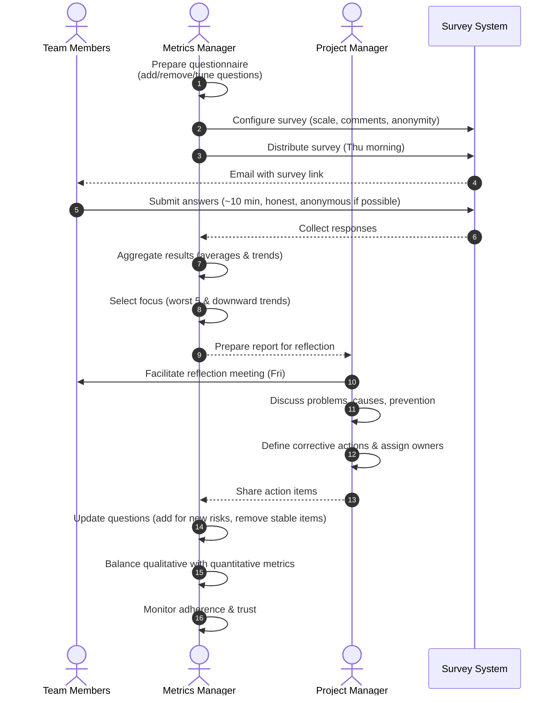

**Source:**  Mota, Pedro João. "Scoreboard: a support for management information needs." _MSE Reflection Paper_ (2009).
## 1. Core Idea

The **Scoreboard** is a lightweight tool to support project and team managers by collecting **qualitative insights** directly from team members.

- Instead of relying only on quantitative metrics (budget, code size, defect counts), it captures **perceptions and opinions**—often the only way to assess issues like morale, cohesion, or trust.
    
- It’s especially useful for **distributed teams** or in areas where hard data is hard to define or too costly to measure

## 2. How It Works

1. **Design questions** – general (“How do you evaluate the Project Manager?”) + specific (“How accurate were the weekly task estimates?”).
    
2. **Collect answers** – usually via a web questionnaire, short (≤10 min), ideally anonymous to encourage honesty.
    
3. **Evaluate answers** – semantic 5-point scale (Very Bad → Very Good) with optional comments.
    
4. **Analyze results** – highlight worst 5 issues and downward trends.
    
5. **Discuss in reflection meetings** – the data itself doesn’t solve problems, but triggers conversations and commitments.
    
6. **Maintain scoreboard** – add/remove questions to stay relevant, avoid fatigue.

```mermaid
flowchart LR
  %% Phases
  subgraph T[Think]
    GQM(Define goals & info needs<br/>use GQM if possible)
    QDEF(Design questions<br/>• General roles/areas<br/>• Specific issues/risks)
    SCALE(Define scale & inputs<br/>• 5-level semantic scale<br/>• Comments<br/>• Optional “Don’t know”)
    GQM --> QDEF --> SCALE
  end

  subgraph A[Act]
    DIST(Distribute questionnaire<br/>web form, short)
    RESP(Collect responses)
    DIST --> RESP
  end

  subgraph R[Reflect]
    AGG(Aggregate data<br/>• Averages by question<br/>• Trends over time)
    SELECT(Select focus<br/>• Worst ~5 items<br/>• Downward trends)
    MEET(Reflection meeting<br/>Discuss: what/why/why missed/how prevent)
    ACTION(Plan actions & owners)
    AGG --> SELECT --> MEET --> ACTION
  end

  subgraph M[Maintain]
    UPDATE(Update questions<br/>• Add for new risks/actions<br/>• Remove stable/high items<br/>• Tune wording/scales)
    BALANCE(Balance with quantitative metrics)
    CHECK(Monitor adherence & trust)
    UPDATE --> BALANCE --> CHECK
  end

  %% Cross-phase flow
  SCALE --> DIST
  RESP --> AGG
  ACTION --> UPDATE
  CHECK -.-> GQM

  %% Cadence (as a node, not a note)
  WEEK[[Weekly cadence:<br/>Thu collect → Fri reflect]]
  DIST -. aligns .-> WEEK
  MEET -. aligns .-> WEEK

```

## 3. Strengths

- **Cost-efficient**: quick for members, rich data for managers.
    
- **Focus**: highlights most important issues for team discussion.
    
- **Promotes reflection**: helps individuals step back and assess (“reflection-on-action”).
    
- **Flexible**: can extend to risk management, training needs, or team suggestions.

## 4. Weaknesses

- Can overshadow quantitative metrics if overused.
    
- Lack of shared meaning in scales may skew results.
    
- Averages can hide dissent (outliers lost in mean).
    
- If results aren’t acted on, team motivation to answer drops.
    
- Danger of being seen as **evaluating individuals** instead of roles/activities.
    
- Requires continuous trust and maintenance

## 5. Lessons from the Mappers Project

- Weekly cycle: answer Thursday → analyze same day → discuss Friday. Short gap between answering and discussion is crucial.
    
- Around **35 questions** balanced between roles and general team issues.
    
- Questions that stabilized (consistently good for 4+ weeks) were removed to prevent fatigue.
    
- Checklists (Google Docs) ensured process discipline.
    
- The Scoreboard became the **main source of reflection input**, more than quantitative metrics.

{: .highlight }
**Disclaimer:** AI is used for text polishing and explaining. Authors have verified all facts and claims. In case of an error, feel free to file an issue.