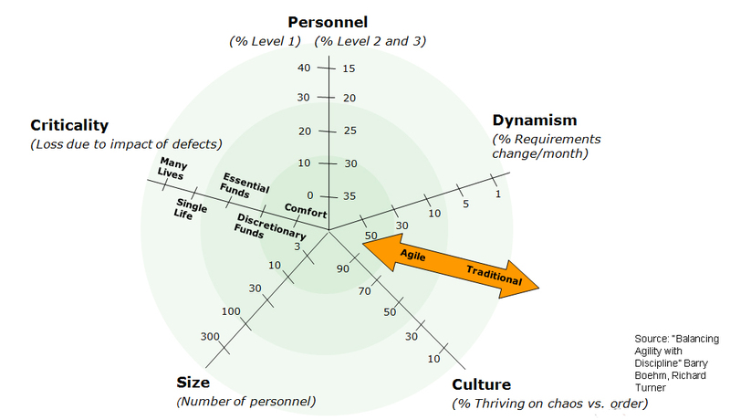
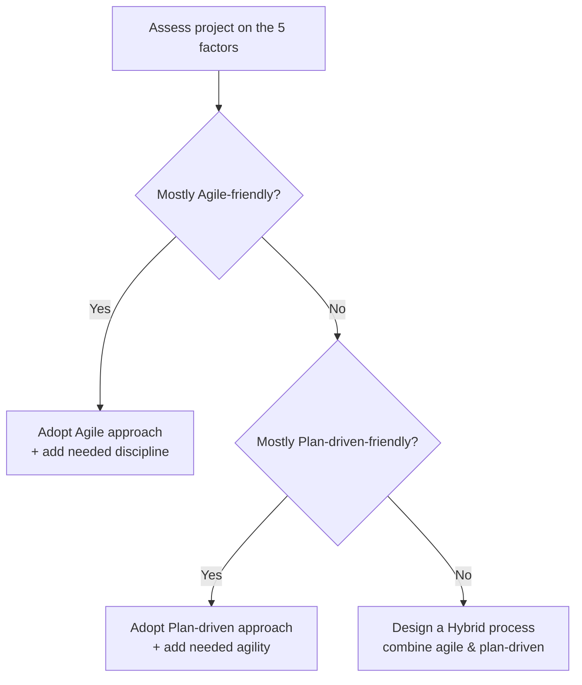

# Balancing Agility and Discipline  
## Choosing the Right Software Process (Boehm & Turner Framework)

**Sources:**  
- Boehm, Barry, and Richard N. Turner. *Balancing agility and discipline: A guide for the perplexed*. Addison-Wesley, 2003. ([oreilly.com](https://www.oreilly.com/library/view/balancing-agility-and/0321186125/)) 
- Boehm, Barry, and Richard Turner. "Using risk to balance agile and plan-driven methods." *Computer* 36.6 (2003): 57-66.  ([fritz.tips](https://www.fritz.tips/wp-content/uploads/2016/09/BeohmAndTurner_UsingRiskToBalanceAgileAndPlan-DrivenMethods.pdf))
- Taylor, Philip et al. "Applying an Agility/Discipline Assessment for a Small Software Organisation." Springer, 2006.([researchgate.net](https://www.researchgate.net/figure/Five-critical-factors-affecting-method-selection-4-p-56_fig2_221219158#:~:text=are%20categorised%20as%20follows%3A%20Environmental,Rate%20the%20project%E2%80%99s%20environmental))

---

## Why Balance Agility and Discipline?

- **Agile methods** focus on adaptability, rapid delivery, and customer collaboration.
- **Plan-driven (disciplined) methods** emphasize upfront planning, documentation, predictability, and process control.
- Most projects need a mix—**no single method fits all situations**.  
- The goal is to find the “sweet spot” for your project: enough agility to adapt, enough discipline to ensure quality and predictability.

---

## Boehm & Turner’s Framework: Five Critical Factors

Boehm & Turner suggest evaluating your project along **five key dimensions** to decide where it fits on the agile–plan-driven spectrum:

1. **Personnel:**  
   - *Agile:* Works best with highly skilled, experienced teams who can self-manage.  
   - *Plan-driven:* Better for teams with less experience or many junior members—needs more structure and guidance.

2. **Criticality:**  
   - *Agile:* Suited for low-criticality projects (failure is inconvenient, not catastrophic).  
   - *Plan-driven:* Required for high-criticality projects (failure could mean loss of life, major financial loss, or mission failure).

3. **Size:**  
   - *Agile:* Small teams and projects (easy communication, less coordination needed).  
   - *Plan-driven:* Large teams and projects (needs formal roles, documentation, and coordination).

4. **Culture:**  
   - *Agile:* Fits organizations with informal, flexible, and change-tolerant cultures.  
   - *Plan-driven:* Fits organizations with formal, hierarchical, and process-oriented cultures.

5. **Dynamism:**  
   - *Agile:* Best for projects with rapidly changing requirements.  
   - *Plan-driven:* Best for projects with stable, well-defined requirements.

---

## How to Choose the Right Approach

- **Profile your project** on each factor (e.g., use a radar chart).
- If most factors lean agile, use an agile process.
- If most factors lean plan-driven, use a plan-driven process.
- If factors are mixed, **blend both approaches**—use agile practices where they fit, and plan-driven practices where needed.

---

## Example: Applying the Framework

**Scenario:**  
A 50-person supply chain management system project.

- **Size:** Medium (borderline between agile and plan-driven).
- **Dynamism:** High (requirements change often).
- **Criticality:** Moderate (failures cause financial loss, not life-threatening).
- **Personnel:** Experienced core team, low turnover.
- **Culture:** Collaborative, flexible.

**Chosen Approach:**  
- Mostly agile tactics (rapid increments, frequent delivery).
- Added plan-driven elements for safety (upfront architecture, planning for scalability).
- Result: Agile process with enough discipline to manage risks.

---

## Visualizing Project Profile: The Polar Chart

A **polar (radar) chart** helps visualize where your project sits on each factor.  
- Center = agile-friendly  
- Outer edge = plan-driven-friendly  
- Most projects are a mix—use a hybrid approach.

Source: [cs3240](https://www.cs3240.org/modules/process/the-polar-chart/)

---

## Risk-Based Decision Process
Source. Taylor, Philip & Greer, Des & Sage, Paul & Coleman, Gerry & Mcdaid, Kevin & Lawthers, Ian & Corr, Ronan. (2006). Applying an Agility/Discipline Assessment for a Small Software Organisation. 290-304. 10.1007/11767718_25. ([researchgate.net](https://www.researchgate.net/figure/Five-critical-factors-affecting-method-selection-4-p-56_fig2_221219158#:~:text=are%20categorised%20as%20follows%3A%20Environmental,Rate%20the%20project%E2%80%99s%20environmental))

- **Assess risks:**  
  - Environmental (context, domain uncertainties)
  - Agile-related (e.g., team turnover, tacit knowledge loss)
  - Plan-driven-related (e.g., costly rework if requirements change)
- **Choose approach based on dominant risks:**  
  - If agile risks dominate, add plan-driven practices.
  - If plan-driven risks dominate, add agile practices.
  - If risks are mixed, use a hybrid strategy.

## Example: Applying the Framework

Source. Boehm, Barry, and Richard Turner. "Using risk to balance agile and plan-driven methods." *Computer* 36.6 (2003): 57-66.  ([fritz.tips](https://www.fritz.tips/wp-content/uploads/2016/09/BeohmAndTurner_UsingRiskToBalanceAgileAndPlan-DrivenMethods.pdf))

**Project Scenario:** _50-person Supply Chain Management System_ (adapted from Boehm & Turner’s case study)

- **Size:** ~50 developers, multi-organization (medium-sized – on the borderline between agile’s small-team sweet spot and a larger project).
    
- **Dynamism:** High requirements volatility – market-driven features and customer-specific adaptations; parts of the system are highly unstable and evolving.
- **Criticality:** Moderate – failures could cause financial loss and disrupt operations, but are not life-critical (primarily impacts “essential funds,” not safety).
- **Personnel:** Strong, experienced core team and a stable workforce (domain experts in key roles). Low turnover means tacit knowledge is retained, making agile practices feasible.
- **Culture:** Collaborative and flexible company culture; comfortable with change and iterative work (agile-friendly).
- **Chosen Approach:** The team opted for a **risk-tailored agile** process. They emphasize agile tactics (rapid increments to deliver value quickly) while introducing selective plan-driven elements for safety nets. For example, they invest in upfront **architecture and planning** to ensure scalability and handle critical components – addressing risks of large team size and moderate criticality. Overall, the project runs in an agile manner with just enough discipline to manage the identified risks (if the environment were more stable and well-understood, a more plan-driven strategy might have been chosen instead)

---

## Key Takeaways

- **No one-size-fits-all:** Every project needs a tailored mix of agility and discipline.
- **Use the five-factor assessment** to guide your process choice.
- **Balance strengths and weaknesses:** Blend agile and plan-driven practices to fit your project’s needs and risks.
- **Continuously monitor and adjust** your approach as the project evolves.

---

{: .highlight }
**Disclaimer:** AI is used for text summarization, explaining and formating. Authors have verified all facts and claims. In case of an error, feel free to file an issue.
