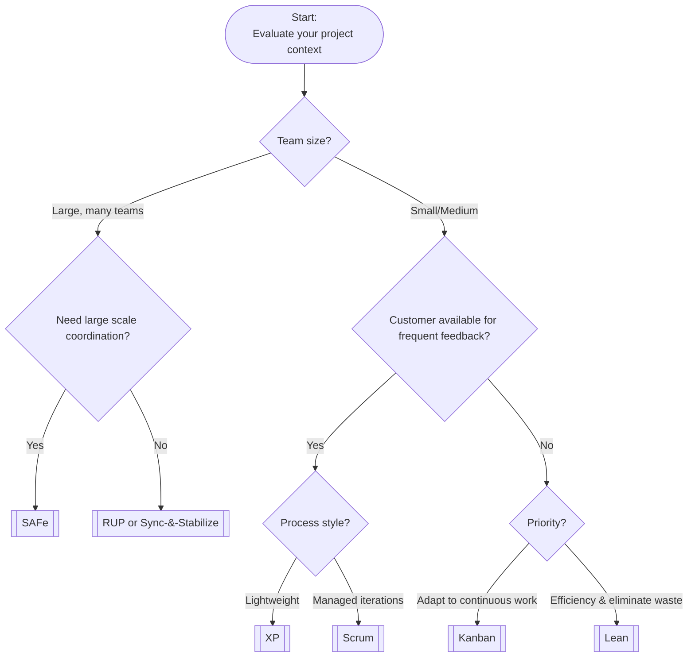

# Choosing Your Software Development Process Framework

Selecting the right software development process framework is crucial for project success. This guide compares eight major frameworks—from heavyweight, plan-driven approaches to lightweight Agile methods—and provides practical decision guidance for MS students.

---

## Key Decision Criteria

When choosing a process framework, consider:

- **Team Size:** Small teams (XP, Scrum) vs. large/multi-team projects (SAFe, RUP).
- **Project Size & Complexity:** Large, complex projects need more structure (RUP, SAFe); small projects can use lightweight methods (Scrum, XP).
- **Risk Tolerance:** High-risk domains (TSP, RUP) require rigor; Agile methods (XP, Kanban) suit projects that can tolerate change.
- **Process Discipline:** Some frameworks require strict adherence (TSP, RUP); others rely on team self-discipline (Kanban, Lean).
- **Documentation Needs:** RUP and TSP require extensive documentation; Agile methods focus on working software.
- **Iteration Cadence:** XP uses short cycles; Scrum has fixed sprints; Kanban is continuous; RUP/SAFe have longer phases.
- **Customer Involvement:** XP and Scrum need frequent feedback; RUP/TSP involve customers at milestones.
- **Tooling:** Heavyweight frameworks need robust tools; lightweight methods can use simple boards or trackers.

---

## Comparison Matrix

| **Framework**                        | **Team Size**         | **Project Size & Complexity** | **Risk Tolerance** | **Process Discipline** | **Documentation** | **Iteration Cadence** | **Customer Involvement** | **Tooling Needs** |
| ------------------------------------ | --------------------- | ----------------------------- | ------------------ | --------------------- | ----------------- | --------------------- | ------------------------ | ----------------- |
| **RUP**                             | Medium/Large          | Large, complex                | Low                | High                  | Extensive         | Long, iterative       | Moderate                | High              |
| **MSS (Sync & Stabilize)**          | Large, feature teams  | Large-scale products          | Moderate           | Moderate              | Light             | Milestone-driven      | Low                     | High              |
| **TSP**                             | Small/Medium          | Small to large, critical      | Very Low           | Very High             | High              | Phased, weekly checks | Low                     | Moderate          |
| **XP**                              | Small                 | Small/Medium, changing        | High               | Moderate/High         | Minimal           | Very short cycles     | Very High               | Moderate          |
| **Scrum**                           | Small                 | Small/Medium                  | Moderate/High      | Moderate              | Minimal           | Fixed sprints         | High                    | Low/Moderate       |
| **Kanban**                          | Flexible              | Any, continuous flow          | High               | Moderate              | Minimal           | Continuous            | Moderate                | Low               |
| **Lean**                            | Any                   | Any, value-focused            | High               | Moderate              | Minimal           | Adaptive              | High                    | Low               |
| **SAFe**                            | Very Large            | Large, enterprise             | Low/Moderate       | High                  | Moderate          | Multi-level, iterative| Moderate                | High              |

---

## Decision Guidance Flowchart

Use this flowchart to narrow down your framework options based on project characteristics:

---

## Key Takeaways

- Match your framework to your project’s size, risk, discipline, and customer needs.
- Use the matrix and flowchart to guide your choice.
- Hybrid approaches are common—adapt frameworks as needed.

---

## Sources

- Rockwood, Justin. "Choose Your Weapon Wisely." (2003 Edition)
- Boehm, Barry, and Richard N. Turner. *Balancing agility and discipline: A guide for the perplexed*. Addison-Wesley, 2003.
- Boehm, Barry, and Richard Turner. "Using risk to balance agile and plan-driven methods." *Computer* 36.6 (2003): 57-66.
- Taylor, Philip et al. "Applying an Agility/Discipline Assessment for a Small Software Organisation." Springer, 2006.
- [ones.com](https://ones.com/blog/rup-vs-agile-methodology-comparison/)
- [planview.com](https://www.planview.com/resources/guide/scaled-agile-framework-how-technology-enables-agility/safe-framework/)
- [projectmanagement.com](https://www.projectmanagement.com/blog-post/23006/scrum-vs-kanban-vs-xp)
- [slideshare.net](https://www.slideshare.net/slideshow/software-lifecycle-model-report/15843737)
- [altexsoft.com](https://www.altexsoft.com/blog/extreme-programming-values-principles-and-practices/)
- [objectstyle.com](https://www.objectstyle.com/blog/agile-scrum-kanban-lean-xp-comparison)
- [6sigma.us](https://www.6sigma.us/lean-six-sigma-articles/principles-of-lean-software-development/)
- [en.wikipedia.org](https://en.wikipedia.org/wiki/Team_software_process)

{: .highlight }
**Disclaimer:** AI is used for text summarization, explaining and formating. Authors have verified all facts and claims. In case of an error, feel free to file an issue.
