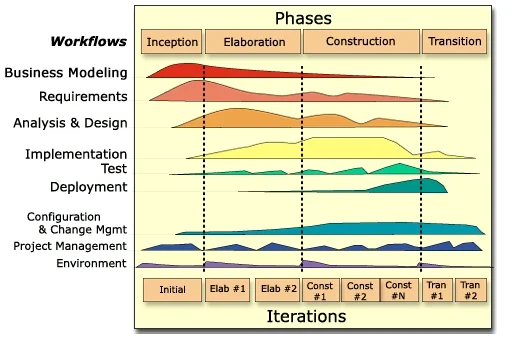
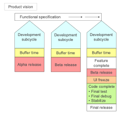
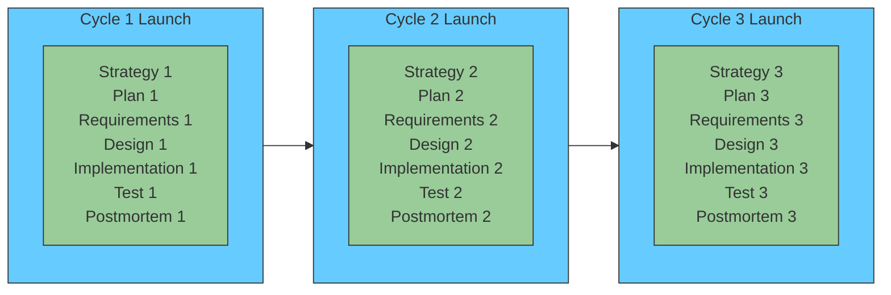
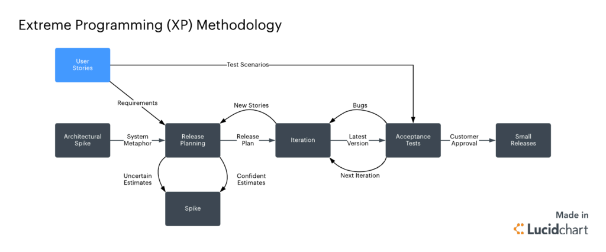
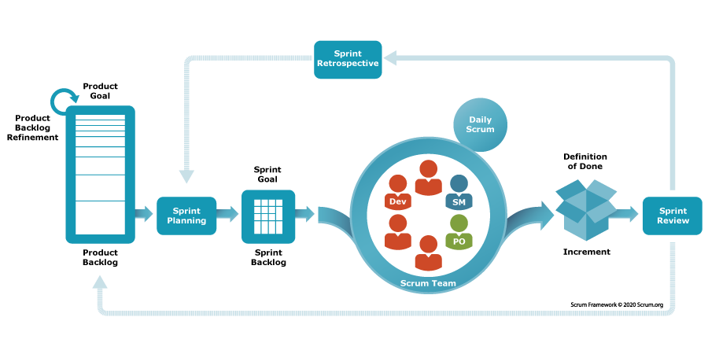
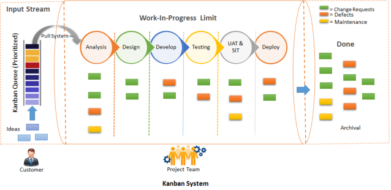
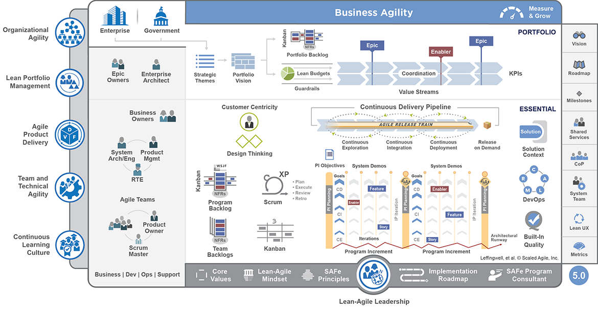

# Framework Summaries and Examples

Finally, let’s summarize each of the eight frameworks with their core philosophy, pros/cons, typical use cases, and a brief example scenario to illustrate when one might be chosen.

### Rational Unified Process (RUP)

Source. [architectureportal.org](http://architectureportal.org/rational-unified-process)

- **Summary:** A **heavyweight, plan-driven** iterative framework from IBM Rational. Organizes development into four phases (Inception, Elaboration, Construction, Transition) with defined milestones and extensive use of UML modeling and documentation. Emphasizes **architecture-first** and **risk-driven** development – tackle high-risk elements early in the project.
    
- **Strengths:** Provides **structure and predictability** for large projects. Excellent for **complex, high-assurance systems** that require thorough requirements analysis and design before coding. Strong focus on **risk management, quality and documentation** ensures no aspect is overlooked. Can accommodate **large teams** and has defined roles for specialization (analyst, architect, tester, etc.).
    
- **Weaknesses:** Can be **overly bureaucratic for small or fast-changing projects** – the overhead of documents and formal steps may slow down progress if requirements are volatile. A _“structured approach”_ like RUP often means **slower initial delivery** and requires significant expertise to tailor properly. Teams not disciplined in following the process can get bogged down.
    
- **Typical Use Cases:** **Enterprise or government projects** where **comprehensive documentation** and **stakeholder sign-offs** are mandated (e.g. defense systems, large banking software). Projects with **low tolerance for schedule slippage** that benefit from detailed planning and architecture stabilization (e.g. a telecom system that must integrate with many subsystems). If an organization already has a process governance (CMMI level requirements, etc.), RUP fits well as it can be tailored to those standards.
    
- **Example:** A government contractor is developing an air traffic control software upgrade. The project involves multiple subcontractor teams and stringent safety requirements. They choose **RUP** so that they can produce the required design documentation (using UML) and follow a gated process with formal reviews (requirements review, architecture review, test plan review) at each phase. Early in Elaboration, they focus on prototyping radar tracking (a high-risk element) to retire technical risks. Though this approach takes substantial upfront time, it provides the predictability and audit trail needed. The team uses IBM Rational tools to manage requirements and design models, and stakeholders are invited to milestone reviews to approve each phase’s outcomes. While this means less flexibility for late changes, it gives the aviation authority confidence that all scenarios are accounted for before full deployment.
    

### Microsoft Synchronize & Stabilize (Sync-&-Stabilize)

Source. Cusumano, M.A. and D.B. Yoffie, “Software Development on Internet Time”, IEEE Computer, Vol. 32, No. 10, 1999, pp. 60-69.

- **Summary:** A **milestone-driven iterative model** developed at Microsoft in the 1990s for products like Windows and Office. Multiple small teams work **concurrently** on different features; they **“synchronize”** by integrating code frequently (often daily) and **“stabilize”** by fixing bugs at the end of each milestone. Emphasizes achieving runnable builds early and often, even if not feature-complete, to enable testing and feedback.
    
- **Strengths:** **Fast-paced development** that can handle big projects by parallelizing work. Daily builds and frequent integration mean **issues surface early** – integration bugs or incompatibilities are caught throughout instead of at the end. Allows a mix of flexibility and control: teams have autonomy to innovate on features in parallel, but regular milestones impose a synchronization point for alignment. Particularly effective for **commercial software** where releasing a series of preview versions (alpha, beta) is acceptable and beneficial. Microsoft found this model kept projects on track: _“projects remain under control because teams frequently synchronize and periodically stabilize”_.
    
- **Weaknesses:** Requires **strong infrastructure and resources** – e.g. dedicated test teams, robust automated build systems, and management of parallel efforts. It assumes a somewhat **loosely defined spec** that evolves; the _“detailed specification is only available at time of release”_, which might concern stakeholders who want exact requirements upfront. Without a heavyweight spec, late changes can be integrated, but there’s a risk of feature creep or integration complexity. Also, having many small teams means **coordination challenges** – periodic integration can be painful if teams diverge, requiring a “stabilization” crunch period to fix integration bugs (Microsoft often had a stabilization phase where new development paused to focus on bug fixing). In short, it’s **resource-intensive** (parallel dev and test) and assumes an ability to tolerate some chaos in mid-development.
    
- **Typical Use Cases:** **Large-scale product development** in a single organization where you can afford separate feature teams and a longer beta phase. Think of **consumer or platform software** (operating systems, office suites, large SaaS products) where hitting a market window is important but you can also iterate with beta releases. Also useful when you expect to **evolve features based on intermediate testing** – e.g. building a new game console OS, you might not know which features will be ready, so you iterate with sync & stabilize to gradually bring the most stable set to release.
    
- **Example:** A tech company is developing a new mobile operating system. They break the engineering group into several teams: UI/UX, Kernel, Networking, Security, etc. Using **Synchronize-and-Stabilize**, each team works in parallel on their features for 3-month “milestone 1”. Every day, a **daily build** is produced integrating all teams’ code. If the build breaks, it’s all-hands-on-deck to fix it immediately. At the end of milestone 1, they declare a **“feature complete” freeze** and enter a stabilization period: no new features, just bug fixes and refining integration. They release a **Milestone 1 Beta** to internal testers. Then they plan Milestone 2, adding more features and improvements based on feedback. This continues until a public Beta and eventually a final release. The frequent syncs mean, for instance, the Networking team discovered early that a new Security encryption module caused some API changes – they fixed those in the next day or two, rather than finding out months later. The downside was some late nights for teams during stabilization, but the end product was robust and delivered on schedule.
    

### Team Software Process (TSP)

- **Summary:** A **high-discipline, metrics-driven** team process defined by Watts Humphrey at the SEI (Software Engineering Institute). TSP extends the Personal Software Process (PSP) to team scale, aiming to create **self-directed teams** that plan and track their work meticulously. It provides scripts for project launch, role definitions (e.g. team leader, quality manager), and emphasizes **quantitative management** – tracking time, size, defects, and yielding detailed project data. The philosophy is that **measured, defined processes lead to predictably high-quality software**.
    
- **Strengths:** **Predictability and quality.** TSP has a track record of dramatically reducing defects and improving estimation accuracy by forcing rigor in planning and execution. Each developer using PSP practices means code is reviewed and tested at the personal level; the team’s consolidated data allows accurate status and early warning of issues. TSP’s focus on **continuous improvement** and retrospection (through post-mortems) means the process gets better each cycle. It’s great for **critical systems** where defects are unacceptable – teams have reported near-zero post-release defects with TSP. Also, it instills **engineering discipline** in teams – from design and code reviews to risk management (there is even a defined step to identify and mitigate risks during the launch phase).
    
- **Weaknesses:** **High overhead and entry barrier.** Implementing TSP requires training the team in PSP first (each member must learn personal discipline and data tracking), which is a significant investment. The process involves lots of logging and meetings (TSP launch has up to 9 meetings with scripts), which can be seen as bureaucratic. TSP is less flexible in the face of changing requirements – it prefers upfront planning and commitment to a plan, so scope changes mid- cycle can disrupt the carefully laid plans (TSP can handle change, but the culture is to manage it via formal re-planning). It’s mainly been adopted in specialized domains; **mainstream agile teams might find it overly rigid** and against the agile ethos (e.g. individuals might resist the detailed time tracking). Also, TSP doesn’t inherently scale to systems requiring multiple teams beyond coordinating separate TSP teams (no built-in concept of large program coordination aside from each team doing TSP).
    
- **Typical Use Cases:** **Safety-critical or mission-critical projects** where a defect could be catastrophic (medical devices, aircraft software, automotive systems) and thus a rigorous process is justified. Also used in **high-maturity organizations** (CMMI Level 5 type companies) or those pursuing Six Sigma level quality. TSP shines in environments that value **detailed metrics** – e.g. contracting situations where you must demonstrate quantitative control over the project. Teams that have tried less structured agile methods and struggled with quality or meeting commitments might adopt TSP to impose needed discipline.
    
- **Example:** A software team at a pacemaker manufacturer is tasked with developing the next-gen firmware. Given the life-and-death nature of the product, they choose **TSP**. All developers first go through a PSP training, learning to estimate and record their work carefully. The project begins with a **TSP launch** – the team, guided by a TSP coach, defines goals (e.g. “no more than 1 defect per KLOC”), roles (one member is the Quality Manager, another the Schedule Manager, etc.), and a detailed plan broken into a sequence of development cycles. They estimate size and effort for each feature and use those to build a schedule. As development proceeds, each member logs the time they spend on each task and defect. Each week the team meets to compare planned vs actual hours and defects injected/removed. Early in the project, these metrics show the team is falling behind on module X development; they use TSP’s data to pinpoint that design took longer than expected, so they collaboratively re-balance workload and adjust the plan (with management’s agreement). By the end, the team has precise data showing they met their quality goal (e.g. achieved 0.5 defects/KLOC in system testing, in line with PSP review removal rates). When an FDA auditor asks about the development process, the team presents detailed logs and a **quality plan** demonstrating compliance and rigor. The result is a highly reliable firmware, achieved on schedule, with full accountability – albeit at the cost of a lot of upfront effort in process and planning.
    

### Extreme Programming (XP)

Source. [nimblework](https://www.nimblework.com/agile/extreme-programming-xp/)

- **Summary:** A **pioneering Agile methodology** (created by Kent Beck) that pushes iterative development to the extreme. XP is built on 5 values (communication, simplicity, feedback, courage, respect) and 12 hallmark practices (such as **Pair Programming**, **Test-Driven Development**, **Continuous Integration**, **Refactoring**, and **Small Releases**). XP teams plan in very short cycles, continuously refactoring and integrating, with a heavy emphasis on **involving the customer** and improving code quality through testing. The goal is to **embrace change** even late in development and deliver working software at a very rapid cadence.
    
- **Strengths:** **Rapid responsiveness and high customer satisfaction.** XP’s practice of having an **on-site customer** means the team is always building what the customer needs _right now_. If requirements change, XP welcomes it – the next iteration’s plan will simply reflect the new priorities. The focus on automated testing (everyone writes unit tests for all code, and customer writes acceptance tests) results in a robust codebase that can be changed with confidence; this mitigates the risk of quick changes causing quality issues. XP’s **continuous integration and frequent refactoring** keep the design clean and adaptable. For the team, XP can be very empowering and improve skills (pair programming facilitates knowledge sharing). It’s been noted that XP can dramatically improve **productivity for small teams** in volatile environments, delivering a constant stream of useful features.
    
- **Weaknesses:** **Not suited for large teams or fixed-scope, high-ceremony contexts.** XP really only works with a dedicated, small team and a customer who is co-located and available full-time. It struggles with projects that have **extensive external constraints** (e.g. regulatory documentation, interfaces to many other systems) because it deliberately does _less_ upfront requirements and design – that can be problematic if you have to, say, provide a complete design document early. The reliance on **high discipline** in engineering practices is a double-edged sword: if any XP practice is not done well (say, people don’t actually write tests or pair program diligently), the process can break down. Some developers or stakeholders may resist practices like pair programming or the lack of formal documents. Also, because XP doesn’t formally address scaling, coordination beyond ~10 people becomes ad hoc (some have tried “XP at scale” with mixed success). In summary, XP can be **intense** and requires buy-in to its culture; it’s not a one-size-fits-all if the environment can’t support continuous customer engagement or the team isn’t willing to practice XP’s strict routines.
    
- **Typical Use Cases:** **Small teams in a single location** with **direct access to customers**. Startups are a classic fit: for example, a startup building a web app might use XP so they can iterate daily and pivot as they learn what users really want. XP is also used in IT departments for projects where requirements are fuzzy and likely to change (internal applications where the business customer works down the hall). It’s well-suited to **short timeframe projects** where delivering something working soon is more important than extensive planning. Also, teams that have a strong testing culture or want to build one may adopt XP to enforce test-first development.
    
- **Example:** A financial tech startup has a team of 6 developers and one product manager (acting as the customer proxy) developing a new mobile payment app. They choose **XP** to cope with the uncertain requirements – they know they’ll need to tweak features based on user feedback. The team works in a common bullpen area, coding in **pairs** each day (two people, one computer) to solve tasks. They follow **test-driven development**, writing unit tests for every new feature before writing the code. The product manager sits with the team and is available whenever a question arises or a decision needs quick clarification – for instance, developers will ask, “What should happen if a user’s payment fails?” and get an immediate answer. They deploy a new build to a test server every day (sometimes multiple times a day). Every two weeks, they hold a **planning game** with the product manager to pick user stories for the next iteration, based on what was learned (e.g. after a pilot with 50 users, they realize they need to simplify the sign-up process, so they prioritize that for the next iteration). Documentation is minimal – a lightweight README and the tests themselves describe the system’s behavior. As a result, the startup can respond extremely quickly to investor demos and user feedback, releasing updates sometimes daily. Within a few months, they have a robust, test-covered core product. When a compliance requirement emerges (e.g. audit logging for transactions), they handle it by writing tests for those scenarios and implementing just enough logging to pass the tests, rather than writing a big design document. The XP approach gives them the agility to evolve the product in sync with a fast-changing business environment.
    

_Scrum vs. XP: While both are Agile, XP takes engineering practices to extremes – e.g., continuous refactoring, on-site customer – to enable rapid change. This image shows a simplified Scrum workflow, but XP would involve even more frequent code integrations and test feedback._

### Scrum

Source. [scrum.org](https://www.scrum.org/resources/what-scrum-module)

- **Summary:** **Scrum** is a lightweight Agile framework focused on managing work in **short, fixed iterations** (called Sprints). It defines just three roles – Product Owner, Scrum Master, Development Team – and a simple set of ceremonies (Sprint Planning, Daily Scrum stand-ups, Sprint Review, Sprint Retrospective). Work is organized via a **Product Backlog** (prioritized list of user stories) and each Sprint, the team commits to a Sprint Backlog of items to deliver. Scrum doesn’t prescribe specific technical practices (unlike XP); it’s more about **project management and team self-organization**.
    
- **Strengths:** **Simple and widely applicable.** Scrum’s strength lies in its **empirical approach** – every sprint you inspect and adapt. It provides just enough structure to keep a team focused (daily accountability, a clear goal for the sprint, regular stakeholder input) but is not overly heavyweight. It has become one of the most popular methodologies because it’s relatively easy to understand and implement for teams transitioning from waterfall; many organizations use Scrum as their first step into Agile. Scrum also **promotes collaboration and visibility** – the whole team is aware of progress and impediments through daily stand-ups and transparent backlog tracking. By delivering potentially shippable increments frequently, Scrum ensures value is realized early and feedback is gathered often. It’s effective for **managing complex projects** where you might not know all requirements upfront – Scrum lets you incorporate new insights each sprint. Additionally, Scrum’s concept of **cross-functional, self-organizing teams** improves team ownership and morale (everyone figures out together how to get work done, rather than being assigned tasks top-down).
    
- **Weaknesses:** **Scope beyond a single team and enforcement of technical quality are potential gaps.** Scrum, by design, doesn’t say how multiple teams coordinate on one product – you need to add scaling techniques (e.g. Scrum of Scrums, or use frameworks like SAFe, LeSS). So using Scrum in a large project (50+ devs) without adaptation can lead to cross-team integration issues. Another frequent challenge is that Scrum doesn’t specify engineering practices; if a team adopts Scrum but neglects good technical practices (no automated testing, etc.), they can end up with poor quality or unsustainable pace – this is sometimes called _“Scrum but no engineering, leading to Scrumfall”_. Also, Scrum requires **dedicated roles** (Product Owner availability is crucial, Scrum Master to remove impediments) – if those roles are not properly filled, the process suffers (e.g. an absent Product Owner means requirements won’t be clarified in time). Some teams and organizations also struggle with the time-box commitment: if not done right, teams might feel pressure to overcommit and then crunch to meet the sprint goal, or conversely if something urgent comes up mid-sprint, Scrum says you shouldn’t change scope – not all environments allow that stability (e.g. ops teams with emergencies). In summary, Scrum is not a silver bullet – it addresses project management well, but **needs to be complemented with solid agile engineering practices and possibly scaling tactics** for larger endeavors.
    
- **Typical Use Cases:** **Software product teams** of 5-9 people developing new features in close collaboration with a product manager/stakeholders. Common in **web development, mobile app development, and enterprise application teams** where work can be divided into increments that deliver user-facing value. Also used in **agile transformation efforts** – many companies train teams in Scrum as a starting template because it’s well-documented and straightforward. Scrum works best when the product backlog is well-managed and priorities can be shifted each sprint, so domains like marketing tech, e-commerce, and general IT projects are a good fit. It’s also seen beyond software – e.g. some hardware or marketing teams use “Scrum” for organizing work, which speaks to its generic nature.
    
- **Example:** A mid-sized e-commerce company has a **Scrum team** of 8 (devs + QA + UX) tasked with building a new online shopping cart system. They have a Product Owner from the business side who maintains the backlog of features (user stories like “As a shopper, I want to save my cart for later”). The team operates in 2-week **Sprints**. At Sprint Planning, they select the top items they believe can be completed in 2 weeks based on their past velocity. Each day, the team holds a **15-minute stand-up meeting** to sync: e.g. a developer might say “Yesterday I finished the coupon code validation, today I’ll start on the PayPal integration, and I’m blocked waiting for API credentials – Scrum Master, can you assist with that impediment?” Throughout the sprint, they update a task board (or digital tool) showing tasks in To Do / In Progress / Done columns. At the end of the sprint, they do a **Sprint Review** with stakeholders – they demo a working checkout flow (maybe not all payment methods yet, but basic credit card checkout works). They gather feedback – the stakeholders love it but ask if they can prioritize adding gift card support next. In the **Retrospective** right after, the team discusses their process: they realize testing spilled over a bit past the sprint end; they decide next time to involve QA earlier and perhaps adopt some test automation (here we see Scrum prompting improvement – maybe borrowing an XP practice). In the next sprint, they adjust their plan to include those improvements. This cycle repeats, and every 2 weeks the business gets to see progress and adjust priorities. Within a few sprints, a minimal viable product is ready and they even release it to a small percentage of users for beta. The Scrum framework ensured that at any given point, there was transparency about progress and obstacles, and the cadence of reviews ensured the product was aligned with business needs throughout.
    

### 

Source. [agilegnostic](https://agilegnostic.wordpress.com/2015/09/13/lean-kanban-methodology-to-application-support-and-maintenance/)

- **Summary:** **Kanban** is an Agile method originating from lean manufacturing, focused on **visualizing work and limiting work-in-progress (WIP)** to improve flow. In software, a Kanban system is typically a board divided into columns that represent process stages (e.g. “Backlog”, “In Development”, “Testing”, “Done”), with cards (tasks/user stories) flowing across the board as they are worked on. Unlike Scrum, Kanban has **no fixed time iterations**; it’s a **continuous flow model**. Teams pull in new work whenever capacity is available, and they strive to optimize the cycle time (time from start to finish) of work items. Core practices include setting WIP limits per column, measuring flow metrics, and continuously improving the process.
    
- **Strengths:** **Great flexibility and continuous delivery.** Kanban shines in environments where work arrives unpredictably or priorities shift often – for example, maintenance teams or DevOps teams. Because there’s no sprint commitment, the team can re-prioritize or take on new urgent tasks at any time by simply pulling the new card when something else finishes. It also **exposes bottlenecks** clearly: if testing is slower than development, the “Testing” column will accumulate cards, signaling a need to adjust. By limiting WIP, Kanban prevents overloading individuals and encourages finishing work in progress before starting new work (improving focus and quality). It can deliver value **continuously**; whenever a card is done, that piece of functionality can potentially be released – which leads to faster delivery of features and fixes. Kanban is also relatively easy to implement over an existing process; you can “start with what you do now” and gradually improve, making it a gentle path to agility. It doesn’t mandate roles, so existing team structures can remain. Teams practicing Kanban often reach high efficiency by relentlessly tweaking their process policies (like daily standups become about flow, not status).
    
- **Weaknesses:** **Less prescriptive, may lack rhythm or a sense of deadline.** For teams not used to self-management, Kanban’s open nature can be challenging – without the time-box of a sprint or a defined planning meeting, some teams might struggle to keep momentum or stakeholder engagement. There is **no formal built-in review or retrospective** event (though teams often add regular cadences), so if the team doesn’t institute those, they might miss feedback loops or improvement opportunities. Also, because scope is never “locked in” (you can always add a new card), there’s a risk of constantly shuffling priorities or extending lead times unless discipline is maintained. In terms of predictability, Kanban provides **metrics** (like average cycle time, throughput) which can help forecast, but some stakeholders might be uncomfortable without the concept of an “iteration” or a promised sprint deliverable. Essentially, Kanban demands a **continuous improvement mindset** – teams that just set up a board but don’t actively manage WIP or analyze their flow might not see much benefit (it’s not just a board, it’s a process of evolutionary change). Also, Kanban doesn’t specify anything about technical practices; quality control is up to the team’s own standards (teams often incorporate XP practices into Kanban for that reason).
    
- **Typical Use Cases:** **Operations, support, and maintenance teams** are a classic fit – e.g. an IT operations team handling incoming support tickets can use Kanban to manage workload since ticket arrival is unpredictable. **Continuous delivery teams** also use Kanban when they release features as soon as they’re ready, rather than bundling in sprints – for instance, teams practicing _Continuous Deployment_ often move to a Kanban model to release features one by one. Kanban is used in **marketing or content teams** too, where tasks go through stages (draft, review, publish) and deadlines are fluid. It can also augment Scrum teams (Scrumban) by visualizing flow within a sprint or handling inbound interruptions. Any scenario where the focus is on **throughput and flow rather than fixed scheduling** is a good candidate.
    
- **Example:** A SaaS company has a **Platform team** that provides internal tools and fixes infrastructure bugs for other dev teams. Their work tends to be a mix of planned improvements and urgent fixes. They adopt **Kanban** to manage this flow. They set up a digital Kanban board with columns: Backlog, Ready, In Progress, In Review, Done. They impose a WIP limit of, say, 3 items “In Progress” at any time, since there are 5 engineers – this prevents them from starting everything at once. When an engineer finishes a task (moves a card to “Done”), they pull the next top-priority card from “Ready” into “In Progress”. High-priority bug comes in? The product manager can immediately put it in the Backlog, and if it’s truly urgent, mark it as top of “Ready” – it will be the next thing pulled. The team also has a policy: any **expedite item** (really critical outage) can override WIP limits but they highlight it in red on the board (so everyone sees the cost of emergency work). They monitor metrics: they notice the **average cycle time** for a task is, say, 4 days, and they aim to reduce that. Over weekly team discussions (they decided to have a weekly retro since no formal Scrum ceremonies), they realize code reviews are a bottleneck (things sit in “In Review” too long). So they change their policy: whenever a card is in Review, at least one dev must drop what they’re doing to review it (sort of a “swarm” practice) – this reduces waiting time. Over time, they tune their WIP limits and policies to optimize flow. The Platform team’s stakeholders appreciate that urgent requests get addressed immediately and that there’s _visual transparency_ on all work. There’s no concept of “carryover” or missed sprint commitment – the team simply continuously delivers, and if demand increases, it’s evident on the board (maybe prompting adding a team member or reprioritizing). After 3 months, the metrics show they doubled their throughput of completed cards per week compared to before Kanban, all without ever having a “late sprint” – work just flows steadily.
    

_Example Kanban board: Work is visualized and pulled through stages, as shown above. WIP limits prevent starting too much at once, enabling faster completion per item. This approach suits teams with unpredictable, continuous work streams._

### Lean Software Development

- **Summary:** **Lean** is not a fixed process but a **philosophy/approach** derived from Lean manufacturing principles, applied to software by Mary and Tom Poppendieck. It centers on **7 principles**: Eliminate Waste, Amplify Learning, Decide as Late as Possible, Deliver as Fast as Possible, Empower the Team, Build Quality In, See the Whole. Lean thinking in software means focusing on value to the customer and trimming any activities that don’t directly contribute value (e.g. excessive documentation, wait times, extra features are “waste”). It encourages **small batch sizes** of work, rapid delivery, and constant refinement of the process (continuous improvement or kaizen). Lean often underpins or overlaps with other Agile methods – e.g. Kanban is considered a Lean practice, and SAFe markets itself as “Lean-Agile”.
    
- **Strengths:** **Maximizes efficiency and adaptiveness.** By explicitly identifying “waste” in the development process (such as handoff delays, task switching, over-engineering, defects, etc.), Lean teams can significantly **improve cycle times and quality**. Lean’s principle of **delivering fast and learning fast** means customers get value sooner and the team gets feedback sooner, reducing the risk of building the wrong thing. The emphasis on **deciding as late as feasible** helps in uncertain domains – you keep options open and gather more information before locking decisions, which avoids rework. **Empowering the team** leads to high ownership and motivation; the people doing the work have the authority to change their process to be better. **Building quality in** aligns with practices like TDD, continuous integration – rather than inspecting for quality later, you integrate quality checks into daily work. Overall, Lean can make organizations more **holistically agile**, beyond just the dev team – it promotes looking at the entire value stream (from concept to delivery), which often uncovers improvement opportunities in requirements, deployment, customer engagement, etc. Many modern DevOps and Agile practices trace back to Lean principles (e.g. “limit WIP” = eliminate waste of task switching).
    
- **Weaknesses:** **Requires cultural change and systems thinking.** Because Lean is less prescriptive (there’s no step-by-step method; it’s principles-based), some teams might struggle to translate principles into action. It often requires experienced leadership to foster a Lean culture. Results may not be immediate if an organization is deeply siloed or used to heavy processes – Lean adoption could fail if, say, management still demands big upfront plans (violating “decide late”) or isn’t willing to empower teams. Also, misapplying Lean concepts can lead to problems: e.g. in the name of “eliminating waste” some might cut out essential activities (like skipping design completely). Lean works best with **whole-team involvement** and a learning mindset – if a company’s culture doesn’t reward admitting problems and improving, Lean initiatives can stall (people might hide issues rather than fix them, which is anti-Lean). Additionally, since Lean doesn’t dictate roles or iterations, teams coming from a more structured method might feel “anchorless” – often combining Lean with frameworks (like Kanban or Scrum) gives a tangible process to follow. In short, Lean’s flexibility is a double-edged sword: it’s powerful but can be **abstract** unless concretely implemented.
    
- **Typical Use Cases:** Many **Agile transformations** nowadays incorporate Lean principles at the management level – e.g. **portfolio management** with Lean (deciding late which projects to do based on latest info, limiting work in process across the company). Lean is effective in **product development organizations** aiming to continuously improve delivery speed and quality. Startups often intuitively follow Lean principles (small experiments, MVPs) – indeed Lean Startup methodology is an offspring of lean thinking. It’s also useful in **established organizations to streamline processes**: for instance, a company might use Lean to reduce the time from code complete to production (finding waste in their release process). Teams that have mastered basic Scrum or Kanban often adopt more Lean thinking to level-up (e.g. using value-stream mapping to find bottlenecks outside the development team).
    
- **Example:** A large online retailer’s software department decides to embrace **Lean** principles to speed up feature delivery. They start by **value stream mapping** the process of delivering a feature – from idea to deployment. They discover that after a developer finishes coding a feature, it sits in a testing queue for an average of 5 days – a huge waste in waiting time. To **eliminate this waste**, they reorganize into cross-functional squads where devs and testers work together, and they implement continuous integration so that automated tests run immediately on new code. They also find that writing extensive requirement docs upfront (taking weeks) is often wasted because requirements change once development starts. So they adopt a **“decide as late as possible”** mentality: they still do planning, but at the last responsible moment. For example, instead of detailing the entire year’s requirements, they maintain a lightweight backlog and only flesh out requirements one quarter ahead, and even then they keep them high-level, refining details right before implementation. The teams also begin doing **small batch releases** – instead of a big bang release every 2 months, they aim to deploy every week or even daily (Deliver as Fast as Possible). Initially, operations was nervous about frequent deploys, but by building quality in – automated testing and canary releases – they maintain reliability. Over a few months, the department sees that features that used to take 8-10 weeks from idea to production now take maybe 3 weeks. One specific example: they wanted to add a new recommendation widget on the site. Traditionally it would require a business requirements doc, design sign-off, etc., and might appear in a quarterly release. With Lean thinking, the team immediately created a basic version of the widget and A/B tested it within two weeks, gathered data (Amplify Learning), and then iterated on the idea. The project lead notes that people are less idle now; if something is blocking progress, they swarm to resolve it rather than wait (e.g. “stop the line” mentality from Lean manufacturing). Importantly, management stops demanding detailed Gantt charts for far-future projects (an old habit); instead they look at **Kanban-style charts** showing current flow and ask teams how they can help improve throughput. The Lean adoption has led to a culture where **continuous improvement** meetings are routine: one team, for instance, identified they were getting too many support tickets (waste), so they did a root cause analysis and improved their logging and user documentation to reduce those. In summary, the retailer’s tech org didn’t “install a new process” per se – each team might be using Scrum or Kanban as they prefer – but Lean principles at the higher level dramatically shortened delivery times and increased adaptability.
    

_Lean principle in action: favor small, fast delivery cycles over big batches. This Lean workflow image shows an emphasis on continuous learning and improvement – teams deliver in small increments to gather feedback quickly._

### Scaled Agile Framework (SAFe)

Source. Image is under Copyright by [Scaled Agile Inc](https://framework.scaledagile.com/).

- **Summary:** **SAFe** is a comprehensive **scaling framework** that combines Agile and Lean principles for use in large enterprises. It provides a structured approach with multiple configuration levels: Essential SAFe (team and program level), Large Solution, and Portfolio SAFe. SAFe synchronizes a set of agile teams (called an **Agile Release Train, ART** of typically ~50-125 people) on a common cadence and vision. It introduces new roles like Release Train Engineer (chief Scrum Master), Product Management (over multiple teams), System Architect, etc., and events such as **PI (Program Increment) Planning** – big room planning every ~10 weeks where all teams plan together. SAFe also incorporates Lean portfolio management to ensure alignment of development with business strategy. Essentially, SAFe attempts to **scale Scrum/Agile to the enterprise** by adding the necessary structure for multi-team coordination and long-term planning.
    
- **Strengths:** **Enterprise alignment and visibility.** For organizations that struggled with chaotic agile implementations across many teams, SAFe offers a way to bring **standardization and coordination**. All teams in an ART march to the same drumbeat (e.g. synchronized sprints, common iteration lengths, joint system demos), which facilitates integration of work and **transparency of progress** across teams. The emphasis on PI Planning gets everyone – developers, testers, Product Owners, Product Management, business stakeholders – in one room to agree on objectives for the next increment, which fosters **face-to-face communication at scale** and surfaces dependencies early. SAFe also helps **maintain architectural integrity** with roles like System Architect overseeing cross-team design. By adopting SAFe, organizations can continue to meet governance requirements (there are artifacts and metrics at each level) while still reaping agile benefits like iterative delivery and faster feedback than waterfall. Many enterprises have reported that SAFe enabled them to deliver **more predictably** – teams align on a common cadence, so if one team is slipping, it’s visible and can be addressed in the PI time frame. **Lean-Agile mindset** is promoted throughout, so SAFe encourages eliminating waste and continuous improvement (e.g. there’s an Inspect & Adapt workshop every PI). Additionally, SAFe provides a **huge knowledge base** of best practices and training, which can be helpful for companies new to agile at scale. And importantly, **SAFe can handle very large systems** – its “Large Solution” layer is specifically for integrating multiple ARTs (hundreds of developers) when building something like a jet avionics system or a nationally distributed banking system.
    
- **Weaknesses:** **Complexity and potential bureaucratic feel.** Critics of SAFe argue that it’s **too heavyweight** and prescriptive – it introduces a lot of terminology, roles, and ceremonies that can feel like “waterfall with new names” if implemented poorly. The famous SAFe big picture diagram can be overwhelming, and adopting SAFe often requires significant training and coaching (there are multiple certification levels), which can be expensive and time-consuming. Some agile purists feel SAFe top-down approach could stifle the **self-organizing spirit** of agile teams – e.g. teams might feel they have to meet top-level commitments (PI Objectives) that reduce their ability to adjust sprint by sprint. Implementing SAFe can also lead to **meeting overhead**: PI Planning is 2 full days every quarter for everyone; plus additional meetings like Scrum of Scrums, ART syncs, etc. If the organization is not careful, this can bog teams down. Additionally, SAFe assumes certain **cadences and alignment** that might not fit all contexts – for example, if different teams truly work at different speeds or some parts of the organization can’t be on the same sprint schedule, forcing everything into a SAFe train could be problematic. **Tooling and bureaucracy**: SAFe often comes hand-in-hand with using enterprise tools (like big agile project management suites) and creating lots of backlogs and reports – if done in a rote way, this can feel like a step backwards from the agility of a single Scrum team. Lastly, SAFe, by focusing on existing organizational structures (e.g. it often assumes a hierarchy of decision-makers), might not achieve as radical a transformation as other scale approaches that push for flatter structures; thus a company might do SAFe and still find silo issues (critics sometimes call it “Agile in name, waterfall in spirit” if leadership doesn’t truly embrace change). In summary, SAFe can be very effective, but it’s **easy to do in a checkbox way** that yields less agility – it requires real cultural adoption of Lean-Agile principles to get the best results, not just following the processes mechanically.
    
- **Typical Use Cases:** **Large enterprises** that have **dozens of Agile teams** working on interconnected products or a big product suite. Examples include: an automobile manufacturer’s IT division with 20 teams building a suite of dealer and consumer applications – they adopt SAFe to coordinate releases and align with business quarterly goals. Or a **telecommunications company** that needs to synchronize firmware teams, hardware teams, and software app teams – SAFe’s Large Solution level can coordinate those different ARTs. Also, organizations that require **portfolio-level oversight** (budgeting, compliance) often choose SAFe because it provides a way to connect portfolio epics down to team-level work with traceability. Government agencies with many contractors have also tried SAFe to scale agile across contracting teams. Essentially, any place too large for a single Scrum team (or even a few teams) to handle can look at SAFe as an option if they want to be agile but need structure.
    
- **Example:** A global bank has 15 teams (150+ developers) working on its online banking platform – mobile apps, web portal, backend microservices. They decide to implement **SAFe** to improve coordination, as previously each team was doing agile in their own way and releases were infrequent and painful to integrate. They establish an **Agile Release Train** for Digital Banking. They hold a big **PI Planning** every quarter: all team members (developers, testers) plus product management and other stakeholders (like Compliance and DevOps reps) join a 2-day planning workshop. In this session, the bank’s leadership communicates 3 major objectives for the next quarter (e.g. “Improve mobile deposit experience” and “Integrate Zelle payments”). Teams then break out by feature to plan their work for the next ~5 two-week Sprints (a Program Increment). They identify **dependencies** between teams – e.g. the Mobile App team needs an API from the Core Banking team by Sprint 2 – and a dependency board is used to visualize and resolve these. By the end, they produce a set of **PI Objectives** for each team and a program board showing timelines. During execution, each two-week Sprint, teams do regular Scrum, but they also participate in **ART Sync** meetings: a Scrum of Scrums (for SMs) and a PO Sync (for POs) to ensure cross-team alignment. At the end of each sprint, besides team demos, they have a **System Demo** where the integrated system (all teams’ work) is demoed to business owners. This gives higher-level feedback and ensures, say, the mobile and web experiences are consistent. They measure **program-level metrics** like predictability (did teams achieve their PI objectives?) and cumulative flow across the ART. After the PI, they hold an **Inspect & Adapt** workshop: they review what features did/didn’t get done, analyze metrics like velocity and quality, and identify improvement actions – e.g. they might decide to dedicate one team next PI as an “Enabler team” to focus on clearing technical debt that slowed others. Over two PI cycles, the bank sees significant improvement: previously releases happened only every 4-6 months with last-minute integration firefighting. Now with SAFe, they release at the end of every Program Increment (10 weeks) reliably, and even do mid-PI releases of smaller increments. Executives have better line-of-sight: using SAFe’s portfolio Kanban, they can see how big initiatives (epics) are progressing through implementation. Developers report they feel more connected to the business goals now (thanks to PI planning) and less stressed by surprise demands, since priorities are clarified on the PI cadence. However, they also note there’s more meetings than before – they spend time in PI planning and additional syncs – but overall, the trade-off is positive as work is less chaotic. The company needed this structure, and by truly adopting the Lean-Agile mindset (with leadership support), SAFe did not just add process overhead but actually reduced thrash and improved delivery speed for the bank’s software.

---

## References

- [ones.com](https://ones.com/blog/rup-vs-agile-methodology-comparison/)
- [slideshare.net](https://www.slideshare.net/slideshow/software-lifecycle-model-report/15843737)
- [go.gale.com](https://go.gale.com/ps/i.do?id=GALE%7CA19656552&sid=googleScholar&v=2.1&it=r&linkaccess=abs&issn=00010782&p=AONE&sw=w)
- [jamesmccaffrey.wordpress.com](https://jamesmccaffrey.wordpress.com/2009/01/03/the-synchronize-and-stabilize-software-development-methodology-paradigm/)
- [en.wikipedia.org](https://en.wikipedia.org/wiki/Team_software_process)
- [sei.cmu.edu](https://www.sei.cmu.edu/documents/645/2000_005_001_13754.pdf)
- [altexsoft.com](https://www.altexsoft.com/blog/extreme-programming-values-principles-and-practices/)
- [objectstyle.com](https://www.objectstyle.com/blog/agile-scrum-kanban-lean-xp-comparison)
- [projectmanagement.com](https://www.projectmanagement.com/blog-post/23006/scrum-vs-kanban-vs-xp)
- [6sigma.us](https://www.6sigma.us/lean-six-sigma-articles/principles-of-lean-software-development/)
- [planview.com](https://www.planview.com/resources/guide/scaled-agile-framework-how-technology-enables-agility/safe-framework/)
- [reddit.com](https://www.reddit.com/r/agile/comments/1ili7su/if_youre_working_with_a_large_organization_which/)