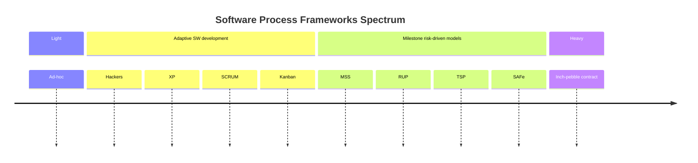

# Process Frameworks

## Framework Summaries & Example Scenarios

- **RUP:** Heavyweight, structured, best for large, complex, high-assurance projects.  
  *Example:* Government or banking software with strict documentation needs.
- **Sync & Stabilize:** Milestone-driven, parallel teams, good for large commercial products.  
  *Example:* OS or office suite development with frequent integration.
- **TSP:** High discipline, metrics-driven, ideal for safety-critical systems.  
  *Example:* Medical device firmware.
- **XP:** Agile, rapid cycles, high customer involvement, best for small teams.  
  *Example:* Startup building a web app with changing requirements.
- **Scrum:** Agile, fixed sprints, simple structure, good for small/medium teams.  
  *Example:* E-commerce feature development.
- **Kanban:** Visual flow, continuous delivery, flexible for support/maintenance teams.  
  *Example:* IT operations or DevOps teams.
- **Lean:** Principle-based, value-focused, adaptable for any size.  
  *Example:* Organization-wide process improvement.
- **SAFe:** Scaled agile, structured for large enterprises.  
  *Example:* Coordinating dozens of teams in a global bank.

---

## Sources

- Rockwood, Justin. "Choose Your Weapon Wisely." (2003 Edition)
- Boehm, Barry, and Richard N. Turner. *Balancing agility and discipline: A guide for the perplexed*. Addison-Wesley, 2003.

{: .highlight }
**Disclaimer:** AI is used for text summarization, explaining and formating. Authors have verified all facts and claims. In case of an error, feel free to file an issue.
