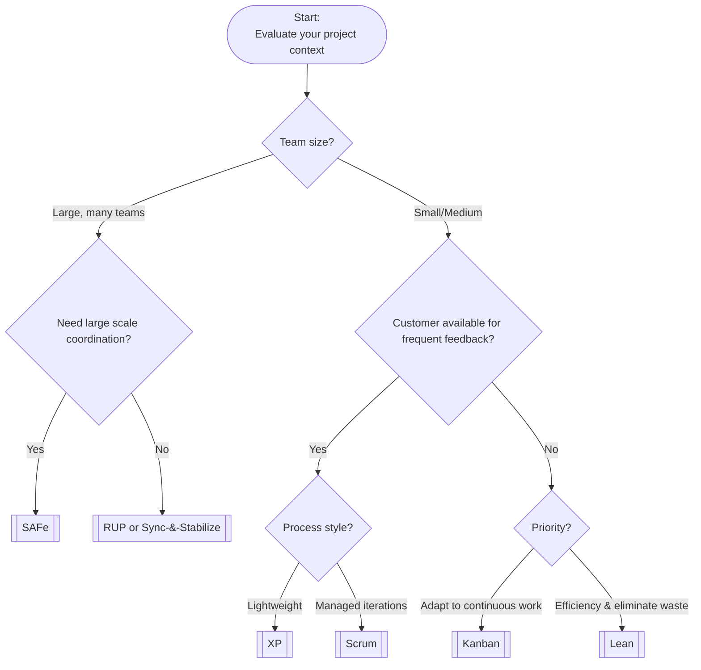

# Framework Summaries and Examples

This page summarizes eight major software development frameworks. For each, you’ll find its core philosophy, strengths and weaknesses, typical use cases, and a brief example scenario. Use the comparison table and references at the end for quick review.

---

## Rational Unified Process (RUP)

- **Summary:** Heavyweight, plan-driven, iterative framework. Four phases: Inception, Elaboration, Construction, Transition. Focuses on architecture-first and risk-driven development.
- **Strengths:** Structured, predictable, excellent for large, complex projects needing thorough documentation and risk management.
- **Weaknesses:** Can be bureaucratic and slow for small or fast-changing projects. Requires expertise to tailor.
- **Use Cases:** Enterprise or government projects needing comprehensive documentation and stakeholder sign-off.
- **Example:** A government contractor uses RUP for an air traffic control upgrade, focusing on early risk reduction and formal milestone reviews.

---

## Microsoft Synchronize & Stabilize (Sync-&-Stabilize)

- **Summary:** Milestone-driven, iterative model. Multiple teams work in parallel, integrate code frequently, and stabilize at milestones.
- **Strengths:** Fast-paced, issues surface early, flexible for evolving specs.
- **Weaknesses:** Resource-intensive, coordination challenges, risk of feature creep.
- **Use Cases:** Large-scale product development (e.g., operating systems, office suites).
- **Example:** A mobile OS project uses daily builds and milestone freezes to manage parallel feature teams.

---

## Team Software Process (TSP)

- **Summary:** High-discipline, metrics-driven process for self-directed teams. Emphasizes quantitative management and continuous improvement.
- **Strengths:** Predictable quality, strong defect reduction, good for critical systems.
- **Weaknesses:** High overhead, requires training, less flexible for changing requirements.
- **Use Cases:** Safety-critical or mission-critical projects (e.g., medical devices).
- **Example:** A pacemaker firmware team uses TSP for rigorous planning, tracking, and quality assurance.

---

## Extreme Programming (XP)

- **Summary:** Agile methodology focused on rapid iterations, customer involvement, and engineering practices (pair programming, TDD, continuous integration).
- **Strengths:** Rapid response to change, high customer satisfaction, strong code quality.
- **Weaknesses:** Not suited for large teams or projects needing heavy documentation.
- **Use Cases:** Small teams with direct customer access, startups, internal IT projects.
- **Example:** A startup uses XP to quickly iterate on a mobile payment app with daily deployments and test-driven development.

---

## Scrum

- **Summary:** Lightweight Agile framework with short, fixed iterations (Sprints), clear roles, and regular ceremonies.
- **Strengths:** Simple, widely applicable, promotes collaboration and visibility.
- **Weaknesses:** Needs scaling for large projects, doesn’t prescribe engineering practices.
- **Use Cases:** Product teams of 5-9 people, web/mobile development, agile transformations.
- **Example:** An e-commerce team uses Scrum for 2-week sprints, daily stand-ups, and regular reviews.

---

## Kanban

- **Summary:** Agile method focused on visualizing work and limiting work-in-progress (WIP) for continuous flow.
- **Strengths:** Flexible, continuous delivery, exposes bottlenecks.
- **Weaknesses:** Less prescriptive, may lack deadlines or rhythm.
- **Use Cases:** Operations, support, maintenance, continuous delivery teams.
- **Example:** A platform team uses Kanban to manage unpredictable support and infrastructure tasks.

---

## Lean Software Development

- **Summary:** Principle-based approach focused on eliminating waste, amplifying learning, and delivering fast.
- **Strengths:** Maximizes efficiency, adapts quickly, empowers teams.
- **Weaknesses:** Requires cultural change, less prescriptive.
- **Use Cases:** Product development, process improvement, agile transformations.
- **Example:** An online retailer uses Lean principles to reduce delivery time and improve team collaboration.

---

## Scaled Agile Framework (SAFe)

- **Summary:** Scaling framework for large enterprises, combining Agile and Lean principles. Synchronizes multiple teams on a common cadence.
- **Strengths:** Enterprise alignment, visibility, supports large systems.
- **Weaknesses:** Can be complex and bureaucratic, requires training and buy-in.
- **Use Cases:** Large organizations with many agile teams, portfolio-level oversight.
- **Example:** A global bank uses SAFe to coordinate 15 teams on its online banking platform, improving release reliability and business alignment.

---

## Comparison Table

| **Framework** | **Team Size** | **Project Size & Complexity** | **Risk Tolerance** | **Process Discipline** | **Documentation** | **Iteration Cadence** | **Customer Involvement** | **Tooling Needs** |
|---------------|--------------|------------------------------|--------------------|-----------------------|-------------------|----------------------|--------------------------|-------------------|
| RUP           | Medium/Large | Large, complex               | Low                | High                  | Extensive         | Long, iterative      | Moderate                 | High              |
| Sync-&-Stabilize | Large      | Large-scale products         | Moderate           | Moderate              | Light             | Milestone-driven     | Low                      | High              |
| TSP           | Small/Medium | Small to large, critical     | Very Low           | Very High             | High              | Phased, weekly checks| Low                      | Moderate          |
| XP            | Small        | Small/Medium, changing       | High               | Moderate/High         | Minimal           | Very short cycles    | Very High                | Moderate          |
| Scrum         | Small        | Small/Medium                 | Moderate/High      | Moderate              | Minimal           | Fixed sprints        | High                     | Low/Moderate      |
| Kanban        | Flexible     | Any, continuous flow         | High               | Moderate              | Minimal           | Continuous           | Moderate                 | Low               |
| Lean          | Any          | Any, value-focused           | High               | Moderate              | Minimal           | Adaptive             | High                     | Low               |
| SAFe          | Very Large   | Large, enterprise            | Low/Moderate       | High                  | Moderate          | Multi-level, iterative| Moderate                | High              |

---

## Decision Guidance Flowchart

---

## References

- ones.com: [RUP vs Agile Methodology Comparison](https://ones.com/blog/rup-vs-agile-methodology-comparison/)
- slideshare.net: [Synchronize and Stabilize Lifecycle](https://www.slideshare.net/slideshow/software-lifecycle-model-report/15843737)
- en.wikipedia.org: [Team Software Process](https://en.wikipedia.org/wiki/Team_software_process)
- altexsoft.com: [Extreme Programming Values, Principles, and Practices](https://www.altexsoft.com/blog/extreme-programming-values-principles-and-practices/)
- objectstyle.com: [Agile, Scrum, Kanban, Lean, XP Comparison](https://www.objectstyle.com/blog/agile-scrum-kanban-lean-xp-comparison)
- projectmanagement.com: [Scrum vs Kanban vs XP](https://www.projectmanagement.com/blog-post/23006/scrum-vs-kanban-vs-xp)
- 6sigma.us: [Principles of Lean Software Development](https://www.6sigma.us/lean-six-sigma-articles/principles-of-lean-software-development/)
- planview.com: [SAFe Framework](https://www.planview.com/resources/guide/scaled-agile-framework-how-technology-enables-agility/safe-framework/)

---

{: .highlight }
**Disclaimer:** AI is used for text summarization, explaining and formating. Authors have verified all facts and claims. In case of an error, feel free to file an issue.