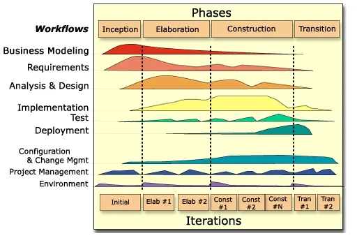

# RUP and the Unified Process

The Rational Unified Process organises a project into four phases — **Inception, Elaboration,
Construction, Transition** — each ending in a milestone, and runs iterations inside them. Its two
commitments are **architecture-first** and **risk-driven**: settle the structural decisions and
attack the riskiest elements early, while changing them is still cheap
.

## 1. The phases are about risk retired, not work completed

The distinctive idea is what the milestones mean. A RUP phase does not end when a quantity of work
is finished; it ends when a class of uncertainty has been resolved.

- **Inception** establishes scope and the business case — should this exist at all?
- **Elaboration** is where the architecture is proven, usually by building an executable skeleton
  that exercises the risky paths. By its end the structural risk should be gone.
- **Construction** builds the remaining functionality against that settled architecture.
- **Transition** moves the product to its users — beta, migration, training, cutover.

The "hump chart" above makes the other point: requirements, design, implementation and test are
**disciplines that run throughout**, not phases in sequence. Requirements work does not stop when
Construction starts; there is simply less of it.

## 2. AUP and OpenUP are the same shape, made smaller

RUP is a framework meant to be **tailored**, and the criticism it attracts — that it is heavyweight
— is mostly a criticism of untailored RUP, which prescribes far more roles, artefacts and activities
than any one project needs. Two lighter members of the family exist for that reason.

The **Agile Unified Process** keeps the four phases and cuts the artefacts to a working minimum.
**OpenUP** is the open-source member, developed under the Eclipse Process Framework and described by
its own documentation as *minimal, complete and extensible*: it retains the phases, milestones and
iterative structure while reducing the prescribed content to what a small co-located team can
sustain .

Treating them as one family is the honest presentation. The shape — phased, architecture-first,
risk-driven, iterative inside the phases — is what carries over; the weight is a dial.

## 3. When it fits

**Example — a system that cannot be re-architected later.** A team replacing a bank's payment
routing has an architectural question that dominates everything else: whether the new component can
meet the throughput and reconciliation guarantees the old one did. RUP's answer is to spend
Elaboration building a skeleton that routes real traffic volumes end to end, with most functionality
absent, and to treat that as the gate. If the skeleton cannot hit the numbers, the project has
learned so while the code is small. Construction then proceeds against a structure nobody expects to
change.

That is the profile RUP suits: **large projects where architecture is the dominant risk and getting
it wrong is expensive to undo**, and where defined roles help because the team is too large for
everyone to hold the whole system in their head.

It fits badly where requirements change faster than the architecture can be settled, and where the
tailoring effort exceeds the project. An untailored RUP on a small team is the standard failure —
the ceremony arrives, the benefit does not.

## How solid is this?

- **This page has no reviewed primary source behind it.** RUP is covered because the course teaches
  it and because it anchors the plan-driven end of the [comparison](index.md), but this review did
  not read Kruchten or the RUP product documentation. The description is standard and uncontroversial;
  treat it as vocabulary rather than as evidenced claims .
- **`balduino2007openup` is grey literature** — a nine-page white paper written by an IBM Rational
  engineer who was a committer on the project it describes. Useful for what OpenUP *is*; not
  independent evidence about it.
- **No source here compares RUP's outcomes with anything.** The "when it fits" reasoning is derived
  from what the framework does, not from measured results.
- **RUP is largely historical as a commercial product**, though its vocabulary — phases, iterations,
  architecture-first — is thoroughly absorbed into practice.

---

### Acknowledgments

This page adapts material from lectures by **Eduardo Miranda** and **David Root**
 on software project management.

### References



---

{: .highlight }
**Disclaimer:** AI is used for text summarization, polishing and explaining. Authors have verified
all facts and claims. In case of an error, feel free to file an issue.
