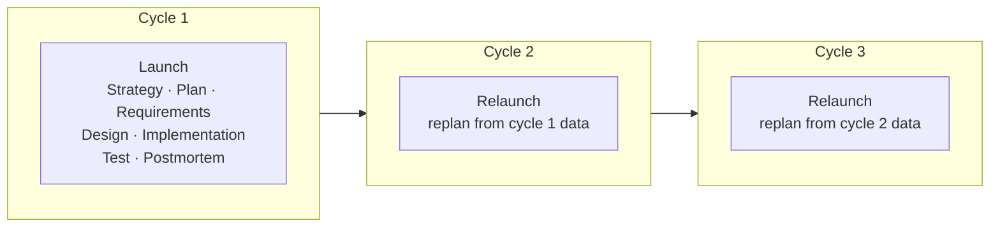

# TSP and PSP

The Team Software Process is the high-discipline end of the spectrum: a defined, measured process in
which teams plan their own work in detail, track time, size and defects against that plan, and use
the resulting data to plan the next cycle. Watts Humphrey built it at the SEI to produce
**self-directed teams** .

It rests on the **Personal Software Process**, which teaches an individual engineer to do the same
things for their own work — because a team cannot plan quantitatively if its members cannot.

## 1. PSP first: the engineer measures their own work

PSP is a training discipline. An engineer records how long each activity takes, how large the
resulting product is, and every defect they inject and remove, including where each defect was
introduced and where it was caught. Over a series of exercises that data becomes a personal baseline:
this is how long I take, this is my defect density, this is how accurate my estimates are.

The argument is that estimation and quality are personal skills that improve only with feedback, and
that most engineers have never seen their own numbers. Once they have, planning stops being a guess
and design reviews start looking economically obvious — finding a defect at review is dramatically
cheaper than finding it in test, and the engineer's own data shows it.

## 2. TSP: the team plans, and the plan is theirs

TSP wraps PSP-trained engineers in a team structure. Each development cycle opens with a **launch** —
a scripted multi-day sequence in which the team agrees goals, defines roles, produces its own
detailed plan and estimates, and commits to it — and closes with a **postmortem** feeding data
forward.

Roles are explicit — team leader, planning manager, quality manager, process manager and others — and
they are held by working engineers rather than by separate managers. The plan is produced **by the
team**, which is the point: Humphrey's claim is that engineers commit to plans they made and comply
with plans imposed on them.

**Example — what the quality manager actually watches.** In a TSP team the quality manager tracks
review yield: the proportion of defects present at a stage that the review at that stage catches. If
design reviews are yielding 40% while the plan assumed 70%, that shows up in the cycle's data before
the test phase confirms it expensively. The response is a process change — more preparation time,
smaller review chunks — decided by the team from its own numbers.

## 3. What it demands, and where that breaks

TSP asks for training, discipline and sustained data collection. Every engineer needs PSP training
before it works at all, launches consume days, and the measurement only pays off if it is kept up
across cycles.

It suits organisations building software where predictability and defect rates genuinely matter and
where the investment can be amortised — long-lived teams, high-assurance products. It fits badly with
short-lived teams, heavy staff churn, or work whose requirements change faster than a cycle.

There is also a hazard the data itself creates, and it is the one this handbook keeps returning to:
a process that records every engineer's time and defects produces exactly the data that corrupts when
it is used to appraise people. Humphrey was explicit that process data must not be used that way —
see [process metrics](../basics/metrics.md).

## How solid is this?

- **Humphrey's TSP report is an SEI technical report by the method's author** — institutionally
  published and DoD-sponsored, but a **method definition**, not an evaluation. It describes what TSP
  is and argues for it; it is not independent evidence that it works.
- **The PSP material here comes from a teaching deck** used at Innopolis  —
  grey literature with no venue or date, useful for the method's structure rather than for claims
  about it.
- **This review found no independent outcome study** of TSP. There is a body of SEI-published
  results, but it was not part of this review and is largely produced by the method's own institution.
- **TSP and PSP are little used in industry today** relative to agile frameworks. They remain worth
  teaching as the clearest existing statement of *measured, disciplined engineering* — the pole
  against which lighter methods define themselves.

---

### Acknowledgments

This page adapts material from lectures by **Eduardo Miranda** and **David Root**
 on software project management.

### References



---

{: .highlight }
**Disclaimer:** AI is used for text summarization, polishing and explaining. Authors have verified
all facts and claims. In case of an error, feel free to file an issue.
