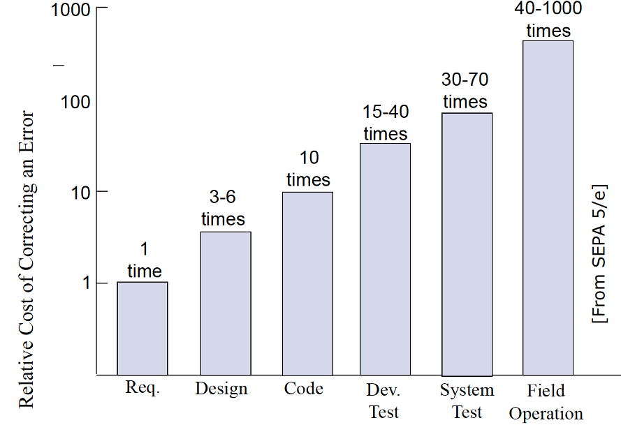

# History of Process in Software Engineering

_* adapted from Root, 2014_

## Early History: Smith and Taylor

### Adam Smith (1776) — *The Wealth of Nations*

Smith described the division of labor in manufacturing:
> _“One man draws out the wire, another straights it, a third cuts it, a fourth points it, a fifth grinds it at the top for receiving the head: to make the head requires two or three distinct operations: to put it on is a particular business, to whiten the pins is another ... and the important business of making a pin is, in this manner, divided into about eighteen distinct operations, which in some manufactories are all performed by distinct hands, though in others the same man will sometime perform two or three of them.”_

**Key Idea:**  
- Breaking work into specialized tasks increases efficiency and quality.

### Frederick Winslow Taylor (1856–1915) — Scientific Management

Taylor’s principles revolutionized industrial work:
- Replace rule-of-thumb methods with scientific study of tasks.
- Scientifically select, train, and develop each employee.
- Provide detailed instruction and supervision for each worker’s task.
- Divide work nearly equally between managers (planning) and workers (execution).

**Impact:**  
- Laid the foundation for process thinking in engineering and management.

---

## The Quality Movement: Deming

### Early Approach

- **Design → Build → Test/Check → Discard rejects**
- Quality was ensured by inspecting and removing defective products after production.

### W. Edwards Deming (1900–1993)

- Worked on census and manufacturing in Japan (1950s).
- Introduced process analysis, data collection, and defect prevention.
- Emphasized **prevention** over **post-inspection**.
- Focused on continuous improvement and root cause analysis.

**Key Concepts:**
- Analyze processes, not just products.
- Collect data to identify sources of defects.
- Take action to prevent defects before they occur.

**Question:**  
Does this apply to software?  
*Hint: The SEI (Software Engineering Institute) thinks so!*

---

## Why Process in Software Engineering?

Software projects face unique challenges:
- **Human variation:** People work differently; process helps standardize.
- **Complexity:** Software systems are intricate and interconnected.
- **Volatility:** Requirements and environments change rapidly.
- **Invisible:** Software is intangible; defects are hard to spot.
- **Defect propagation:** Small errors can spread and multiply through the lifecycle.

---

### Defect Propagation

**Software Project Work Products:**  
Defects can occur at any stage and impact downstream work:

- Estimations
- Use cases, scenarios, elicitation/refinement tools
- Software requirements specification
- Statement of work
- Design and architecture documents
- Test plans
- Code (primary artifact)
- Others (deployment, operations, etc.)

**Impact:**  
A defect in early stages (e.g., requirements) can propagate and become much more costly to fix later.

---

## Quality Assurance (QA) — More Than Just Testing

**QA applies to the process, not just the product!**

### Product Delivered

- Bug/defect free
- Answers the problem (conforms to requirements)
- Passes validation and verification (testing, reviews, inspections)

### Processes That Build the Product

- Limit human variation and defect injection
- Ensure consistent, high-quality outcomes
- Closely tied to the product’s quality

**QA Activities:**
- Audits
- Inspections
- Standards (e.g., CMMI)
- Formalized processes

---

## Key Takeaways

- Process thinking originated in manufacturing but is essential in software engineering.
- Quality is best achieved by preventing defects through good processes, not just by catching them at the end.
- Software projects require structured processes to manage complexity, change, and human factors.
- QA is a continuous activity that applies to both the product and the process.

---

## Acknowledgments

This content is heavily inspired by and adapted from lectures by **Eduardo Miranda** and **David Root** on software project management. The structure, examples, and pedagogical approach reflect their teaching materials and frameworks.

---

## Sources

- Root, David. *Managing Software Development*. Lecture materials, 2014.

---

{: .highlight }
**Disclaimer:** AI is used for text polishing and explaining. Authors have verified all facts and claims. In case of an error, feel free to file an issue.