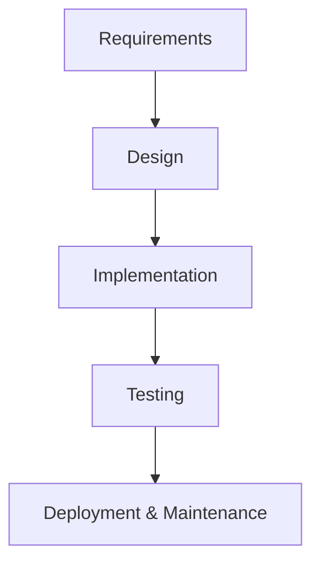
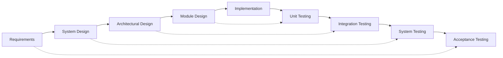

# Software Project Lifecycle Models – Overview

This page outlines seven widely used lifecycle models—**Waterfall, V-Model, Iterative, Incremental, Prototyping, RAD, Spiral**—what they are, why they’re useful, and when to apply them. A compact comparison table closes the page.

---

## Waterfall

**What it is.** A linear, once-through sequence (Requirements → Design → Implementation → Testing → Maintenance). Each phase is completed and signed off before the next.  
**Why it’s used.** Strong structure and documentation; predictable milestones and contracts. Limited adaptability: feedback arrives late and change is costly.

**Good fits (examples).**

- Stable, well-specified projects (e.g., fixed-scope government systems, regulated upgrades).
    
- Domains demanding documentation and stage gates (e.g., certain defense/legacy contexts).
    

**Source:** Larman & Basili (2003), _IEEE Computer_. [cs.umd.edu](https://www.cs.umd.edu/~basili/publications/journals/J90.pdf) • IEEE/EIA 12207.2 excerpt via DoD: [dote.osd.mil](https://www.dote.osd.mil/Portals/97/docs/TEMPGuide/IEEE_EIA_12207.2_1997.pdf)

---

## V-Model

**What it is.** A refinement of Waterfall pairing each development stage with a corresponding test stage (e.g., requirements ↔ acceptance test; design ↔ integration/unit).  
**Why it’s used.** Early test planning and traceability improve quality; still largely sequential and change-averse.

**Good fits (examples).**

- Safety-/mission-critical software where verification and validation are paramount (e.g., medical devices, avionics, automotive).
    
- Projects requiring end-to-end traceability from requirements to tests.
    

**Source:** Falcão et al. (2024). Chapter on V-Model experience. (Springer/[researchgate.net](https://www.researchgate.net/publication/382066222_Experiences_in_Using_the_V-Model_as_a_Framework_for_Applied_Doctoral_Research#:~:text=The%20introduction%20of%20the%20V,was%20%EF%AC%81rst%20featured%20in%20the))

---

## Iterative

**What it is.** Build in repeated mini-cycles; reassess and refine requirements, design, and implementation each iteration.  
**Why it’s used.** High adaptability and continuous learning reduce late-stage surprises; needs scope discipline to avoid “endless iteration.”

**Good fits (examples).**

- Evolving or uncertain requirements; product and R&D work.
    
- Historic example: NASA Shuttle primary avionics—17 iterations over ~31 months to accommodate changing needs.
    

**Sources:** Larman & Basili (2003), _IEEE Computer_ [cs.umd.edu copy](https://www.cs.umd.edu/~basili/publications/journals/J90.pdf); IEEE/EIA 12207.2 (evolutionary strategies).

---

## Incremental

**What it is.** Deliver the system in **increments**—each a usable slice—until complete.  
**Why it’s used.** Early value and staged integration; can prioritize risky/valuable features first. Requires careful integration planning.

**Good fits (examples).**

- Large enterprise systems rolled out by module (e.g., core customer accounts → billing → reporting).
    
- MVP then progressive enhancements; standards historically allowed evolutionary/incremental builds (e.g., MIL-STD-498).
    

**Sources:** Larman & Basili (2003) [cs.umd.edu copy](https://www.cs.umd.edu/~basili/publications/journals/J90.pdf), _IEEE Computer_; DoD/MIL-STD-498 guidance.

---

## Prototyping

**What it is.** Create quick, focused prototypes to clarify needs; either throw away (to refine specs) or evolve into the product.  
**Why it’s used.** Very fast feedback reduces requirements risk, especially for UX. Must manage expectations; prototypes may sidestep performance/security until later.

**Good fits (examples).**

- UI-intensive apps (mobile/desktop) where look-and-feel drives acceptance.
    
- Feasibility spikes for new algorithms or integrations; early client demos for complex business rules.
    

**Source:** **SWEBOK v3**, IEEE Computer Society (Prototyping).  
Link: [ieeecs-media.computer.org/media/education/swebok/swebok-v3.pdf](https://ieeecs-media.computer.org/media/education/swebok/swebok-v3.pdf)

---

## RAD (Rapid Application Development)

**What it is.** Time-compressed, user-involved delivery in short cycles; heavy use of prototyping, component reuse, and small, focused teams.  
**Why it’s used.** Fast turnaround and continuous user input; less suitable for very large or safety-critical systems without added rigor.

**Good fits (examples).**

- Business applications with urgent time-to-value (e.g., call-center tools, internal dashboards).
    
- Process re-engineering efforts where users co-design workflows in workshops.
    

**Source:** Larman & Basili (2003) discussing RAD’s origins (James Martin), _IEEE Computer_ [cs.umd.edu copy](https://www.cs.umd.edu/~basili/publications/journals/J90.pdf).

---

## Spiral

**What it is.** A **risk-driven** cycle: set objectives → analyze risks → engineer → evaluate; repeat, mixing methods as risks dictate.  
**Why it’s used.** Makes risk mitigation the central driver; highly adaptable but requires strong risk expertise and governance.

**Good fits (examples).**

- Large, complex, high-uncertainty programs (e.g., defense/aerospace platforms, platform modernizations).
    
- Projects needing phased “specify → prototype → evaluate → refine” with explicit risk burn-down.
    

**Source:** Boehm (1988/2002), _IEEE Computer_ [cse.msu.edu copy](https://www.cse.msu.edu/~cse435/Homework/HW3/boehm.pdf).

---

## Comparison at a Glance

|Model|Structure|Flexibility|Feedback|Risk Handling|Typical Use|
|---|---|---|---|---|---|
|**Waterfall**|Linear, once-through|Low|Late|Low (implicit)|Stable, regulated work|
|**V-Model**|Linear with mapped tests|Low|Moderate (planned tests)|Low–Moderate (quality focus)|Safety/mission-critical with V&V|
|**Iterative**|Repeat mini-cycles|High|High (each iteration)|Moderate (learn early)|Evolving requirements, R&D|
|**Incremental**|Deliver in slices|Moderate|Moderate (per increment)|Moderate (stage risky parts first)|Phased enterprise rollouts, MVP→growth|
|**Prototyping**|Build → feedback → refine|High|Very high|Moderate (requirements risk)|UX-heavy or novel concepts|
|**RAD**|Short, user-driven cycles|High|High|Moderate (fast loops)|Fast business apps, re-engineering|
|**Spiral**|Risk-driven loops|Very high|High|**Very high** (explicit)|Large, high-risk programs|

---

### Selected References

- Boehm, B. W. (1988/2002). _A Spiral Model of Software Development and Enhancement_. **IEEE Computer**. [cse.msu.edu copy](https://www.cse.msu.edu/~cse435/Homework/HW3/boehm.pdf) 
    
- Larman, C., & Basili, V. R. (2003). _Iterative and Incremental Development: A Brief History_. **IEEE Computer**. [cs.umd.edu copy](https://www.cs.umd.edu/~basili/publications/journals/J90.pdf)
    
- IEEE/EIA 12207.2. _Software Life Cycle Processes—Implementation Considerations_ (Annex on once-through vs. evolutionary strategies). Link: [dote.osd.mil](https://www.dote.osd.mil/Portals/97/docs/TEMPGuide/IEEE_EIA_12207.2_1997.pdf)
    
- **SWEBOK v3**. IEEE Computer Society (section on Prototyping). _Software Engineering Body of Knowledge, Version 3.0_. IEEE Computer Society (SWEBOK V3) [ieeecs-media.computer.org](https://ieeecs-media.computer.org/media/education/swebok/swebok-v3.pdf).
    
- Falcão, R., et al. (2024). _Experiences in Using the V-Model…_ (Springer chapter). Falcão, Rodrigo, et al. "Experiences in Using the V-Model as a Framework for Applied Doctoral Research." _Handbook on Teaching Empirical Software Engineering_. Cham: Springer Nature Switzerland, 2024. 255-276. [researchgate.net](https://www.researchgate.net/publication/382066222_Experiences_in_Using_the_V-Model_as_a_Framework_for_Applied_Doctoral_Research#:~:text=The%20introduction%20of%20the%20V,was%20%EF%AC%81rst%20featured%20in%20the).
    
{: .note }
Tip: In practice, teams often **combine** models (e.g., incremental delivery developed iteratively, with prototypes and spiral-style risk spikes). Choose the mix that fits **risk, volatility, compliance, and time-to-value**.

{: .highlight }
**Disclaimer:** AI is used for text polishing, explaining and summarization. Authors have verified all facts and claims. In case of an error, feel free to file an issue.
