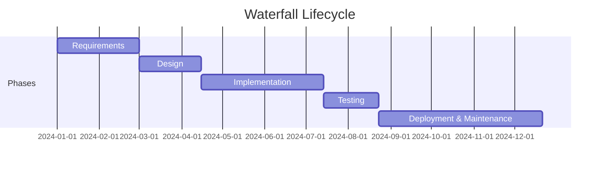

# Waterfall

Waterfall runs a project as a sequence of phases — requirements, design, implementation, testing,
maintenance — each completed and signed off before the next begins. Its defining feature is not the
order of the phases but the **exit criterion** between them.

## 1. The advantage and the disadvantage are the same property

Fixed phases with defined exit criteria are what make waterfall **contractible**: you can price a
phase, staff it, audit it and hold someone to it. For fixed-scope procurement, regulated work and
anything with stage gates, that is not bureaucracy — it is the whole point.

The same property is what delays the first honest feedback to the end. Winston Royce, describing the
scheme in 1970, put the objection more sharply than its critics later would: testing is *"the first
event for which timing, storage, input/output transfers, etc., are experienced as distinguished from
analyzed"*, and failures found there are not local. *"A simple octal patch or redo of some isolated
code will not fix these kinds of difficulties"*  — the design itself has
to change, and by then the design has been signed off for months.

**One sentence answers the exam question**: *the exit criteria that make waterfall auditable and
contractible are the same ones that push the first real feedback to the end of the project.*

## 2. Royce's five steps, which are the useful part

Royce did not stop at the diagram. Most of his paper is spent fixing it, and his five additions are
what a modern reader should take away :

1. **Program design comes first** — before requirements are finalised.
2. **Document the design** — thoroughly, and as a deliverable in its own right.
3. **Do it twice** — build a pilot version of the parts you understand least.
4. **Plan, control and monitor testing** — testing is not a phase you arrive at.
5. **Involve the customer** — formally, and more than once.

**Example — a third of the schedule spent building it wrong on purpose.** Step 3 matters most:
*"arrange matters so that the version finally delivered to the customer for operational deployment
is actually the second version insofar as critical design/operations areas are concerned."* For a
thirty-month effort Royce budgets **ten months** to that pilot pass — a third of the programme spent
on a version nobody will ship, bought to learn the real timing and storage behaviour before the
deliverable design is committed . This is the first appearance here of
paying for information about the riskiest part before committing — the idea Boehm generalises
eighteen years later into [the spiral](spiral.md).

{: .warning }
**Do not over-correct.** "Do it twice" is a single pilot pass to retire originality risk. It is
**not** iterative development, and Larman & Basili say so directly: the feedback in Royce *"has been
lost in most descriptions of this model, although it is clearly not classic IID"*
.

## 3. Where it came from, and what got lost

Waterfall is not a method anyone set out to design. The stagewise sequence predates Royce — Ruparelia
traces it to **Benington in 1956**, with Royce modifying it in 1970 ,
and Boehm independently dates the stagewise model to 1956 and the SAGE project
. The word *waterfall* never appears in Royce's paper. What does appear,
about the strictly sequential version, is: *"I believe in this concept, but the implementation
described above is risky and invites failure"* .

What survived into practice was the diagram without the feedback. Pressman concedes the point in a
footnote: although the original model *"made provision for 'feedback loops,' the vast majority of
organizations that apply this process model treat it as if it were strictly linear"*
. By 1996 a US Air Force acquisition guidebook was printing a boxed
note recommending against it .

## How solid is this?

- **Royce 1970 contains no data.** The author calls his own content *"prejudices"* in the first
  paragraph. It establishes what its best-known advocate actually argued — not whether waterfall
  works.
- **The provenance is well supported and says nothing about performance.** Six independent sources
  agree Royce was misread and two date the sequence before him, but none of them compares outcomes
  between lifecycle models.
- **Larman & Basili is a history, not an evaluation** . The
  comparative figures it carries are secondary citations to other studies; cite those to their
  originals.
- **`stsc1996lifecycles` is grey literature** — a government acquisition guidebook with no named
  author, useful as evidence of what was being recommended in 1996.

---

### Acknowledgments

This page adapts material from lectures by **Eduardo Miranda** and **David Root**
 on software project management.

### References



---

{: .highlight }
**Disclaimer:** AI is used for text summarization, polishing and explaining. Authors have verified
all facts and claims. In case of an error, feel free to file an issue.
