# Function Point Analysis (FPA) Explained

## 1. Why size with Function Points?

- Estimation is hard and important.
- LOC isn’t great (language-dependent, easy to game, not known early).
- Function Points (FP) size what the user gets, not how it’s coded.

---

## 2. What is a Function Point?

A Function Point measures the amount of business functionality delivered to a user.  
It’s technology-independent and user-visible.

---

## 3. Overall Model (UFP → AFP)

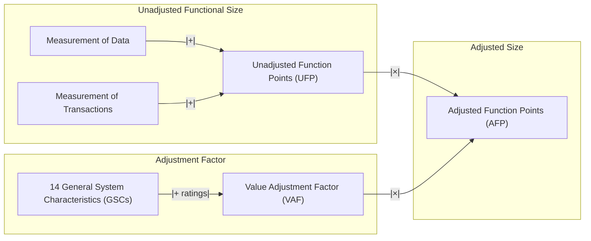

- **UFP = Data FPs + Transaction FPs**
- **AFP = UFP × VAF**

---

## 4. Data Functions

### 4.1 Types

- **ILF (Internal Logical File):** logical data the application maintains.
- **EIF (External Interface File):** logical data the application uses but does not maintain.

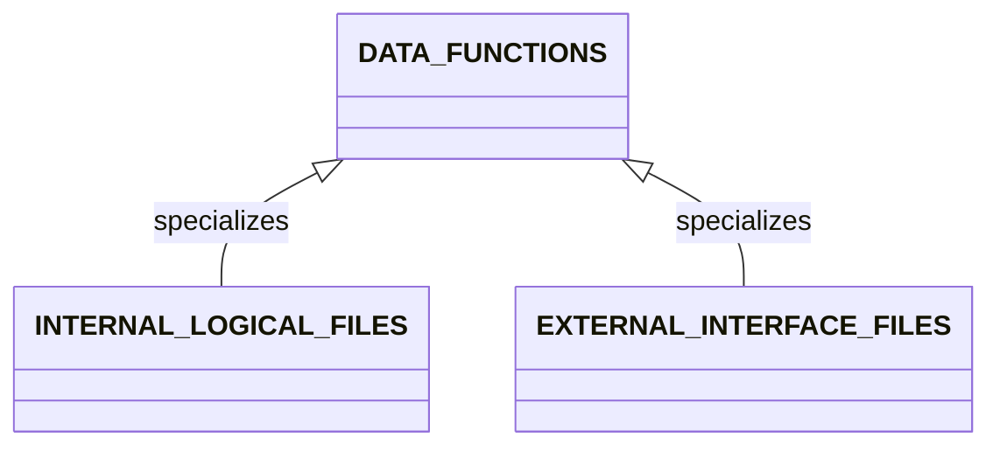

**Boundary matters:** The same physical file can be ILF for one app and EIF for another.

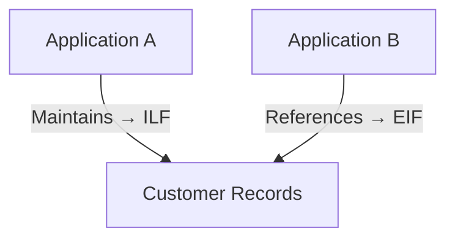

### 4.2 DETs and RETs

- **DET (Data Element Type):** user-recognizable field (name, date, amount).
- **RET (Record Element Type):** subgroup within a file (e.g., header/details).

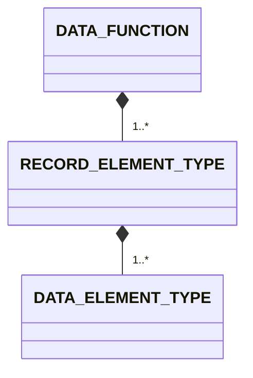

### 4.3 Example (Customer, Credit Card, Address)

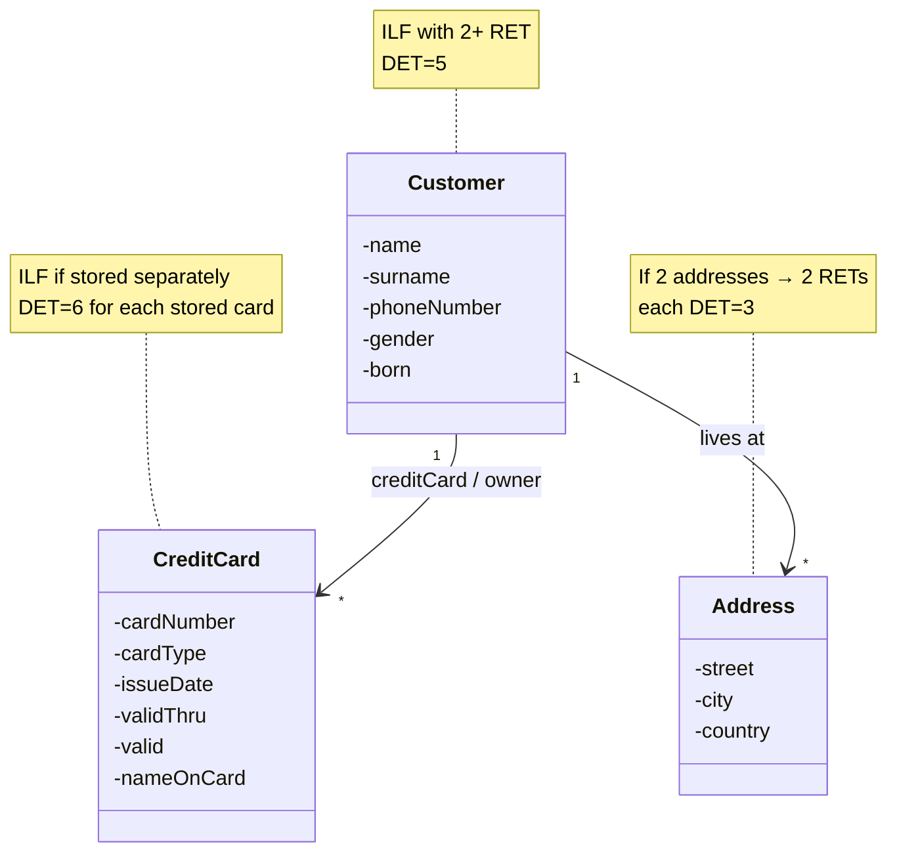

- Customer is an ILF (system maintains it), with DETs=5 and 2+ RETs (e.g., personal info + repeated related info).
- Address may be additional RETs under Customer (each address DET=3) or a separate ILF/EIF if maintained elsewhere.
- CreditCard is a separate ILF if this app maintains it; otherwise it’s an EIF.

**Quick table:**

| Entity     | Type | RETs                        | DETs |
|------------|------|----------------------------|------|
| Customer   | ILF  | ≥2 (personal, related sets) | 5    |
| Address    | RETs under Customer or separate ILF/EIF | 2 (in example) | 3    |
| CreditCard | ILF (if maintained) / EIF (if external) | n (per stored card) | 6    |

**Card illustration:**

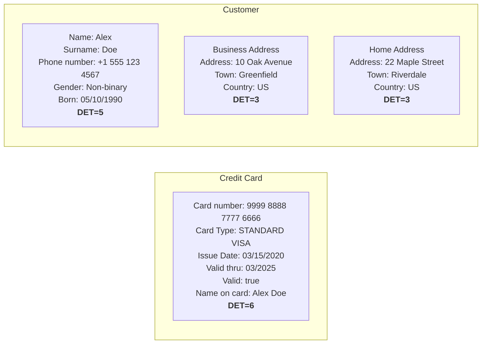

---

## 5. Data Complexity & Weights

### 5.1 ILF/EIF Complexity Matrix

| RETs \ DETs | 1–19 | 20–50 | 51+   |
|-------------|------|-------|-------|
| 1           | Low  | Low   | Avg   |
| 2–5         | Low  | Avg   | High  |
| 6+          | Avg  | High  | High  |

### 5.2 Weights (IFPUG typical)

| Data Function | Low | Avg | High |
|---------------|-----|-----|------|
| ILF           | 7   | 10  | 15   |
| EIF           | 5   | 7   | 10   |

Use the matrix to get complexity, then convert to FPs using the weights.

---

## 6. Transactional Functions

### 6.1 Types

| Type | What it does |
|------|-------------|
| EI   | Data/control enters the system. |
| EO   | Processed/derived data leaves the system. |
| EQ   | Retrieves data (input→output) with no significant processing. |

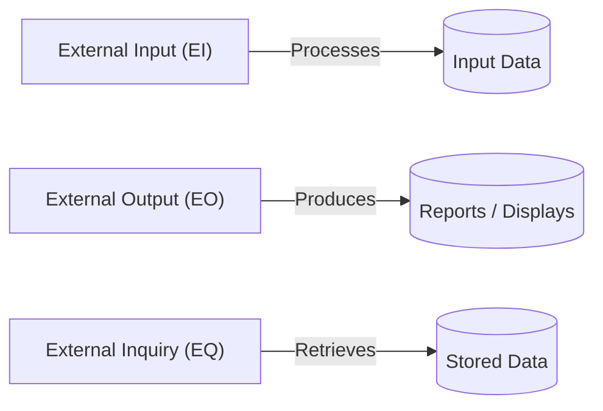

### 6.2 Taxonomy

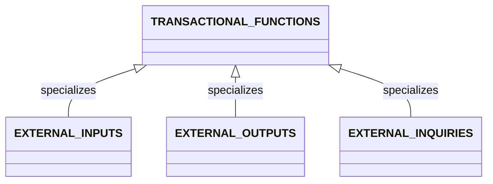

### 6.3 What defines a transaction (FTRs & DETs)

- **FTRs (File Type References):** ILFs/EIFs the transaction reads/writes.
- **DETs:** user-recognizable input/output fields.

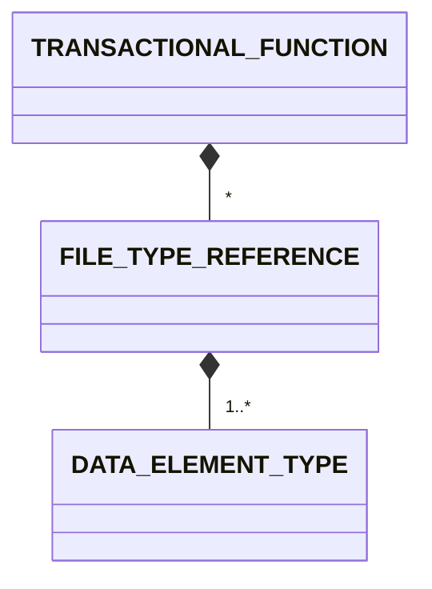

### 6.4 Mini Shopping Example (EI / EO / EQ)

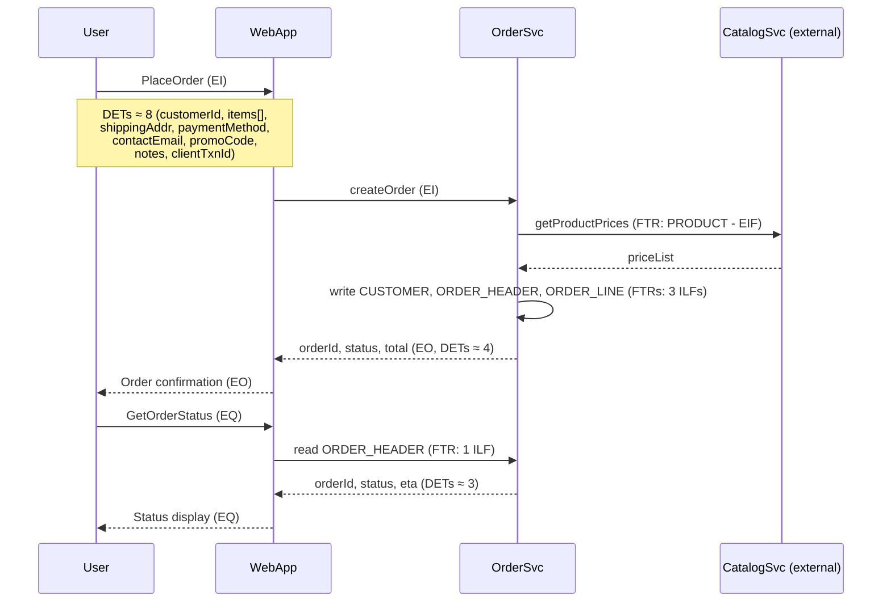

**One-liners:**

- EI PlaceOrder → FTRs=3–4, DETs≈8
- EO Confirmation → FTRs=2–3, DETs≈4
- EQ GetOrderStatus → FTRs=1, DETs≈3

---

## 7. Complexity & Weights for Transactions

### 7.1 EO/EQ Complexity (by FTR & DET)

| FTRs \ DETs | 1–5 | 6–19 | 20+   |
|-------------|-----|------|-------|
| 0–1         | Low | Low  | Avg   |
| 2–3         | Low | Avg  | High  |
| 4+          | Avg | High | High  |

**Weights:**

- EO: Low 4, Avg 5, High 7
- EQ: Low 3, Avg 4, High 6

### 7.2 EI Complexity (by FTR & DET)

| FTRs \ DETs | 1–4 | 5–15 | 16+   |
|-------------|-----|------|-------|
| 0–1         | Low | Low  | Avg   |
| 2           | Low | Avg  | High  |
| 3+          | Avg | High | High  |

**Weights:**

- EI: Low 3, Avg 4, High 6

---

## 8. Putting it Together

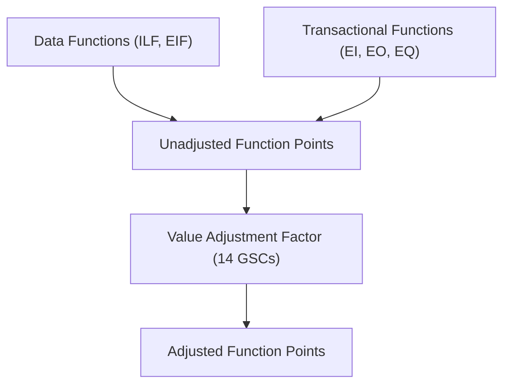

- **UFP = Data FP + Transaction FP**
- **AFP = UFP × VAF**

---

## 9. VAF (Value Adjustment Factor) — Quick View

- What: Multiplier from 14 GSCs rated 0–5.
- Formula: **VAF = 0.65 + 0.01 × (sum of 14 ratings)**
- Range: ~0.65–1.35. If your process ignores VAF, treat it as 1.00 (UFP-only).
- Rule of thumb: Think “each GSC point ≈ 1% change.”
- Example: Average ratings (3 each) → total 42 → VAF = 0.65 + 0.42 = 1.07 (~+7%).

---

## 10. Quick Checklist (for Students)

1. Identify ILFs/EIFs (watch the application boundary).
2. For each file: count RETs and DETs → get complexity → map to FP.
3. Identify EIs/EOs/EQs; for each, count FTRs and DETs → complexity → FP.
4. UFP = sum of all data + transactional FPs.
5. If required, rate GSCs → compute VAF → AFP.

---

## 11. Sources

1. Gunti,Naveen. "Functional Points Examined", 2006. [ku.edu](https://people.eecs.ku.edu/~hossein/810/Readings/fun-point-analysis-explained.pdf)
2. Kang, Byeongdo, and Jongseok Lee. “Estimating Procedure for Function Point and Development Cost in South Korea.” _International Journal of Networked and Distributed Computing_, vol. 6, no. 3, July 2018, pp. 185–94. [Atlantis Press](https://www.atlantis-press.com/journals/ijndc/25905549/view)

{: .highlight }
**Disclaimer:** AI is used for text summarization, explaining and formatting. Authors have verified all facts and claims. In case of an error, feel free to file an issue or fix with a pull request.
