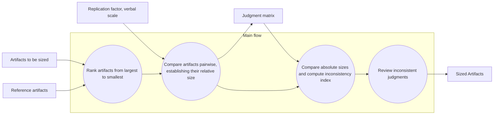

# Paired Comparison Estimation Method

## 1. Concept and Aim

The **Paired Comparison Estimation Method (PCEM)** helps derive **consistent size estimates** of software modules or user stories by comparing them **two at a time**.

Instead of asking “How big is module X?”, the method asks,

> “Is module X bigger or smaller than module Y — and by how much?”

From these _relative judgments_, the method produces:

- 📏 **Estimated absolute magnitudes** (e.g., story points, SLOC, effort)
- ⚖️ **A measure of internal consistency** among judgments

> ✅ The method guarantees **consistency**, not correctness.  
> 🔍 Inconsistent comparisons must be reviewed until the Inconsistency Index is acceptable.

---

## 2. Core Idea

People are more accurate at **comparing relative magnitudes** than assigning absolute numbers (Hihn & Lum, 2004).  
Each comparison expresses a ratio (e.g., “Story A is twice Story B”).  
These ratios fill a **Judgment Matrix**, from which the relative scale is derived mathematically.

---

## 3. Basic Process

---

## 4. Step-by-Step Explanation

| Step | Description | Example |
|------|-------------|---------|
| **1. Rank artifacts** | List the items (modules or user stories) roughly from largest to smallest. | Story D > Story B > Story C > Story A |
| **2. Pairwise comparison** | Compare each pair and record how much larger/smaller one is (e.g., 2×, 0.5×). Fill the upper triangle of a _Judgment Matrix_. | A vs. B = 3 means A is 3× larger than B. |
| **3. Compute consistency** | Use the **geometric mean** to compute each item’s relative magnitude and derive an **Inconsistency Index**. | Inconsistency ≤ 0.35 is acceptable (Miranda, 2009). |
| **4. Review inconsistencies** | Re-examine comparisons that violate logical consistency (if A>B and B>C, then A>C). | If not, revise A–C comparison. |
| **5. Normalize results** | Pick a **reference artifact** with a known size to convert relative magnitudes into actual units. | If reference = 2000 SLOC, multiply ratios to get estimates. |

---

## 5. Probabilistic Extension (NASA–JPL)

**Hihn & Lum (2004)** expanded the method by:

- Treating each pairwise judgment as a **distribution** (triangular: min, mode, max)
- Running **Monte Carlo simulations** to propagate uncertainty
- Allowing **multiple reference modules** (each with its own known size)

Result: a **probability distribution** for each size estimate — not just a single number.

> This makes the method especially useful in early project phases with uncertainty.

---

## 6. Example (Simplified)

Suppose we have 4 modules (A, B, C, D).  
An estimator judges:

| Compared Modules | Relative Size |
|------------------|--------------|
| A / B            | 2            |
| A / C            | 3            |
| A / D            | 4            |
| B / C            | 1.5          |
| B / D            | 2            |
| C / D            | 1.5          |

From these ratios, a **Judgment Matrix** is formed.  
The **geometric mean** of each row gives relative magnitudes:

| Module | Geometric Mean | Relative Scale |
|--------|----------------|---------------|
| A      | 2.21           | 2.21          |
| B      | 1.11           | 1.11          |
| C      | 0.76           | 0.76          |
| D      | 0.54           | 0.54          |

If C = 2000 SLOC (reference), then:

- A = 5826 SLOC
- B = 2913 SLOC
- D = 1414 SLOC

---

## 7. Managing Inconsistency

The **Inconsistency Index (II)** measures how logically consistent the comparisons are.  
A perfectly consistent matrix satisfies:

$$a_{ij} \times a_{jk} = a_{ik}​$$

When II ≤ 0.35 → results are considered reliable.  
Higher values mean the estimator should review their judgments.

---

## 8. Reduced Comparison Designs (Miranda et al., 2009)

In large projects, comparing every pair (Full Factorial) becomes overwhelming.  
Miranda’s team introduced **Incomplete Cyclic Designs (ICDs)** to:

- Limit the number of required comparisons
- Still maintain balanced, connected comparisons
- Maintain acceptable accuracy (correlation ≈ 0.9 with full set)

> Example: For 10 user stories, instead of 45 comparisons, only ~20 may be required (r = 4).

---

## 9. Strengths

- Relies on **explicit, rational comparisons**
- Provides a **mathematical consistency check**
- **Empirically validated** (Miranda, Hihn, Bozóki)
- Encourages estimator **commitment and reflection**

---

## 10. Weaknesses

- No built-in mechanism to **aggregate multiple estimators**’ opinions
- May suffer from **anchoring bias** (first comparisons influence later ones)
- Full designs can be **time-consuming or tedious**

---

## 11. Practical Takeaway

PCEM bridges **expert judgment** and **quantitative reasoning**.  
It’s particularly suited for:

- Early estimation when little data exist
- Agile user-story sizing
- Research on consistency and cognitive estimation

> In essence: _compare wisely, check consistency, iterate._

---

## 12. Sources

- Miranda, E., Bourque, P., & Abran, A. (2009). _Sizing User Stories Using Paired Comparisons._ Information and Software Technology.
- Hihn, J., & Lum, K. (2004). _Improving Software Size Estimates by Using Probabilistic Pairwise Comparison Matrices._ IEEE Int. Symposium on Software Metrics.
- Miranda, E. (2001). _Improving Subjective Estimates Using Paired Comparisons._ IEEE Software, 18(1), 87–91.

---

{: .highlight }
**Disclaimer:** AI is used for text summarization, explaining and formatting. Authors have verified all facts and claims. In case of an error, feel free to file an issue or fix with a pull request.
